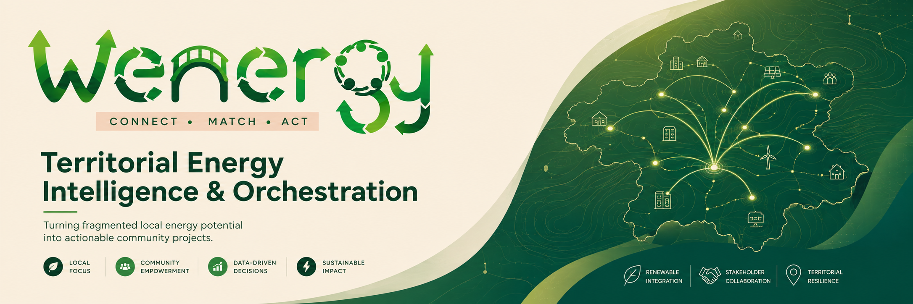
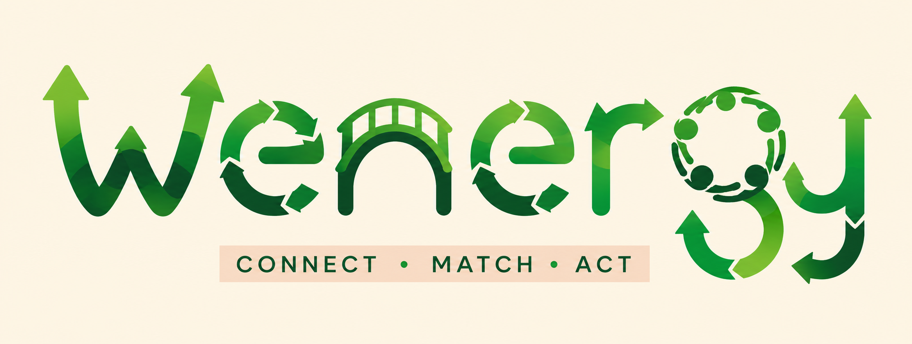
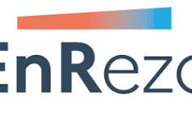
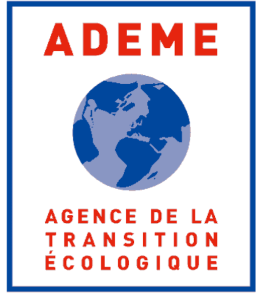

  

  

  <strong>CONNECT • MATCH • ACT</strong> 
  <em>Turning fragmented local energy potential into actionable community projects.</em>

---

# Wenergy Business Case

## Territorial Energy Intelligence & Orchestration

**CONNECT • MATCH • ACT**

> **Turning fragmented local energy potential into actionable community projects.**

**Status:** Functional Proof of Concept / Pre-Pilot Validation  
**Initial pilot territory:** Foix / Pays Foix-Varilhes, Ariège, France  
**Business model:** B2G2C territorial SaaS  
**Product category:** Territorial Energy Intelligence & Orchestration  
**Current development stage:** Functional multi-energy POC with real territorial evidence, opportunity screening, actor intelligence and Project Lenses

---

## 🧭 Wenergy Business Case Navigator

> **Jump directly to any part of the Wenergy case.**

| Explore | Section |
|---|---|
| ⚡ **Executive Overview** | [Executive Summary](#executive-summary) |
| 🔍 **The Challenge** | [Problem & Territorial Need](#problem) |
| 📍 **Starting Territory** | [Why Foix / Pays Foix-Varilhes](#why-foix) |
| 🌱 **The Product** | [Wenergy Product Definition](#product-definition) |
| ⚙️ **How It Works** | [Product Architecture](#product-architecture) |
| 🧭 **Using Wenergy** | [Product Experience](#product-experience) |
| 👥 **Who Uses It** | [Users & Community](#users-community) |
| 🌍 **Beyond Data-Rich Territories** | [Evidence-Adaptive Scalability](#evidence-adaptive-scalability) |
| 📈 **Why the Market Exists** | [Market Need & Drivers](#market-need) |
| 🎯 **Who Buys** | [Customers & ICP](#customers-icp) |
| 🧮 **Market Opportunity** | [TAM / SAM / SOM](#market-sizing) |
| 🥊 **Competitive Context** | [Competition & Differentiation](#competition) |
| 💼 **How Wenergy Makes Money** | [Business Model](#business-model) |
| 💶 **Commercial Model** | [Pricing & Procurement](#pricing-procurement) |
| 📊 **Economics** | [Unit Economics](#unit-economics) |
| 📉 **Financial Case** | [Five-Year Financial Model](#financial-model) |
| 📍 **First Real Deployment** | [Foix Pilot](#foix-pilot) |
| 🚀 **Reaching the Market** | [Go-to-Market](#gtm) |
| 🌱 **Planet** | [Environmental Impact](#environmental-impact) |
| 🤝 **People & Communities** | [Social Impact](#social-impact) |
| 📏 **Proving Value** | [Impact & KPI Framework](#impact-framework) |
| 🛡️ **Responsible Deployment** | [Governance & Ethics](#governance) |
| ⚠️ **What Could Go Wrong** | [Risk & Mitigation](#risk) |
| 🤝 **Ecosystem** | [Funding & Partnerships](#partnerships) |
| 🛣️ **Where Wenergy Goes Next** | [Roadmap](#roadmap) |
| 📚 **Evidence Base** | [Sources & Claim Boundaries](#sources) |

---

---

# 1. Executive Summary

The energy transition does not suffer from a complete absence of data, technology, experts or renewable-energy potential.

In many territories, all four already exist.

The harder problem is turning them into a coherent, understandable and actionable local project pipeline.

A small or medium-sized territory may have access to:

- electricity data;
- building information;
- renewable-resource maps;
- planning and environmental datasets;
- public statistics;
- specialised energy tools;
- engineering firms;
- energy syndicates;
- consultants;
- local businesses;
- farmers;
- municipal facilities;
- community knowledge.

Yet the territory may still struggle to answer a much more operational set of questions:

> Which local energy opportunities are actually worth investigating?

> Which resource could serve which need?

> Which actors need to cooperate?

> Which constraints matter?

> Which evidence is strong, estimated or missing?

> Which candidate should receive scarce professional study budget first?

> What could the project mean for the community?

> Who should become involved next?

> And what happened to the project after professional feasibility?

Wenergy is being developed to address this gap.

Wenergy is a **Territorial Energy Intelligence & Orchestration platform** that connects local renewable and recoverable-energy resources, energy needs, infrastructure, actors, constraints and evidence to identify, explain, prioritise and help advance local clean-energy projects.

Its product philosophy is:

**CONNECT • MATCH • ACT.**

The full Wenergy journey is:

**EXPLORE → CONNECT → MATCH → UNDERSTAND → DECIDE → ENGAGE → ACT → FOLLOW → LEARN → MEASURE**

Wenergy is not intended to replace:

- engineers;
- consultants;
- energy syndicates;
- ALECs;
- network operators;
- professional feasibility studies;
- environmental assessment;
- permitting;
- financing;
- procurement;
- project developers;
- installers.

Instead, it is designed to improve what happens **before, between and after** those specialist interventions.

Its role is to transform fragmented territorial information into structured **Project Lenses**.

A Project Lens can bring together:

- the potential resource;
- the local energy need;
- relevant actors;
- infrastructure context;
- environmental and planning constraints;
- evidence provenance;
- uncertainty;
- scenario information;
- project maturity;
- the next professional validation required.

The intended result is not automatic project approval.

It is a better question for the territory and a better starting point for the professional who must ultimately validate the project.

> **WENERGY ORIENTS AND CONNECTS. QUALIFIED PROFESSIONALS VALIDATE, ENGINEER AND IMPLEMENT.**

---

## 1.1 The Commercial Thesis

Wenergy is designed as a recurring **B2G2C** product.

The primary paying customer is expected to be a territorial public organisation such as:

- an EPCI / communauté de communes;
- an energy syndicate;
- a selected communauté d'agglomération;
- another appropriate territorial organisation.

The territorial licence then creates shared infrastructure that can support:

- member communes;
- public-sector technical teams;
- energy professionals;
- businesses;
- farmers;
- local actors;
- residents.

The long-term objective is that the essential community-facing layer can be available to residents without requiring them to purchase an individual subscription.

The public organisation pays for the intelligence infrastructure.

The wider community gains appropriate access to it.

A future optional Premium consumer layer may exist for additional individual functionality, but payment must never influence public project ranking or technical priority.

---

## 1.2 The Economic Thesis

Wenergy does not attempt to create savings by removing professional expertise.

The opposite is true:

**professional expertise remains essential.**

The economic hypothesis is that territories can use that expertise more efficiently if expensive professional analysis begins with a structured, evidence-backed candidate rather than a blank page.

The intended funnel is:

**LARGE TERRITORIAL OPPORTUNITY UNIVERSE**

↓

**DETERMINISTIC SCREENING**

↓

**EVIDENCE-BACKED OPPORTUNITIES**

↓

**PROJECT LENSES**

↓

**TERRITORIAL SHORTLIST**

↓

**PROFESSIONAL INVESTIGATION**

↓

**PHYSICAL IMPLEMENTATION**

A territory should not need to commission full feasibility work for every theoretically possible rooftop, waste-heat relationship, biomass resource or energy pathway.

Wenergy aims to help determine which candidates deserve that expenditure first.

If successful, this can reduce:

- duplicated data collection;
- repeated GIS preparation;
- low-value exploratory work;
- unnecessary feasibility investigations;
- staff time spent reconstructing information;
- specialist time spent on candidates that could have been filtered earlier.

Any real savings remain under the control of the territorial organisation.

They can potentially be redirected toward:

- additional energy projects;
- public-building renovation;
- energy-poverty programmes;
- mobility;
- social services;
- other local public priorities.

Wenergy does not determine those public spending choices.

It aims to improve the decision process that precedes them.

---

## 1.3 The Environmental Thesis

Wenergy is software-first.

It does not require proprietary Wenergy energy hardware to operate.

Its direct digital environmental principles include:

- deterministic-first computation;
- selective AI;
- reusable public-data connectors;
- incremental data refresh;
- shared territorial infrastructure;
- low-compute operation;
- no mandatory proprietary sensor network.

The larger environmental value is expected to come downstream.

Renewable-energy projects still consume:

- capital;
- materials;
- engineering resources;
- land or building space;
- construction effort;
- professional time.

Therefore:

**more renewable projects is not automatically the same as better environmental decision-making.**

Wenergy aims to help territories identify the projects that best fit:

**RESOURCE + NEED + ACTORS + INFRASTRUCTURE + CONSTRAINTS + EVIDENCE**

before major resources are committed.

---

## 1.4 The Social Thesis

Wenergy also addresses an access problem.

Access to territorial energy intelligence currently depends heavily on:

- institutional capacity;
- technical expertise;
- available public data;
- GIS capacity;
- professional budgets;
- individual ability to understand specialist information.

The primary social-impact area is therefore:

> **Inclusive territorial energy access, community empowerment and local energy decision capacity.**

Wenergy is designed so that:

- small communes can share infrastructure through a territorial licence;
- residents can receive understandable project information;
- businesses and farmers can understand why they may be relevant to an opportunity;
- experts can access deeper evidence and methodology;
- community input can improve project evidence without replacing technical governance.

---

# 2. The Problem

## 2.1 The Territorial Energy Execution-Intelligence Gap

The core problem addressed by Wenergy can be described as the:

# **Territorial Energy Execution-Intelligence Gap**

Territories increasingly possess information about their energy system.

But information availability does not automatically create the capacity to convert that information into projects.

A typical local energy opportunity may require evidence about:

- renewable resource;
- energy consumption;
- buildings;
- businesses;
- farms;
- public facilities;
- network infrastructure;
- administrative geography;
- planning rules;
- environmental constraints;
- resource ownership;
- potential beneficiaries;
- professional feasibility.

Those data frequently exist in different places, at different scales and at different confidence levels.

A local authority may therefore face a paradox:

> **MORE ENERGY DATA does not automatically create MORE ENERGY ACCESS or MORE ENERGY PROJECT CAPACITY.**

The bottleneck increasingly becomes the ability to:

1. connect evidence;
2. understand relationships;
3. identify plausible projects;
4. communicate uncertainty;
5. prioritise scarce professional attention;
6. connect the right actors;
7. preserve what is learned.

---

## 2.2 Fragmentation Is Technical

Territorial energy evidence may be distributed across:

- APIs;
- CSV files;
- GIS portals;
- public dashboards;
- administrative databases;
- planning documents;
- PDF studies;
- spreadsheets;
- consultant reports;
- local knowledge.

A decision-maker may need several tools simply to understand one candidate project.

The issue is therefore not always missing information.

It is often missing **integration**.

---

## 2.3 Fragmentation Is Institutional

Energy-project development can involve:

- commune;
- EPCI;
- energy syndicate;
- network operator;
- engineering firm;
- business;
- farmer;
- land or building owner;
- public administration;
- project developer;
- resident;
- financing body.

No single actor necessarily holds the complete picture.

A technically plausible project can therefore fail because the relevant people never connect.

---

## 2.4 Fragmentation Is Financial

Professional energy expertise is valuable and therefore costly.

A resource-constrained territory cannot realistically commission detailed feasibility for every theoretical possibility.

The decision problem becomes:

> **Where should scarce engineering and study budget be spent first?**

Without a structured pre-screening layer, professional resources may be used simply to establish whether a candidate was worth investigating in the first place.

Wenergy attempts to move part of that work upstream.

---

## 2.5 Fragmentation Is Social

Residents and local actors may technically have access to public information while still being unable to answer:

- What is being considered?
- Why this project?
- What could it mean for us?
- Which actors are involved?
- Who benefits?
- What evidence supports the project?
- What remains uncertain?
- What happens next?
- How can we participate?
- What eventually happened?

A public PDF or GIS map does not automatically create public understanding.

This creates an information asymmetry between:

**the people technically developing the transition**

and

**the people living inside it.**

---

## 2.6 Fragmentation Creates Institutional Memory Loss

Territorial studies frequently end as:

- PDFs;
- spreadsheets;
- emails;
- consultant reports.

When a project stops, staff change or several years pass, the evidence may be difficult to recover.

A rejected project can contain valuable knowledge:

- a resource estimate was wrong;
- demand was insufficient;
- a constraint became decisive;
- an actor was unwilling;
- network routing was unrealistic.

If that evidence disappears into disconnected documents, future teams may repeat the same work.

Wenergy is therefore designed around persistent **Project Lenses** and an **Opportunity Journey**.

---

## 2.7 The Problem Is Not “Lack of Experts”

Wenergy explicitly rejects the idea that software should replace energy professionals.

The problem is not that:

- engineers do not exist;
- consultants do not exist;
- public energy agencies do not exist.

The problem is that those experts may receive fragmented, poorly prepared or very broad investigation requests.

A more useful professional handoff is:

> “Here is a specific resource-demand relationship. These sources support it. These actors appear relevant. These constraints have been identified. These variables remain uncertain. Please validate these specific questions.”

The objective is to improve the **input to expertise**.

---

# 3. Why Foix / Pays Foix-Varilhes?

Foix and the wider Pays Foix-Varilhes territory were selected because they provide a realistic environment for testing the problem Wenergy is intended to solve.

The territory is not valuable because it is easy.

It is valuable because it represents the type of community that risks being disadvantaged as the energy transition becomes increasingly:

- data-intensive;
- technically complex;
- multi-actor;
- dependent on specialised expertise.

---

## 3.1 Territorial Profile

The broader Pays Foix-Varilhes territory includes approximately:

- **42 communes**
- **33,679 inhabitants**
- **444 km²**

It combines:

- Foix as an urban centre;
- smaller rural communes;
- agriculture;
- businesses;
- public facilities;
- varied building stock;
- renewable-energy resources;
- recoverable-energy flows;
- environmental and planning constraints.

This creates a useful multi-energy testing environment.

---

## 3.2 Real Affordability Context

Official INSEE evidence used in the Wenergy research indicates approximately:

**Foix commune**

- poverty rate: **24.0%**
- median disposable income: approximately **€23,470**

**Pays Foix-Varilhes EPCI**

- poverty rate: **16.1%**
- median disposable income: approximately **€24,930**

These indicators do not mean that every resident is energy-poor.

They demonstrate why energy affordability, efficient public investment and equitable access to community energy information matter in the pilot territory.

---

## 3.3 A Rural and Dispersed Context

A rural/intermunicipal territory creates different energy-planning challenges from a major metropolitan authority.

Resources and needs may be geographically dispersed.

Examples include:

- farms;
- municipal buildings;
- schools;
- businesses;
- forest/biomass resources;
- waste facilities;
- hydro resources;
- public facilities;
- rooftop solar opportunities.

The relevant project may therefore depend on relationships across commune boundaries.

This strengthens the case for a territorial rather than commune-by-commune intelligence layer.

---

## 3.4 Limited Capacity Makes Prioritisation Important

A small commune cannot maintain:

- a solar specialist;
- biomass specialist;
- geothermal specialist;
- heat-network specialist;
- GIS team;
- data engineering team;
- full project-development unit

for every possible opportunity.

Nor should it need to.

Existing professional expertise can be engaged when justified.

Wenergy aims to help identify **where that engagement is most valuable**.

---

## 3.5 Foix Is Also a Strong Data-Rich Reference Territory

France provides unusually strong public-data infrastructure.

Relevant ecosystems include:

- Enedis Open Data;
- INSEE;
- IGN / Géoplateforme;
- ADEME Open Data;
- environmental/planning datasets;
- public territorial documents.

This allows the first Wenergy architecture to be tested against relatively strong evidence.

That is useful because a low-data model should first be benchmarked against an environment where more of the underlying reality can be checked.

---

## 3.6 Foix Is the Starting Point, Not the Limit

Wenergy is not intended to depend permanently on French data maturity.

The target architecture supports:

- **High-Data Mode**
- **Partial-Data Mode**
- **Low-Data Mode**

The French POC therefore serves two purposes:

1. test whether the relationship-based model works;
2. create a reference against which lower-data estimation methods can later be evaluated.

---

## 3.7 Early Stakeholder Discovery

Initial Wenergy field discovery has included direct discussions with:

- the Mayor of Foix;
- Mr Massat, former President of SDE09.

These interactions are treated as **qualitative stakeholder discovery**.

They are not presented as:

- formal endorsements;
- partnerships;
- purchasing commitments.

Wenergy has also prepared structured pre-survey instruments for:

- local authorities;
- waste stakeholders;
- energy experts;
- agriculture / biomass;
- residents;
- businesses / facility managers.

At this stage these are discovery tools, not a source of claimed statistically validated survey results.

---

# 4. Wenergy: Product Definition

## 4.1 What Wenergy Is

> **Wenergy is a Territorial Energy Intelligence & Orchestration platform that connects local energy needs, renewable and recoverable resources, infrastructure, actors and constraints to identify, explain, prioritise and help advance local clean-energy projects.**

A more complete definition is:

> **Wenergy is a shared territorial intelligence and orchestration infrastructure that connects fragmented energy data, local energy flows, community needs, actors, constraints and professional processes so different members of a community can understand what is possible, decide what deserves attention, participate appropriately and connect the strongest opportunities to real-world action.**

---

## 4.2 What Wenergy Is Not

Wenergy is not:

- a solar installer;
- a wind developer;
- a biomass supplier;
- a professional engineering firm;
- a feasibility certificate;
- an automatic permitting system;
- a replacement for public governance;
- a replacement for an energy syndicate;
- a replacement for an ALEC;
- an autonomous AI that decides public investment.

It is the upstream and connective layer between:

**territorial evidence**

and

**professional project development**.

---

## 4.3 Product Promise

The Wenergy product promise is:

# **CONNECT • MATCH • ACT**

### CONNECT

Connect:

- data;
- resources;
- energy needs;
- actors;
- infrastructure;
- constraints;
- community knowledge.

### MATCH

Identify plausible relationships:

**RESOURCE ↔ NEED ↔ ACTORS ↔ INFRASTRUCTURE ↔ CONSTRAINTS**

### ACT

Turn a promising relationship into a clear next step:

- request evidence;
- contact actor;
- obtain professional validation;
- investigate funding;
- initiate feasibility;
- involve relevant community stakeholders.

---

## 4.4 Complete Product Loop

Wenergy is designed around:

### EXPLORE

Understand the territory.

### CONNECT

Create a shared Data & Energy Fabric.

### MATCH

Identify plausible local energy relationships.

### UNDERSTAND

Transform the relationship into an explainable Project Lens.

### DECIDE

Compare, prioritise, shortlist or reject.

### ENGAGE

Allow appropriate actors/community users to contribute or follow.

### ACT

Connect the opportunity to the right real-world process.

### FOLLOW

Track project maturity.

### LEARN

Return professional validation and rejection evidence to the project record.

### MEASURE

Track real outcomes after implementation.

---

## 4.5 Current POC Scale

The current Foix/Ariège POC contains:

| Product evidence | Current value |
|---|---:|
| Screening opportunities | 32,628 |
| Project Lenses | 32,628 |
| Actors | 38,069 |
| Energy pathways | 8 |
| Building polygons | 85,734 |
| Opportunities intersecting mapped planning/environmental constraint context | 14,174 |
| Actors associated with official IRIS context | 35,996 |
| Actors with HIGH address-level energy evidence | 145 |
| Observed address-level energy evidence associated with actors | 25,234.248 MWh/year |

These numbers demonstrate POC scale.

They do **not** mean:

- 32,628 feasible projects;
- 32,628 projects ready for construction;
- 32,628 implemented projects.

---

## 4.6 Current Energy Pathways

The POC currently represents eight pathways:

| Pathway | Screening opportunities |
|---|---:|
| Solar | 32,215 |
| Waste heat | 151 |
| Biomass | 127 |
| Hydro | 79 |
| Geothermal | 28 |
| Wind | 12 |
| Agricultural biogas | 8 |
| Municipal waste / recoverable energy | 8 |

Solar therefore represents approximately **98.7%** of the current screening catalogue.

This imbalance is disclosed deliberately.

It reflects the maturity of the current datasets and screening logic.

It does not mean Wenergy's long-term strategy is solar-only.

Lower-volume pathways currently demonstrate architectural extensibility rather than equivalent maturity.

---

## 4.7 The Project Lens

The **Project Lens** is Wenergy's central product object.

A Project Lens can contain:

### RESOURCE

What renewable or recoverable-energy resource may exist?

### NEED

What local energy need could potentially be served?

### PROJECT PURPOSE

What local problem could the project address?

### ACTORS

Who may:

- own;
- operate;
- consume;
- regulate;
- finance;
- validate;
- implement;
- benefit?

### INFRASTRUCTURE

Which spatial, building, network or site context matters?

### CONSTRAINTS

Which environmental, planning or technical issues require review?

### EVIDENCE

What information supports the opportunity?

Where did it come from?

### UNCERTAINTY

What is:

- observed;
- estimated;
- inferred;
- unknown?

### NEXT ACTION

What should happen next?

Who needs to do it?

---

## 4.8 Evidence Taxonomy

Wenergy distinguishes:

- **OBSERVED**
- **ESTIMATED**
- **INFERRED**
- **ACTOR-CONFIRMED**
- **EXPERT-VALIDATED**
- **ASSUMED**

This prevents different levels of evidence from being presented as equivalent.

The system should always help users understand:

**WHAT WE KNOW**

**WHY WE KNOW IT**

**WHAT WE DO NOT KNOW**

**WHAT SHOULD BE VERIFIED NEXT**

---

## 4.9 Core Methodological Guardrails

Wenergy is built around explicit boundaries:

> **SCREENING ≠ FEASIBILITY**

> **RELATIONSHIP ≠ OWNERSHIP**

> **DEMAND CONTEXT ≠ METERED DEMAND**

> **CONSTRAINT ≠ AUTOMATIC EXCLUSION OR AUTHORISATION**

> **STRAIGHT-LINE DISTANCE ≠ NETWORK ROUTE**

> **PRIORITY ≠ SUCCESS PROBABILITY**

> **MAPPED ACTOR ≠ WILLING PARTICIPANT**

> **RESOURCE POTENTIAL ≠ GUARANTEED ENERGY**

> **INTEREST ≠ TECHNICAL VALIDITY**

> **MISSING EVIDENCE ≠ PERMISSION TO INVENT DATA**

---

## 4.10 From Digital Intelligence to Physical Energy

Wenergy itself is not the physical renewable-energy installation.

The intended impact chain is:

**LOCAL ENERGY PROBLEM**

↓

**WENERGY TERRITORIAL INTELLIGENCE**

↓

**EVIDENCE-BACKED PROJECT LENS**

↓

**TERRITORIAL PRIORITISATION**

↓

**PROFESSIONAL FEASIBILITY**

↓

**ENGINEERING / FUNDING / PERMITTING**

↓

**PHYSICAL IMPLEMENTATION**

↓

**MEASURED COMMUNITY AND ENVIRONMENTAL IMPACT**

Potential downstream projects can include:

- rooftop solar;
- renewable heat;
- waste-heat recovery;
- heat networks;
- geothermal;
- biomass heat;
- hydro;
- wind;
- agricultural biogas;
- appropriate municipal waste-recovery pathways.

---

# 5. Initial Evidence Sources

Primary territorial/context sources used in the current public case include:

### Agglo Foix-Varilhes

Official territorial website:

https://www.agglo-foix-varilhes.fr/

### PCAET — Pays Foix-Varilhes

https://www.agglo-foix-varilhes.fr/plan-climat-air-energie-territorial/42/

### Agglo Foix-Varilhes Activity Report

https://www.agglo-foix-varilhes.fr/sites/agglo-foix-varilhes.fr/files/documents/kiosque/rapport_activite2023v6.pdf

### INSEE — Foix

https://www.insee.fr/fr/statistiques/2011101?geo=COM-09122

### INSEE — Pays Foix-Varilhes EPCI

https://www.insee.fr/fr/statistiques/2011101?geo=EPCI-200067791

### INSEE — Ariège territorial/rural analysis

https://www.insee.fr/fr/statistiques/7721493

### Enedis Open Data

https://data.enedis.fr/

### IGN / Géoplateforme

https://geoservices.ign.fr/

### ADEME Open Data

https://data.ademe.fr/

### Haut Conseil pour le Climat — Territorial Climate Policy

https://www.hautconseilclimat.fr/actualites/le-haut-conseil-pour-le-climat-publie-un-rapport-sur-les-politiques-climatiques-dans-les-territoires/

### I4CE — Climate Financing for French Local Authorities

https://www.i4ce.org/en/publication/overview-climate-financing-french-local-authorities/

---

> **END OF MASTER BUSINESS CASE — BLOCK 1 / 12**
>
> Next: **Product Architecture + Product Experience + Users + Low-Data / Global Scalability**
---

# 6. Product Architecture

> **BLOCK 2A — PRODUCT ARCHITECTURE**

Wenergy is designed as a layered **Territorial Energy Intelligence & Orchestration system**, not as a single map, dashboard or black-box scoring algorithm.

Its architecture deliberately separates:

- source evidence;
- evidence quality;
- actors;
- deterministic screening;
- candidate opportunities;
- project intelligence;
- human understanding;
- participation;
- professional action;
- project maturity;
- measured impact.

Each layer answers a different question.

---

## 6.1 Architecture in One View

AUTHORITATIVE PUBLIC DATA  
+  
LOCAL TERRITORIAL DATA  
+  
ACTOR / CUSTOMER EVIDENCE  
+  
TRANSPARENT ESTIMATES WHERE REQUIRED  

↓

**DATA & ENERGY FABRIC**

↓

**EVIDENCE & PROVENANCE LAYER**

↓

**ACTOR LAYER**

↓

**WENERGY ENGINE**

↓

**OPPORTUNITIES**

↓

**PROJECT LENS**

↓

**PROJECT STORY + SCENARIO EXPLORER + DATA & EVIDENCE**

↓

**SIMPLE MODE / EXPERT MODE**

↓

**DECISION & PRIORITISATION**

↓

**ACTOR / COMMUNITY ENGAGEMENT**

↓

**ACT**

↓

**PROFESSIONAL HANDOFF**

↓

**PROFESSIONAL FEASIBILITY**

↓

**PHYSICAL IMPLEMENTATION**

↓

**OPPORTUNITY JOURNEY**

↓

**IMPACT & VALUE**

↓

**MEASURED OUTCOMES**

↓

**RETURNED TERRITORIAL EVIDENCE**

The resulting Wenergy loop is:

> **EXPLORE → CONNECT → MATCH → UNDERSTAND → DECIDE → ENGAGE → ACT → FOLLOW → LEARN → MEASURE**

---

## 6.2 Data & Energy Fabric

The **Data & Energy Fabric** is Wenergy's technical foundation.

Territorial-energy information is normally fragmented across many systems and formats.

Relevant evidence can include:

- building geometries;
- addresses;
- electricity evidence;
- heating context;
- public facilities;
- businesses;
- farms;
- waste streams;
- renewable resources;
- recoverable-energy sources;
- administrative boundaries;
- demographic context;
- infrastructure;
- environmental constraints;
- planning constraints;
- local studies;
- actor-contributed information.

Wenergy does not simply place these datasets next to each other.

The Fabric is designed to normalise them into a common territorial structure while preserving:

- original source;
- geography;
- resolution;
- methodology;
- freshness;
- evidence status;
- uncertainty.

The purpose is:

> **CONNECT HETEROGENEOUS EVIDENCE WITHOUT PRETENDING THAT ALL EVIDENCE HAS THE SAME QUALITY.**

This distinction is fundamental.

An observed address-level energy value should not be treated as equivalent to:

- an IRIS-level territorial context value;
- a statistical proxy;
- a modelled estimate;
- an assumption.

The Data & Energy Fabric therefore provides not only integration but **evidence discipline**.

---

## 6.3 Data Roles Rather Than Permanent Provider Lock-In

For scalability, Wenergy separates the **meaning of data** from the organisation that currently provides it.

Conceptual data roles include:

- `BUILDING_FOOTPRINT`
- `ELECTRICITY_CONSUMPTION`
- `HEAT_DEMAND`
- `SOLAR_RESOURCE`
- `BIOMASS_RESOURCE`
- `WASTE_HEAT_SOURCE`
- `ACTOR`
- `POPULATION`
- `LAND_USE`
- `INFRASTRUCTURE`
- `ENVIRONMENTAL_CONSTRAINT`
- `PLANNING_CONSTRAINT`

In France, one of these roles may be populated using evidence from:

- Enedis;
- INSEE;
- IGN / Géoplateforme;
- ADEME;
- another authoritative French or territorial dataset.

In another country, the same semantic role may be supplied by a completely different provider.

The target architecture is therefore:

> **COMMON WENERGY CORE**  
> +  
> **COUNTRY / DATA ADAPTERS**  
> +  
> **TERRITORY CONFIGURATION**  
> +  
> **LOCAL EVIDENCE**

This is essential to make Wenergy a reusable product rather than a Foix-specific data project.

---

## 6.4 Evidence & Provenance Layer

Wenergy treats evidence quality as a first-class product element.

The evidence taxonomy distinguishes:

- **OBSERVED**
- **ESTIMATED**
- **INFERRED**
- **ACTOR-CONFIRMED**
- **EXPERT-VALIDATED**
- **ASSUMED**

This means a value based on a directly observed source should never silently appear equivalent to:

- a territorial average;
- a statistical proxy;
- a modelled range;
- an assumption.

The product should always help the user answer:

> **WHAT DO WE KNOW?**

> **HOW DO WE KNOW IT?**

> **HOW PRECISE IS IT?**

> **WHAT IS STILL UNKNOWN?**

> **WHAT SHOULD BE VERIFIED NEXT?**

This is particularly important for public-sector decision support, where false precision can lead to poor allocation of study budgets and infrastructure investment.

---

## 6.5 Actor Layer

Energy projects are not only data relationships.

They are **human and institutional relationships**.

The Actor Layer structures organisations, facilities, sites and stakeholder roles that may matter to project development.

Potential actor categories include:

- communes;
- EPCIs;
- public facilities;
- schools;
- healthcare facilities;
- businesses;
- industrial sites;
- farmers;
- waste organisations;
- energy syndicates;
- ALECs;
- network operators;
- consultants;
- engineering firms;
- project developers;
- installers;
- community organisations;
- residents where appropriate.

The Actor Layer helps answer:

- Who may possess the resource?
- Who may have the need?
- Who owns or operates the site?
- Who can validate the evidence?
- Who may finance?
- Who may regulate?
- Who can engineer or implement?
- Who could benefit?
- Who may be affected?
- Who should be contacted next?

A mapped actor does **not** mean:

- confirmed ownership;
- willingness;
- partnership;
- commercial commitment.

It means that the actor may be relevant and the relationship requires validation.

---

## 6.6 Wenergy Engine

The Wenergy Engine identifies plausible local energy relationships.

Conceptually, it connects:

> **RESOURCE ↔ NEED ↔ ACTORS ↔ INFRASTRUCTURE ↔ CONSTRAINTS ↔ EVIDENCE**

The engine is designed primarily around:

- deterministic rules;
- mathematical calculations;
- geospatial analysis;
- pathway-specific logic;
- explicit evidence.

This design is deliberate.

The core screening process should be:

- reproducible;
- explainable;
- auditable;
- computationally proportionate.

Generative AI does not independently certify energy feasibility.

AI can assist with:

- explanation;
- translation;
- structured extraction;
- document analysis;
- accessibility.

But the evidence and deterministic logic remain authoritative for screening.

---

## 6.7 Why a Map Alone Is Not Enough

A map can answer:

> **Where is something?**

Wenergy must answer a harder question:

> **Why could these things form a useful local energy relationship?**

For example, separate datasets might show:

- a business;
- a possible waste-heat source;
- a nearby public facility;
- thermal-demand context;
- environmental constraints.

Those objects do not automatically form a project.

Wenergy attempts to determine whether the relationship between them is sufficiently plausible and sufficiently supported to deserve deeper investigation.

The value therefore comes from connecting:

> **RESOURCE + NEED + ACTORS + CONTEXT + EVIDENCE**

rather than merely displaying each layer independently.

---

## 6.8 Opportunity Layer

A plausible screened relationship becomes a Wenergy **Opportunity**.

The current Foix/Ariège POC contains:

> **32,628 SCREENING OPPORTUNITIES**

Opportunities can be:

- explored;
- filtered;
- compared;
- enriched;
- shortlisted;
- deprioritised;
- placed on hold;
- rejected.

The objective is not to maximise the number of opportunities.

A territory cannot commission professional feasibility for tens of thousands of theoretical candidates.

The purpose is to progressively transform a very large search universe into a much smaller pipeline worthy of scarce professional attention.

The intended funnel is:

> **LARGE TERRITORIAL SEARCH UNIVERSE**  
> ↓  
> **SCREENING OPPORTUNITIES**  
> ↓  
> **EVIDENCE-BACKED CANDIDATES**  
> ↓  
> **TERRITORIAL SHORTLIST**  
> ↓  
> **PROFESSIONAL INVESTIGATION**

---

## 6.9 Project Lens

The **Project Lens** is Wenergy's central product object.

It transforms an Opportunity into a structured investigation object.

A Lens can include:

### Resource

What renewable or recoverable-energy resource may exist?

### Need

Which local energy demand could potentially be served?

### Project Purpose

What local problem could the relationship address?

### Actors

Who may need to:

- cooperate;
- validate;
- authorise;
- finance;
- implement;
- benefit?

### Infrastructure

Which site, network, building or geographic context matters?

### Constraints

Which environmental, planning or technical factors require investigation?

### Evidence

What information supports the candidate?

Where did it come from?

At what geographic and methodological precision?

### Uncertainty

What is:

- observed;
- estimated;
- inferred;
- unknown?

### Next Action

What must happen next?

Who should do it?

Which professional question requires validation?

The Project Lens is therefore the bridge between:

> **TERRITORIAL DATA**

and

> **A REAL PROJECT-DEVELOPMENT QUESTION.**

---

## 6.10 Project Story

Technical evidence can be correct and still be inaccessible to most users.

The **Project Story** translates the Project Lens into understandable narrative.

It can explain:

- why the opportunity appeared;
- what local resource is relevant;
- which need it may address;
- which actors matter;
- what evidence exists;
- what remains uncertain;
- what the next responsible step is.

The Project Story does not create a different reality.

It explains the same evidence at a more accessible level.

This is especially important for:

- elected officials;
- non-technical public employees;
- businesses;
- farmers;
- residents.

---

## 6.11 Scenario Explorer — “What This Project Could Mean”

A central Wenergy concept is the Scenario Explorer:

> **WHAT THIS PROJECT COULD MEAN**

Finding a technically interesting relationship is not enough.

The user also needs to understand what that relationship could become in practice.

The Scenario Explorer can help users ask:

- What physical project could this become?
- Which local need could it serve?
- Which actors could participate?
- Which assumptions need to be true?
- What evidence is still missing?
- What alternative configurations may exist?
- What could the project mean for the community?
- What professional validation is still required?

For example, instead of only showing:

> **Possible waste-heat source near demand site**

Wenergy can explain:

> If professional validation confirms suitable source temperature, operating hours, demand compatibility and network routing, this relationship could potentially become a local heat-recovery project. Those variables remain unverified.

This is:

> **SCENARIO EXPLORATION**

It is not:

- investment-grade modelling;
- professional engineering simulation;
- guaranteed energy output;
- guaranteed savings;
- guaranteed ROI.

Its purpose is to make technical opportunity intelligence understandable before professional feasibility.

---

## 6.12 Methodological Boundaries

The architecture includes explicit guardrails:

> **SCREENING ≠ FEASIBILITY**

> **RELATIONSHIP ≠ OWNERSHIP**

> **DEMAND CONTEXT ≠ METERED DEMAND**

> **CONSTRAINT ≠ AUTOMATIC EXCLUSION OR AUTHORISATION**

> **STRAIGHT-LINE DISTANCE ≠ NETWORK ROUTE**

> **PRIORITY ≠ SUCCESS PROBABILITY**

> **MAPPED ACTOR ≠ WILLING PARTICIPANT**

> **RESOURCE POTENTIAL ≠ GUARANTEED ENERGY**

> **INTEREST ≠ TECHNICAL VALIDITY**

> **MISSING EVIDENCE ≠ PERMISSION TO INVENT DATA**

These are not disclaimers added at the end of the product.

They are part of the Wenergy methodology itself.

---

> **END BLOCK 2A — PRODUCT ARCHITECTURE**

---

# 7. Product Experience

> **BLOCK 2B — PRODUCT EXPERIENCE, USERS, COMMUNITY & ACT**

Wenergy is designed around a progression from **territory-scale exploration** to **project-scale understanding** and finally to **real-world action**.

The experience is deliberately not limited to technical analysts.

The same territorial evidence can support different experiences for:

- public decision-makers;
- technical teams;
- energy professionals;
- businesses;
- farmers;
- residents.

---

## 7.1 Current Functional Product Surface

| Product Area | Purpose | Current Status |
|---|---|---|
| **Home / Territory Overview** | Understand the territory at a glance | Functional POC |
| **Map V4** | Geographic exploration of opportunities, actors and context | Functional POC |
| **Opportunities** | Review and filter screened relationships | Functional POC |
| **Actors** | Understand organisations and stakeholders connected to projects | Functional POC |
| **Data & Evidence** | Inspect provenance, quality and uncertainty | Functional POC |
| **Project Story** | Human-readable explanation of one candidate | Functional POC |
| **Project Lens** | Structured project-investigation object | Functional POC |
| **Scenario Explorer** | Explore “What This Project Could Mean” | Functional POC |
| **Opportunity Journey** | Track project maturity | Functional POC |
| **Impact & Value** | Separate potential from realised outcomes | Functional POC |
| **Simple Mode** | Accessible view for non-specialists | Functional POC |
| **Expert Mode** | Technical evidence and methodology | Functional POC |
| **French / English** | Multi-language product experience | Functional POC |
| **Governed participation workflows** | Follow / contribute / “I’m Interested” | Product direction / partial concept |
| **Professional handoff workflow** | Connect Project Lens to external validation | Product direction |
| **Portfolio management** | Manage multiple projects across maturity stages | Product direction |

---

# 7.2 Product Navigation Logic

The user journey can be understood as five levels.

| Level | Core Question | Main Wenergy Surface |
|---|---|---|
| **1 — Territory** | What exists here? | Home + Map |
| **2 — Opportunity** | Which relationships appear promising? | Opportunities |
| **3 — Evidence** | Why does this opportunity exist? | Data & Evidence + Actors |
| **4 — Project** | What could this become? | Project Lens + Project Story + Scenario Explorer |
| **5 — Action** | What should happen next? | Opportunity Journey + ACT |

The navigation philosophy is therefore:

> **TERRITORY → RELATIONSHIP → EVIDENCE → PROJECT → ACTION**

---

# 7.3 Home — Territorial Overview

The Home experience gives decision-makers a high-level understanding of the local energy system before they investigate individual opportunities.

It can surface:

- number of screening opportunities;
- represented pathways;
- number of mapped actors;
- evidence maturity;
- territorial distribution;
- areas with stronger or weaker data;
- project maturity;
- opportunities requiring attention.

The objective is not to overwhelm the user with raw records.

It is to answer:

> **WHERE SHOULD I LOOK FIRST?**

---

# 7.4 Map — Geographic Exploration

The Map provides the spatial context required for territorial-energy reasoning.

Potential layers include:

- building geometries;
- actors;
- candidate opportunities;
- resource context;
- energy-demand context;
- environmental constraints;
- planning constraints;
- infrastructure.

A territory can therefore move visually between:

**THE BIG PICTURE**

and

**ONE SPECIFIC PROJECT RELATIONSHIP.**

---

# 7.5 Opportunities — Turning Scale Into Focus

The current POC contains:

| Metric | Current Value |
|---|---:|
| Screening opportunities | **32,628** |
| Project Lenses | **32,628** |
| Energy pathways | **8** |

The existence of 32,628 screening opportunities does not mean a territory should investigate 32,628 projects.

The product objective is the opposite.

Wenergy should progressively reduce the search space.

### Illustrative Decision Funnel

| Funnel Stage | Indicative Volume |
|---|---:|
| Raw POC screening opportunities | **32,628** |
| Stronger longlist | **~100** |
| Deeper review | **~30–50** |
| Territorial shortlist | **~10–30** |
| Professional investigation shortlist | **~5–15** |

These are pilot workflow targets, not guaranteed outcomes.

The key question is:

> **Can Wenergy help concentrate professional attention on the candidates that deserve it most?**

---

# 7.6 Data & Evidence — Why Should I Trust This?

A project recommendation without evidence is not sufficient for public-sector use.

The Data & Evidence experience allows users to understand:

- source provenance;
- geographic precision;
- evidence type;
- methodology;
- freshness;
- uncertainty;
- assumptions;
- missing information.

### Evidence Status Model

| Evidence Status | Meaning |
|---|---|
| **OBSERVED** | Directly supported by source evidence |
| **ESTIMATED** | Calculated from a transparent model or proxy |
| **INFERRED** | Relationship inferred from available evidence |
| **ACTOR-CONFIRMED** | Confirmed by a relevant local actor |
| **EXPERT-VALIDATED** | Reviewed by a qualified professional |
| **ASSUMED** | Explicit assumption requiring validation |

The objective is not to eliminate uncertainty.

It is to make uncertainty **visible and actionable**.

---

# 7.7 Actors — Energy Projects Are Networks

Physical energy projects rarely involve one organisation.

A local project may require a network such as:

| Role | Example |
|---|---|
| Resource holder | Farmer / business / public facility |
| Demand site | School / building / business |
| Territorial authority | Commune / EPCI |
| Energy governance | SDE / energy syndicate |
| Network actor | Enedis / other operator |
| Technical validation | BET / engineering firm |
| Environmental expertise | Specialist consultant |
| Implementation | Installer / developer |
| Community | Residents / local organisations |

The Actor experience therefore asks:

> **WHO HAS TO CONNECT FOR THIS PROJECT TO BECOME REAL?**

This is one of the reasons Wenergy is described as an **orchestration** platform.

---

# 7.8 Project Lens — The Shared Project Object

The Project Lens becomes the shared object through which different users can understand the same candidate.

### Project Lens Scorecard

| Dimension | Core Question |
|---|---|
| **Resource** | What local renewable or recoverable resource may exist? |
| **Need** | Which demand could it serve? |
| **Actors** | Who must participate? |
| **Infrastructure** | What physical/network context matters? |
| **Constraints** | What may limit or reshape the project? |
| **Evidence** | What supports the candidate? |
| **Uncertainty** | What remains unknown? |
| **Scenario** | What could the project become? |
| **Maturity** | How far has it progressed? |
| **Next Action** | What should happen now? |

The Project Lens is designed to become a common language between:

- territory;
- expert;
- local actor;
- community.

---

# 7.9 Project Story — Technical Evidence Without Technical Exclusion

A technically correct system can still exclude non-specialists if information is presented only through:

- GIS layers;
- engineering terminology;
- raw calculations;
- database tables.

The Project Story translates the Lens into human-readable reasoning.

It can explain:

> **WHAT IS THIS?**

> **WHY DID WENERGY SURFACE IT?**

> **WHAT LOCAL NEED COULD IT ADDRESS?**

> **WHO MAY BE INVOLVED?**

> **WHAT DO WE KNOW?**

> **WHAT DO WE NOT KNOW?**

> **WHAT HAPPENS NEXT?**

This makes territorial energy intelligence more accessible without hiding technical limitations.

---

# 7.10 Scenario Explorer — What This Project Could Mean

The Scenario Explorer is not intended to be a professional engineering simulator.

It is a **decision-understanding layer**.

### Example Scenario Structure

| Element | Example Question |
|---|---|
| Physical concept | What type of project could emerge? |
| Resource | Which energy flow would be used? |
| Demand | Which building or activity could benefit? |
| Actors | Who would need to participate? |
| Assumptions | What needs to be true? |
| Missing Evidence | What still needs to be measured? |
| Community Meaning | What could change locally? |
| Professional Validation | What study is required next? |

A scenario may therefore state:

> **If professional validation confirms suitable resource conditions, operating hours, demand compatibility and infrastructure routing, this relationship could potentially become a viable local energy project. Those variables remain unverified.**

This is deliberately different from claiming:

> **This project will save €X and produce Y MWh.**

---

# 8. User Experience by Persona

Wenergy is built around one evidence base but multiple interfaces.

---

## 8.1 Persona Matrix

| User | Primary Need | Wenergy Value |
|---|---|---|
| **EPCI / Territory** | Decide where to focus | Portfolio + prioritisation |
| **Small Commune** | Access capacity it cannot build alone | Shared territorial infrastructure |
| **Energy Expert** | Receive structured evidence | Better professional handoff |
| **Business** | Understand why its site matters | Resource / demand relationship |
| **Farmer** | Understand resource relevance | Biomass / biogas / energy opportunity |
| **Resident** | Understand local projects | Simple Mode + community layer |

---

# 8.2 Local Authority / EPCI Experience

A territorial organisation may use Wenergy to:

- understand the overall energy opportunity landscape;
- compare multiple pathways;
- identify stronger Project Lenses;
- inspect constraints;
- identify missing evidence;
- connect relevant actors;
- prioritise professional studies;
- track project maturity;
- preserve project history.

### Core Value

> **ALLOCATE LIMITED PROFESSIONAL ATTENTION MORE INTELLIGENTLY.**

---

# 8.3 Small Commune Experience

A small commune may not have:

- a dedicated GIS team;
- a data engineer;
- specialists in every renewable pathway;
- sufficient budget for repeated exploratory studies.

The B2G2C / territorial licence model allows the commune to benefit from shared infrastructure.

The principle is:

> **SHARED TERRITORIAL CAPABILITY INSTEAD OF REBUILDING ANALYTICAL CAPACITY COMMUNE BY COMMUNE.**

---

# 8.4 Expert / Technical Professional Experience

An expert can receive a Project Lens containing:

- candidate relationship;
- source evidence;
- assumptions;
- actor context;
- constraints;
- uncertainty;
- missing information;
- specific validation question.

This can transform the starting point from:

> “Please explore renewable energy in our territory.”

to:

> “Please validate this specific candidate relationship and these identified uncertainties.”

The expert remains responsible for professional conclusions.

---

# 8.5 Business / Facility Experience

A business may use Wenergy to understand:

- why its site appears;
- whether it has a potential resource;
- whether it has a relevant energy need;
- which nearby relationships exist;
- what evidence supports the candidate;
- which information is still missing.

Future workflows may allow the business to state:

- I operate this site;
- this information is incorrect;
- I have additional evidence;
- I am interested in discussing the opportunity.

---

# 8.6 Farmer Experience

Farmers may participate in pathways involving:

- agricultural biogas;
- biomass;
- organic residues;
- rooftop solar;
- energy demand;
- land/resource relationships.

The platform should never infer willingness simply because a farm appears in public evidence.

A farmer can instead progressively become:

**MAPPED ACTOR**

↓

**CONTACTED ACTOR**

↓

**ACTOR-CONFIRMED**

↓

**POTENTIAL PARTICIPANT**

---

# 8.7 Resident Experience

Residents require a fundamentally different experience.

The community-facing layer should help answer:

- What project is being investigated?
- Why here?
- Which resource is involved?
- Which public/community need could it serve?
- Which actors are involved?
- Who might benefit?
- What is uncertain?
- What stage is the project at?
- Can I follow it?
- How can I participate?
- What eventually happened?

The objective is:

> **MAKE TERRITORIAL ENERGY INTELLIGENCE ACCESSIBLE WITHOUT REQUIRING ENERGY-ENGINEERING EXPERTISE.**

---

# 9. Simple Mode vs Expert Mode

| Dimension | Simple Mode | Expert Mode |
|---|---|---|
| Project explanation | Yes | Yes |
| Evidence summary | Simplified | Detailed |
| Source provenance | Essential only | Full |
| Methodology | Limited | Detailed |
| Assumptions | Explained simply | Explicit |
| Constraints | Human-readable | Technical |
| Screening logic | Summary | Detailed |
| Uncertainty | Clear language | Evidence taxonomy |
| Next action | Yes | Yes |

The principle is:

> **DIFFERENT DEPTH — SAME TRUTH.**

---

# 10. Community & Actor Engagement

Wenergy is intended to become a two-way platform.

One product concept is:

# **I'M INTERESTED**

This is not intended as a popularity score.

Its meaning depends on role.

---

## 10.1 Engagement Matrix

| User | Possible Meaning of “I'm Interested” |
|---|---|
| Resident | Follow project / receive updates |
| Resident | Participate in appropriate consultation |
| Business | Discuss potential site/resource relationship |
| Farmer | Provide resource evidence |
| Public actor | Flag candidate for review |
| Facility operator | Correct / confirm site information |
| Expert | Indicate capacity to validate |

---

## 10.2 Governance Rule

> **INTEREST ≠ TECHNICAL PRIORITY**

A project does not become technically stronger because more people click a button.

Wenergy keeps separate:

**TECHNICAL EVIDENCE**

**COMMUNITY INTEREST**

**ACTOR WILLINGNESS**

**PUBLIC GOVERNANCE**

**PROFESSIONAL FEASIBILITY**

These dimensions can inform each other without being collapsed into one opaque score.

---

# 11. ACT — Connecting Intelligence to Action

ACT is a central differentiator.

A useful Project Lens should not end with:

> **Interesting opportunity.**

It should end with:

> **What must happen next?**

---

## 11.1 Possible ACT Actions

| Missing / Required Step | Potential Action |
|---|---|
| Ownership unclear | Confirm owner/operator |
| Demand uncertain | Request actual energy data |
| Resource uncertain | Measure or validate resource |
| Business participation unknown | Contact actor |
| Environmental context unclear | Obtain specialist review |
| Network feasibility unclear | Contact network operator |
| Candidate appears strong | Commission professional feasibility |
| Financing uncertain | Investigate funding programmes |
| Public engagement required | Initiate appropriate participation |
| Project rejected | Record reason and preserve evidence |

---

# 11.2 Professional Handoff

Wenergy does not replace the existing energy ecosystem.

Instead, it aims to make professional handoff more structured.

### Existing Ecosystem

- ALECs;
- energy syndicates;
- BETs;
- engineering firms;
- network operators;
- environmental consultants;
- developers;
- installers;
- financing bodies.

### Wenergy Role

> **ORIENT → CONNECT → STRUCTURE → HAND OFF**

The expert receives a stronger starting point.

---

# 11.3 Professional Boundary

Wenergy does not replace:

- professional feasibility;
- engineering design;
- legal interpretation;
- environmental assessment;
- network studies;
- permitting;
- procurement;
- financing decisions;
- installation.

Its intended value lies upstream and between those processes.

---

# 12. Opportunity Journey

Projects evolve through maturity.

| Stage | Project Maturity |
|---|---|
| **M0** | Candidate |
| **M1** | Evidence-supported |
| **M2** | Context-enriched |
| **M3** | Selected for professional investigation |
| **M4** | Professional feasibility |
| **M5** | Funded / permitted / procured |
| **M6** | Implemented |
| **M7** | Measured |

Wenergy's core initial responsibility is:

> **M0 → M3**

Later stages are led by qualified external professionals and public decision processes.

---

# 12.1 Why Rejected Projects Still Matter

A project may fail because:

- resource is insufficient;
- demand was overestimated;
- environmental constraints are significant;
- routing is impractical;
- the relevant actor is unwilling;
- economics are poor.

This is not useless output.

It is new territorial evidence.

The desired learning loop is:

> **PROJECT LENS → PROFESSIONAL REVIEW → RESULT → UPDATED TERRITORIAL MEMORY**

A failed project should make the next project decision smarter.

---

# 13. Impact & Value Experience

The Impact & Value layer separates five maturity levels:

| Impact Stage | Meaning |
|---|---|
| **Potential** | Opportunity exists |
| **Decision** | Territory acts on evidence |
| **Enabled** | Project progresses toward implementation |
| **Implemented** | Physical project exists |
| **Measured** | Real outcome has been observed |

This protects Wenergy from impact inflation.

> **POTENTIAL ≠ IMPACT**

---

# 14. Product Experience Thesis

Wenergy attempts to create one continuous user journey:

> **SEE THE TERRITORY**

↓

> **UNDERSTAND THE EVIDENCE**

↓

> **IDENTIFY THE RELATIONSHIP**

↓

> **UNDERSTAND WHAT THE PROJECT COULD MEAN**

↓

> **DECIDE WHETHER IT DESERVES ATTENTION**

↓

> **CONNECT THE RIGHT PEOPLE**

↓

> **TAKE THE RIGHT NEXT ACTION**

↓

> **FOLLOW WHAT HAPPENS**

↓

> **LEARN FROM THE RESULT**

The objective is not simply to digitise territorial energy information.

It is to make that information **actionable across the entire local ecosystem.**

---

> **END BLOCK 2B — PRODUCT EXPERIENCE**

---

# 15. Evidence-Adaptive Scalability

> **BLOCK 2C — EVIDENCE-ADAPTIVE SCALABILITY, LOW-DATA & LOW-COMPUTE**

One of Wenergy's most important long-term design principles is that a community should not need France-level data infrastructure before it can benefit from territorial energy intelligence.

The current Foix/Ariège Proof of Concept benefits from a relatively mature French environment:

- strong public open data;
- authoritative geospatial infrastructure;
- electricity evidence;
- statistical geography;
- planning and environmental datasets;
- identifiable territorial institutions;
- relatively mature energy-sector actors.

This is an advantage for initial development.

It allows Wenergy's methodology to be tested in an environment where more of the underlying evidence can be checked.

However, this must not become a permanent product dependency.

Many communities that could benefit most from better energy planning may have:

- weaker public datasets;
- incomplete building records;
- few digitised actor registers;
- limited GIS capability;
- limited professional capacity;
- weak network information;
- limited compute infrastructure.

If Wenergy required a sophisticated data ecosystem before becoming useful, it would risk excluding precisely the communities with the least capacity to create that intelligence themselves.

The target architecture is therefore designed around three evidence modes:

| Mode | Evidence Environment | Wenergy Behaviour |
|---|---|---|
| **HIGH-DATA** | Strong authoritative data ecosystem | Granular screening and stronger traceability |
| **PARTIAL-DATA** | Some observed data, important gaps | Observations + proxies + ranges + local validation |
| **LOW-DATA** | Minimal formal infrastructure | Initial hypotheses + explicit uncertainty + evidence-building |

The fundamental principle is:

> **LESS DATA SHOULD MEAN LESS CERTAINTY — NOT ZERO PRODUCT.**

---

# 15.1 High-Data Mode

High-Data Mode represents environments where multiple authoritative data layers are already available.

The current Foix/Ariège POC primarily operates in this environment.

Possible inputs include:

- detailed building geometries;
- electricity evidence;
- official statistical geography;
- business / facility data;
- planning context;
- environmental constraints;
- infrastructure context;
- pathway-specific resource information.

### High-Data Product Behaviour

| Capability | Expected Quality |
|---|---|
| Geographic screening | High |
| Building-level context | Potentially granular |
| Actor matching | Stronger |
| Constraint context | Richer |
| Evidence traceability | High |
| Estimated variables | Lower proportion |
| Project Lens confidence | Potentially higher |
| Professional handoff | More structured |

High-data does **not** mean certainty.

Professional feasibility remains required.

It means Wenergy begins with a stronger evidence base.

---

# 15.2 Partial-Data Mode

Many territories will sit between complete evidence and almost no evidence.

A community may have:

- population data;
- buildings;
- basic administrative geography;
- some electricity information;
- basic land-use information;

while lacking:

- complete actor inventories;
- building-level consumption;
- heat-demand information;
- detailed resource evidence;
- infrastructure data;
- high-resolution constraints.

Wenergy should remain useful.

The architecture can combine:

> **OBSERVED EVIDENCE**  
> +  
> **AUTHORITATIVE CONTEXT**  
> +  
> **TRANSPARENT PROXIES**  
> +  
> **STATISTICAL ESTIMATES**  
> +  
> **LOCAL ACTOR INPUT**  
> +  
> **UNCERTAINTY RANGES**

---

## 15.2.1 Example — Missing Building Heat Demand

Suppose Wenergy knows:

- building use;
- approximate area;
- climate zone;

but does not know actual annual heat consumption.

Instead of inventing an exact number, the Project Lens could show:

| Field | Example |
|---|---|
| **Demand status** | ESTIMATED |
| **Estimated range** | X–Y MWh/year |
| **Confidence** | MEDIUM |
| **Method** | Building type + area + climate benchmark |
| **Missing evidence** | Actual utility consumption |
| **Next action** | Collect bill / professional energy assessment |

This preserves usefulness while protecting evidence integrity.

---

# 15.3 Low-Data Mode

Low-Data Mode is designed for communities where formal energy-data infrastructure may be very limited.

The objective is not to simulate a false data-rich environment.

The objective is to build a **minimum useful territorial intelligence layer** from whatever responsible evidence exists.

Potential initial inputs may include:

- territory boundary;
- basic population data;
- open geographic data;
- global climate information;
- land use;
- available building footprints;
- manually entered public facilities;
- municipal records;
- community questionnaires;
- local businesses identified by users;
- agricultural information;
- community-contributed evidence;
- expert observations.

From this minimum base, Wenergy can still create:

- territorial exploration;
- resource hypotheses;
- demand hypotheses;
- initial Project Lenses;
- uncertainty labels;
- confidence states;
- Scenario Explorer outputs;
- actor-discovery tasks;
- data-gap tasks;
- professional next-action guidance.

The system becomes less precise.

It does not become useless.

---

# 15.4 Graceful Degradation

Traditional analytical systems often effectively behave like:

> **NO DATA = NO ANALYSIS**

Wenergy aims for:

> **LESS DATA = BROADER RANGES + LOWER CONFIDENCE + MORE VALIDATION TASKS**

The difference can be visualised as:

| Evidence Availability | Wenergy Response |
|---|---|
| Strong | More observed evidence |
| Moderate | Mix of observed + estimated |
| Weak | Broad estimates + explicit assumptions |
| Very weak | Hypothesis + data collection task |
| No responsible basis | Do not estimate |

This final case is important.

If Wenergy has no responsible basis for an estimate, it should say:

> **INSUFFICIENT EVIDENCE**

rather than generate a number.

---

# 15.5 Confidence Scorecard

Every low-data or partial-data Project Lens should communicate confidence clearly.

| Confidence | Interpretation |
|---|---|
| 🟢 **HIGH** | Most material claims supported by strong observed or authoritative evidence |
| 🟡 **MEDIUM** | Important variables observed, others estimated transparently |
| 🟠 **LOW** | Significant dependence on proxies or broad assumptions |
| 🔴 **HYPOTHESIS** | Insufficient evidence for prioritisation; useful primarily for validation planning |

Confidence can reflect:

- evidence coverage;
- source quality;
- spatial precision;
- data age;
- proportion estimated;
- actor confirmation;
- expert validation.

The objective is not to create a mysterious score.

The reasoning behind confidence should remain inspectable.

---

# 15.6 Resource Estimation Engine

Low-data Wenergy requires pathway-specific estimation logic.

Quantitative estimation should preferably use:

- deterministic formulas;
- published conversion factors;
- statistical models;
- transparent benchmarks;
- ranges;
- confidence intervals.

Not:

> **ASK AN LLM TO GUESS THE NUMBER.**

---

## 15.6.1 Solar Estimation

Possible inputs:

- building footprint;
- approximate usable surface;
- solar irradiation;
- conservative utilisation factors.

Potential output:

| Evidence | Status |
|---|---|
| Building footprint | OBSERVED / EXTERNAL |
| Roof geometry | UNKNOWN |
| Irradiation | OBSERVED / EXTERNAL |
| Usable roof factor | ASSUMED |
| Solar potential | ESTIMATED RANGE |
| Professional validation | REQUIRED |

The output should be a range rather than false precision.

---

## 15.6.2 Heat Demand Estimation

Potential inputs:

- building type;
- approximate floor area;
- climate;
- benchmark energy intensity;
- construction-period proxy where reliable.

Output:

**estimated demand range**

with:

- method;
- confidence;
- validation requirement.

---

## 15.6.3 Biomass Estimation

Potential inputs:

- forestry statistics;
- land use;
- agricultural activity;
- regional biomass ratios;
- local actor evidence.

Professional validation remains necessary for:

- sustainable availability;
- competing uses;
- logistics;
- emissions;
- environmental compatibility.

---

## 15.6.4 Agricultural Biogas Estimation

Potential inputs:

- livestock statistics;
- crop statistics;
- agricultural land use;
- published feedstock ratios;
- local farm information.

Wenergy should distinguish:

> **ESTIMATED FEEDSTOCK**

from:

> **ACTOR-CONFIRMED FEEDSTOCK**

and:

> **EXPERT-VALIDATED FEEDSTOCK**

---

# 15.7 Actor Discovery in Data-Poor Territories

A territory may not have a complete digital registry of:

- businesses;
- farms;
- public facilities;
- industrial sites;
- waste actors;
- professional organisations.

Wenergy therefore needs progressive actor intelligence.

### Actor Evidence Ladder

| Level | Meaning |
|---|---|
| **Observed Actor** | Supported by reliable source evidence |
| **Discovered Actor** | Found in document, directory or local source |
| **Actor-Provided** | Entered or confirmed by local participant |
| **Estimated Actor Population** | Statistical estimate of category size |
| **Expert-Validated Actor** | Professionally confirmed as relevant |

For example:

> **Estimated agricultural actors: 90–150**

is acceptable if based on a transparent method.

But it must not become:

> **Farm X exists at this exact address**

unless evidence actually supports that claim.

---

# 15.8 Lightweight AI as an Assistant

A small or lightweight language model can support low-data environments.

Potential uses include:

- extracting actor names from documents;
- classifying organisations;
- structuring local reports;
- translating documents;
- extracting energy-related statements;
- summarising municipal material;
- generating validation questions;
- explaining estimates in Simple Mode.

Where appropriate, Wenergy could use:

- lightweight hosted models;
- small open models;
- local models.

The governing rule remains:

> **LLM OUTPUT ≠ OBSERVED FACT**

The language model assists information processing.

It does not become the authority for energy reality.

---

# 15.9 Data-Gap Lenses

In low-data environments, one of the strongest outputs may not initially be:

> **Build this project.**

It may be:

> **Collect this evidence next.**

Examples include:

| Missing Evidence | Next Action |
|---|---|
| Building consumption | Collect utility bill |
| Roof condition | Inspect building |
| Site ownership | Confirm owner/operator |
| Waste heat temperature | Measure source |
| Feedstock quantity | Survey local farms |
| Business willingness | Contact actor |
| Infrastructure route | Professional network study |
| Constraint significance | Specialist review |

Wenergy can therefore create:

> **PROJECT LENSES**

and:

> **DATA-GAP LENSES**

This transforms missing information from a dead end into an evidence-building workflow.

---

# 15.10 Community Knowledge as Infrastructure

In data-poor territories, local people may know things no public database contains.

Examples:

- a farmer knows actual resource availability;
- a business knows its process rejects heat;
- a facility manager knows real energy problems;
- a municipality knows which buildings it owns;
- a resident knows a mapped building is abandoned.

Wenergy's engagement architecture can allow authorised users to contribute such information.

Evidence should retain its status.

For example:

> **ACTOR-PROVIDED**

is not automatically:

> **EXPERT-VALIDATED**

This preserves transparency while making local knowledge useful.

---

# 15.11 Evidence-Building Loop

The low-data system can improve as it is used.

### Evidence Maturity Loop

**LIMITED INITIAL DATA**

↓

**TRANSPARENT ESTIMATE**

↓

**INITIAL PROJECT LENS**

↓

**DATA GAP IDENTIFIED**

↓

**LOCAL CONTRIBUTION**

↓

**ACTOR CONFIRMATION**

↓

**PROFESSIONAL VALIDATION**

↓

**NEW OBSERVED EVIDENCE**

↓

**UPDATED PROJECT LENS**

↓

**HIGHER CONFIDENCE**

This creates an important long-term proposition:

> **Wenergy can become not only a consumer of territorial evidence, but an evidence-building system.**

---

# 16. Low-Compute Architecture

A globally scalable product must also adapt to computational capacity.

Wenergy deliberately avoids making generative AI the mandatory compute layer for every function.

The core architecture relies primarily on:

- deterministic screening;
- conventional databases;
- geospatial calculations;
- reusable rules;
- cached results;
- incremental refresh;
- selective AI.

---

## 16.1 Why Low Compute Matters

Low-compute design supports four objectives:

| Objective | Benefit |
|---|---|
| **Affordability** | Lower infrastructure and API costs |
| **Environmental efficiency** | Less unnecessary compute |
| **Accessibility** | Smaller territories can use the system |
| **Auditability** | Deterministic logic is easier to inspect |

A rural municipality should not need an expensive GPU environment merely to understand local energy opportunities.

---

# 16.2 Low-Bandwidth Design

Some future target territories may also face connectivity limitations.

Potential production practices include:

- lightweight pages;
- progressive loading;
- reduced-detail map modes;
- cached territory summaries;
- downloadable Project Lenses;
- printable exports;
- manual local data entry;
- asynchronous synchronisation;
- limited dependence on continuous AI connectivity.

These are **target production capabilities**, not claims about the current Foix POC.

---

# 16.3 Minimum Local Requirements

A low-resource deployment should minimise what must exist locally.

### Potential Minimum Local Requirements

- basic computer, tablet or shared digital access;
- community / municipal coordinator;
- basic geographic context;
- local knowledge;
- eventual access to professionals for validation.

### Capabilities That Can Be Shared or Remote

- hosting;
- database;
- geospatial processing;
- national/global connectors;
- estimation engine;
- software maintenance;
- selected AI assistance;
- external expert support.

The objective is to avoid requiring every community to reproduce an entire technical organisation locally.

---

# 17. International Data Adapter Strategy

Global scalability requires Wenergy to separate product logic from national data providers.

### Example

| Semantic Role | France Example | Other Territory |
|---|---|---|
| Building footprint | French authoritative source | National / global building source |
| Population | INSEE | National statistics / appropriate global source |
| Solar resource | French/regional evidence | Global or national solar dataset |
| Electricity context | Enedis | Local utility / national provider / proxy |
| Land use | French geographic data | National/global land-cover source |
| Actor register | French business/public sources | Local directory / community evidence |

The product core remains stable.

The data adapter changes.

---

# 17.1 Replication Target

A key future product KPI is:

> **HOW MUCH OF THE WENERGY WORKFLOW CAN BE REUSED IN THE SECOND TERRITORY?**

The current internal target is:

> **≥70% workflow reuse without bespoke redevelopment**

This is a target to validate, not a proven result.

A successful second-territory deployment should demonstrate that Wenergy is becoming:

> **A PRODUCT**

rather than:

> **A CUSTOM FOIX PROJECT**

---

# 17.2 Scalability Maturity Scorecard

| Capability | Current POC | Next Validation | Long-Term Target |
|---|---|---|---|
| Foix data integration | ✅ | Harden connectors | Reusable |
| Multi-energy model | ✅ | Validate pathways | Expand |
| Project Lens | ✅ | Expert testing | Standard object |
| Second territory | ⏳ | Pilot #2 | Repeatable |
| Country adapters | ⏳ | Architecture test | Modular |
| Partial-data mode | Design | Prototype | Production |
| Low-data mode | Design | Prototype | Production |
| Actor contribution | Concept | Pilot | Governed workflow |
| Low-compute deployment | Architectural principle | Benchmark | Production optimisation |
| Measured implementation impact | Not yet | Post-project | M7 tracking |

Legend:

- ✅ = functional POC evidence
- ⏳ = next-stage work
- Design / Concept = product direction, not yet production capability

---

# 18. Scalability Does Not Mean Copy-Paste Uniformity

Wenergy should not assume every territory is identical.

Scalability means:

> **REUSE THE CORE WHILE ADAPTING THE EVIDENCE AND GOVERNANCE.**

Some elements remain common:

- evidence taxonomy;
- Project Lens;
- opportunity maturity;
- actor relationships;
- uncertainty model;
- next-action framework.

Some elements vary:

- datasets;
- local regulation;
- procurement;
- institutional structure;
- language;
- available professionals;
- energy tariffs;
- climate;
- resource availability;
- public governance.

This distinction is essential.

---

# 19. Equity Implication of Evidence-Adaptive Design

The scalability architecture also supports the social mission.

A product requiring:

- advanced open data;
- strong GIS capability;
- dedicated analysts;
- sophisticated infrastructure

would mainly benefit territories already well equipped.

Wenergy aims for a different principle:

> **ACCESS TO TERRITORIAL ENERGY INTELLIGENCE SHOULD NOT DEPEND ENTIRELY ON A COMMUNITY'S EXISTING DATA MATURITY.**

### High-Data Territory

Wenergy primarily **connects existing intelligence**.

### Partial-Data Territory

Wenergy **connects + estimates transparently**.

### Low-Data Territory

Wenergy can help **build the missing intelligence progressively**.

---

# 20. Low-Data Ethical Guardrails

Lower-data environments should not receive lower standards of transparency.

In fact, uncertainty should become **more visible** as evidence weakens.

Key rules include:

> **LOW DATA ≠ LOW TRANSPARENCY**

> **ESTIMATED ≠ OBSERVED**

> **AI-GENERATED ≠ VERIFIED**

> **NO RESPONSIBLE BASIS = NO ESTIMATE**

> **CONFIDENCE MUST BE EXPLAINABLE**

> **LOCAL CONTRIBUTION MUST RETAIN PROVENANCE**

This protects communities from false precision.

---

# 21. Evidence-Adaptive Product Thesis

Wenergy's long-term scalability can therefore be represented as:

| Territory Type | Wenergy Role |
|---|---|
| **Data-rich** | Connect and operationalise fragmented intelligence |
| **Partial-data** | Combine observations with transparent estimation |
| **Low-data** | Build initial intelligence and identify evidence gaps |
| **Low-infrastructure** | Provide lightweight access and shared compute |

The underlying Project Lens remains consistent:

> **RESOURCE + NEED + ACTORS + INFRASTRUCTURE + CONSTRAINTS + EVIDENCE + UNCERTAINTY + NEXT ACTION**

What changes is not the reasoning framework.

What changes is:

> **HOW MUCH WE KNOW AND HOW CONFIDENTLY WE KNOW IT.**

---

# 22. Current POC vs Target Scalable Product

## Current Functional POC

- Foix/Ariège territorial environment;
- real territorial data;
- eight energy pathways;
- 32,628 opportunities;
- 38,069 actors;
- 32,628 Project Lenses;
- Map;
- Data & Evidence;
- Actors;
- Scenario Explorer;
- Opportunity Journey;
- Impact & Value;
- Simple / Expert;
- French / English.

## Target Scalable Product

- reusable national connectors;
- second-territory replication;
- country/data adapters;
- actor-confirmation workflows;
- partial-data estimation engine;
- low-data mode;
- confidence engine;
- data-gap Lenses;
- lightweight AI assistance;
- low-bandwidth workflows;
- production security;
- measured implementation impact.

This distinction is deliberately explicit.

Wenergy should not present roadmap capabilities as already deployed functionality.

---

# 23. Evidence-Adaptive Scalability in One View

> **HIGH-DATA TERRITORY**

Observed evidence  
↓  
Detailed screening  
↓  
Higher-confidence Project Lens

---

> **PARTIAL-DATA TERRITORY**

Observed evidence  
+  
Transparent estimates  
↓  
Medium-confidence Project Lens  
↓  
Validation tasks

---

> **LOW-DATA TERRITORY**

Minimum evidence  
+  
Local knowledge  
+  
Transparent proxies  
↓  
Initial Project Lens  
↓  
Data gaps  
↓  
Community / actor contribution  
↓  
Professional validation  
↓  
Better evidence

---

# 24. Scalability Principle

Wenergy should become progressively useful **before** a territory becomes data-rich.

The objective is not to pretend that every community has the same evidence available in France.

The objective is to:

- use the best evidence available;
- distinguish observations from estimates;
- quantify uncertainty;
- identify missing information;
- involve local actors;
- build confidence progressively;
- connect the strongest opportunities to professional action.

> **IN A DATA-RICH TERRITORY, WENERGY CONNECTS INTELLIGENCE.**

> **IN A DATA-POOR TERRITORY, WENERGY CAN ALSO HELP BUILD IT.**

---

> **END BLOCK 2C — EVIDENCE-ADAPTIVE SCALABILITY**

> **END MASTER BUSINESS CASE — BLOCK 2 / 12**

> **NEXT: BLOCK 3 / 12 — MARKET NEED, REGULATION, CUSTOMERS / ICP, TAM / SAM / SOM**

---

# 25. Market Need & Structural Drivers

> **BLOCK 3A — MARKET NEED, REGULATION & STRUCTURAL DRIVERS**

Wenergy is being developed inside a market where the problem is increasingly not whether local energy transition should happen.

The question is:

> **HOW CAN TERRITORIES TURN POLICY, DATA, FUNDING, RESOURCES AND EXPERTISE INTO A PRIORITISED PIPELINE OF PROJECTS THAT CAN ACTUALLY MOVE FORWARD?**

The French market provides a particularly strong test environment because several structural forces are occurring simultaneously:

- territorial climate planning;
- renewable-energy acceleration;
- public-building decarbonisation;
- heat decarbonisation;
- local renewable-resource planning;
- increasing availability of public energy data;
- public financing for implementation;
- constrained local engineering capacity;
- constrained public budgets.

Together, these forces create an increasingly important **execution layer** between strategy and physical implementation.

That execution layer is the market space Wenergy is exploring.

---

## 25.1 Market Need in One View

| Structural Reality | Consequence for Territories | Wenergy Relevance |
|---|---|---|
| More energy/climate obligations | More projects must be identified and advanced | Prioritisation |
| More public energy data | More evidence exists but remains fragmented | Integration |
| Multiple energy pathways | Technology choice becomes more complex | Multi-energy screening |
| Limited engineering capacity | Not every candidate can receive deep analysis | Pre-screening |
| Public funding exists | Territories need mature candidate pipelines | Project readiness |
| Many specialised tools | Decision workflow remains fragmented | Orchestration |
| Many actors per project | Coordination becomes a bottleneck | Actor layer |
| Public accountability | Decisions must be explainable | Evidence provenance |
| Unequal territorial capacity | Smaller communities risk falling behind | Shared infrastructure |

---

# 25.2 France Has a Large Territorial Buyer Infrastructure

At **1 January 2026**, France has:

| Intermunicipal Structure | Number |
|---|---:|
| **Communautés de communes** | **987** |
| **Communautés d'agglomération** | **230** |
| **Communautés urbaines** | **14** |
| **Métropoles** | **21** |
| **Total EPCI with own taxation** | **1,252** |

These structures group almost the entire French municipal landscape.

France has approximately **34,875 communes**, with only four communes remaining outside an EPCI with own taxation at the beginning of 2026.

**Source:** Direction générale des collectivités locales / Collectivités Locales — Bilan statistique 2026.

https://www.collectivites-locales.gouv.fr/etudes-et-statistiques/acces-aux-statistiques-par-thematique/perimetre-des-intercommunalites/bilans-statistiques-sur-lintercommunalite

---

## 25.3 Why the EPCI Layer Matters for Wenergy

The EPCI layer is especially relevant because energy-transition opportunities often cross individual municipal boundaries.

Examples include:

- one commune containing a renewable resource;
- another containing a large demand;
- infrastructure connecting multiple municipalities;
- shared public facilities;
- intermunicipal waste;
- agricultural resources dispersed across the territory;
- heat-network opportunities crossing local administrative limits.

The EPCI is therefore not only a convenient commercial customer.

It can also be a logical scale for **territorial energy relationships**.

This supports Wenergy's initial commercial focus on:

> **EPCI / INTERMUNICIPAL TERRITORY AS PRIMARY BUYER**

with:

> **ENERGY SYNDICATES AS A PARALLEL MULTI-TERRITORY BUYER**

---

# 25.4 Territorial Climate Planning Is Already Mainstream

France has progressively institutionalised territorial climate planning through the **Plan Climat-Air-Énergie Territorial — PCAET** framework.

According to the French Ministry for Ecological Transition:

> **By February 2026, more than 80% of the French population lived in an EPCI with a PCAET.**

This matters because it shows that territorial climate strategy is no longer a niche activity.

A very large part of the country already operates within a formal territorial transition framework.

**Source:** Ministères de la Transition écologique — Collectivités territoriales : motrices de la neutralité carbone dans les territoires.

https://www.ecologie.gouv.fr/strategie-nationale-bas-carbone/collectivites-territoriales

---

## 25.5 Strategy Does Not Automatically Create Execution

A PCAET can define:

- objectives;
- emissions-reduction ambitions;
- renewable-energy goals;
- action programmes.

But a strategy document does not automatically determine:

- which rooftop deserves investigation first;
- which waste-heat relationship is plausible;
- which business and public building should be connected;
- which biomass resource has a compatible local need;
- which professional should be contacted;
- which evidence is missing.

The execution chain still requires:

> **STRATEGY → TERRITORIAL EVIDENCE → PROJECT IDENTIFICATION → PRIORITISATION → PROFESSIONAL FEASIBILITY → IMPLEMENTATION**

Wenergy is positioned mainly in the middle of that chain.

---

# 25.6 Renewable-Energy Acceleration Creates More Local Decisions

France has also increased the role of local authorities in identifying renewable-energy development areas through the **Zones d'Accélération des Énergies Renouvelables — ZAEnR** framework.

The broader direction is clear:

local authorities are increasingly expected to:

- understand local resources;
- identify areas;
- coordinate planning;
- support project development;
- engage communities.

This reinforces the need for local energy intelligence.

But identifying an area suitable for renewable development is not equivalent to identifying a specific project relationship.

Wenergy therefore complements planning instruments by asking:

> **WITHIN THE LOCAL POTENTIAL, WHICH RELATIONSHIPS DESERVE PROFESSIONAL INVESTIGATION FIRST?**

---

# 25.7 Public-Building Decarbonisation Adds Demand-Side Pressure

The energy transition is not only a generation problem.

Public and tertiary buildings also face increasing pressure to reduce energy consumption and decarbonise heat.

This creates opportunities around:

- building renovation;
- solar;
- geothermal;
- renewable heat;
- heat recovery;
- district heating;
- local energy matching.

Wenergy's architecture is therefore deliberately:

> **RESOURCE + NEED**

rather than:

> **RESOURCE ONLY**

A renewable resource has more territorial value when it can be connected to a relevant local energy need.

---

# 25.8 Heat Is a Major Market Driver

Renewable and recoverable heat is particularly important to Wenergy's multi-energy thesis.

In its 2025 Fonds Chaleur results, ADEME reported that supported projects would enable:

- more than **1,200 new installations**;
- approximately **3.5 TWh/year** of renewable and recoverable heat;
- approximately **643 km** of new heat distribution networks.

For 2026, the French State maintained the **Fonds Chaleur at €800 million**.

ADEME also reported that the project pipeline represented requests for aid totaling approximately **twice the available budget**.

This is a significant market signal.

**Source:** ADEME — Bilan du Fonds Chaleur 2025.

https://www.ademe.fr/presse/communique-national/bilan-du-fonds-chaleur-2025-1200-projets-aides-pour-sortir-des-energies-fossiles/

---

## 25.9 Funding Scarcity Makes Prioritisation More Valuable

The Fonds Chaleur example illustrates an important Wenergy principle.

The issue is not always:

> **THERE IS NO FUNDING.**

It can also be:

> **THERE ARE MORE POSSIBLE PROJECTS THAN AVAILABLE FUNDING, ENGINEERING TIME OR PUBLIC CAPACITY.**

When resources are scarce, prioritisation quality matters more.

A territory benefits from knowing:

- which projects are strongest;
- which need more evidence;
- which should wait;
- which are unlikely to justify further work.

The ability to say:

> **NOT YET**

or:

> **DO NOT PRIORITISE THIS CANDIDATE**

can be economically and environmentally valuable.

---

# 25.10 Public Climate Investment Is Growing — But the Gap Remains Large

I4CE has documented the scale of climate investment required from French local authorities.

Its analysis estimated approximately:

- **€8.3 billion** of climate investment by local authorities in 2022;
- approximately **€19 billion per year** needed over 2024–2030.

The required annual level is therefore more than twice the observed 2022 level in that analysis.

This figure is **not Wenergy's addressable market**.

It is a macro-level indicator of the scale of the territorial investment challenge.

**Source:** I4CE — Overview of climate financing for French local authorities.

https://www.i4ce.org/en/publication/overview-climate-financing-french-local-authorities/

---

## 25.11 Why This Matters to Wenergy

When climate investment needs exceed available resources, territories need better mechanisms to determine:

> **WHICH PROJECTS SHOULD ABSORB LIMITED PUBLIC AND PROFESSIONAL RESOURCES?**

Wenergy's value proposition therefore sits before the investment itself.

It is a **decision infrastructure product**, not a percentage-of-project-construction-cost model.

---

# 25.12 Limited Engineering Capacity Is a Structural Constraint

Territorial transition is increasingly technically demanding.

Projects can require expertise across:

- energy systems;
- buildings;
- GIS;
- networks;
- environmental regulation;
- finance;
- procurement;
- stakeholder engagement.

Large metropolitan authorities may maintain substantial internal teams.

Smaller intermunicipalities and communes often cannot replicate the same capacity.

The Haut Conseil pour le Climat has highlighted the importance of territorial capacity and engineering resources in the implementation of climate policy.

This creates a structural asymmetry:

| Territory | Typical Capacity |
|---|---|
| Major metropolitan authority | Larger specialised teams |
| Medium EPCI | Mixed internal + external expertise |
| Small/rural EPCI | Greater dependence on mutualised/external support |
| Small commune | Limited specialist capacity |

Wenergy is intentionally designed around the middle and lower end of this capacity spectrum.

**Source:** Haut Conseil pour le Climat — Politiques climatiques dans les territoires.

https://www.hautconseilclimat.fr/actualites/le-haut-conseil-pour-le-climat-publie-un-rapport-sur-les-politiques-climatiques-dans-les-territoires/

---

# 25.13 The Market Does Not Lack Tools

The market already contains significant public and professional infrastructure.

Examples include:

- TerriSTORY;
- EnRezo;
- national renewable-energy mapping tools;
- ZAEnR tools;
- Territoires en Transitions;
- OPERAT;
- Enedis Open Data;
- IGN / GIS infrastructure;
- ADEME data;
- ALECs;
- energy syndicates;
- Cerema;
- engineering firms;
- consultants.

This is important.

Wenergy's market thesis is **not**:

> **NO ONE HAS SOLVED ANYTHING.**

The thesis is:

> **THE CURRENT ECOSYSTEM CONTAINS STRONG COMPONENTS, BUT TERRITORIES STILL HAVE TO CONNECT THEM INTO A CROSS-ENERGY PROJECT-PRIORITISATION WORKFLOW.**

---

# 25.14 Fragmented Toolchain vs Wenergy Orchestration

### Existing Workflow

| Step | Possible Tool / Actor |
|---|---|
| Territorial statistics | INSEE |
| Grid / electricity evidence | Enedis |
| Building / geographic evidence | IGN / GIS |
| Heat network potential | EnRezo |
| Transition indicators | TerriSTORY |
| Public-building obligations | OPERAT |
| Environmental context | Specialist GIS layers |
| Professional feasibility | Consultant / BET |
| Funding | ADEME / other programmes |
| Public engagement | Separate process |

Every component can be useful.

But the territory still has to connect them.

### Wenergy Target Workflow

> **DATA → RELATIONSHIP → PROJECT LENS → PRIORITY → ACTOR → NEXT ACTION → PROFESSIONAL HANDOFF**

Wenergy's proposed value lies in this orchestration layer.

---

# 25.15 The Market Problem Is Therefore a Coordination Problem

The energy-transition market can be viewed as five overlapping gaps.

| Gap | Question |
|---|---|
| **Data Gap** | Can we access the required evidence? |
| **Integration Gap** | Can different evidence be connected? |
| **Decision Gap** | Which candidate deserves attention? |
| **Coordination Gap** | Who needs to act? |
| **Execution-Memory Gap** | What happened and what did we learn? |

Many existing products solve one or two of these extremely well.

Wenergy's ambition is to connect the five around one persistent Project Lens.

---

# 25.16 Market Driver Scorecard

| Driver | Strength | Why It Matters |
|---|---|---|
| Territorial climate obligations | ●●●●● | Creates recurring planning need |
| Renewable-energy acceleration | ●●●●● | Creates more local project decisions |
| Heat decarbonisation | ●●●●● | Supports multi-energy demand |
| Public-data expansion | ●●●●○ | Makes software orchestration increasingly feasible |
| Climate funding | ●●●●○ | Enables downstream implementation |
| Engineering scarcity | ●●●●● | Strengthens prioritisation value |
| Public budget constraints | ●●●●● | Rewards efficient study allocation |
| Community expectations | ●●●●○ | Increases need for understandable project information |
| AI / digital tooling | ●●●○○ | Enables assistance but is not the core market driver |

**Scale:** ● = limited relevance; ●●●●● = major structural relevance.

This is a Wenergy strategic assessment, not an externally published market index.

---

# 25.17 Timing Thesis — Why Now?

Wenergy's timing thesis can be summarised as the convergence of five trends.

### 1 — Policy

Territories are expected to plan and deliver decarbonisation.

### 2 — Data

More territorial energy evidence is becoming digitally accessible.

### 3 — Funding

Material public support exists for physical transition projects.

### 4 — Constraint

Local engineering and financial capacity remain limited.

### 5 — Technology

Modern data engineering, geospatial systems and selective AI make integration increasingly affordable.

Together:

> **MORE OBLIGATION + MORE DATA + MORE POTENTIAL + LIMITED CAPACITY = GREATER NEED FOR PRIORITISATION.**

---

# 25.18 Market Thesis

The Wenergy market is not defined simply as:

> “renewable energy software.”

Its intended market is more specific:

> **TERRITORIAL ENERGY DECISION INFRASTRUCTURE FOR ORGANISATIONS THAT MUST TURN LOCAL ENERGY POTENTIAL INTO A DEFENSIBLE PROJECT PIPELINE.**

The first target market is France.

The first primary buyer is the intermunicipal territory.

The first deployment context is Foix / Pays Foix-Varilhes.

The longer-term product is designed to extend beyond both.

---

# 25.19 FACT vs WENERGY INTERPRETATION

To keep the public business case transparent:

| Statement | Status |
|---|---|
| France had 1,252 EPCI with own taxation at 1 Jan 2026 | **EXTERNAL FACT — DGCL** |
| 987 are communautés de communes | **EXTERNAL FACT — DGCL** |
| More than 80% of population lived in EPCI with PCAET in Feb 2026 | **EXTERNAL FACT — French Government** |
| Fonds Chaleur 2026 budget = €800m | **EXTERNAL FACT — ADEME** |
| Fonds Chaleur demand pipeline ≈ 2× budget | **EXTERNAL FACT — ADEME** |
| Local climate investment needs materially exceed recent levels | **EXTERNAL EVIDENCE — I4CE** |
| EPCI are Wenergy's preferred first buyer | **WENERGY STRATEGIC CHOICE** |
| Prioritisation is Wenergy's primary commercial value | **WENERGY BUSINESS THESIS** |
| Wenergy can reduce decision effort | **HYPOTHESIS TO VALIDATE IN PILOT** |
| Wenergy can become repeatable across territories | **HYPOTHESIS TO VALIDATE** |

This distinction will be maintained throughout the business case.

---

# 25.20 Key Market Conclusion

The French territorial-energy ecosystem already contains:

**POLICY**

+

**DATA**

+

**FUNDING**

+

**PROFESSIONAL EXPERTISE**

+

**LOCAL RESOURCES**

The missing value Wenergy is testing is the ability to convert these components into:

> **A SHARED, EXPLAINABLE, MULTI-ENERGY PROJECT PIPELINE THAT TELLS A TERRITORY WHAT DESERVES PROFESSIONAL ATTENTION NEXT.**

That is the commercial problem Wenergy intends to solve.

---

## Sources — Market Need & Drivers

1. Direction générale des collectivités locales — Bilan statistique sur l'intercommunalité 2026  
   https://www.collectivites-locales.gouv.fr/etudes-et-statistiques/acces-aux-statistiques-par-thematique/perimetre-des-intercommunalites/bilans-statistiques-sur-lintercommunalite

2. Ministères de la Transition écologique — Collectivités territoriales et neutralité carbone  
   https://www.ecologie.gouv.fr/strategie-nationale-bas-carbone/collectivites-territoriales

3. ADEME — Bilan du Fonds Chaleur 2025 / priorités 2026  
   https://www.ademe.fr/presse/communique-national/bilan-du-fonds-chaleur-2025-1200-projets-aides-pour-sortir-des-energies-fossiles/

4. I4CE — Overview of climate financing for French local authorities  
   https://www.i4ce.org/en/publication/overview-climate-financing-french-local-authorities/

5. Haut Conseil pour le Climat — Politiques climatiques dans les territoires  
   https://www.hautconseilclimat.fr/actualites/le-haut-conseil-pour-le-climat-publie-un-rapport-sur-les-politiques-climatiques-dans-les-territoires/

---

> **END BLOCK 3A — MARKET NEED & STRUCTURAL DRIVERS**

---

# 26. Customers, ICP & Buying Logic

> **BLOCK 3B — CUSTOMERS, ICP, USERS & BUYING LOGIC**

Wenergy is a multi-user product but it should not be sold indiscriminately to every organisation involved in energy.

The initial commercial model is deliberately focused.

The strongest first buyer is expected to be a territorial organisation that:

- has responsibility for local transition;
- manages or influences multiple communes or assets;
- faces multiple renewable-energy pathways;
- must allocate limited study resources;
- already works with external experts;
- needs stronger project prioritisation before deeper feasibility.

The primary initial ICP is therefore:

> **A FRENCH EPCI OR TERRITORIAL ENERGY ORGANISATION WITH A REAL ENERGY-TRANSITION MANDATE, LIMITED INTERNAL ENGINEERING CAPACITY AND A NEED TO TURN FRAGMENTED EVIDENCE INTO A PRIORITISED PROJECT PIPELINE.**

---

## 26.1 Customer Architecture

Wenergy separates four roles:

| Commercial Role | Meaning |
|---|---|
| **Buyer** | Organisation that pays for Wenergy |
| **Champion** | Person who pushes adoption internally |
| **User** | Person who actively uses the product |
| **Beneficiary** | Person or organisation that gains value without necessarily buying |

This distinction matters because the person paying for Wenergy may not be the person using it every day.

---

## 26.2 Primary Buyer — EPCI / Intermunicipal Territory

The initial preferred buyer is:

> **EPCI / COMMUNAUTÉ DE COMMUNES / COMMUNAUTÉ D'AGGLOMÉRATION**

Why?

Because the EPCI often sits at the scale where:

- climate planning exists;
- multiple communes are coordinated;
- public assets can be viewed collectively;
- renewable resources cross municipal boundaries;
- economic development and energy questions intersect;
- professional studies can be mutualised;
- local project pipelines need prioritisation.

This fits Wenergy's territorial logic better than selling one licence to every small commune individually.

---

## 26.3 Secondary Buyer — Energy Syndicate

Energy syndicates are a parallel high-value buyer.

Potential value includes:

- multi-territory intelligence;
- supporting member communes;
- pre-screening before technical support;
- identifying recurring opportunity types;
- shared professional handoff;
- portfolio visibility.

The commercial proposition can therefore become:

> **ONE WENERGY INSTANCE → MULTIPLE TERRITORIES → SHARED ENERGY-INTELLIGENCE INFRASTRUCTURE**

This could be particularly relevant after the EPCI model is validated.

---

## 26.4 Secondary Buyer — Communauté d'Agglomération / Larger Territory

Larger territories may have greater internal expertise.

That makes their need different.

They may not need Wenergy primarily because they lack analytical capability.

Instead, value may come from:

- integrating multiple internal datasets;
- standardising opportunity evaluation;
- comparing pathways;
- project portfolio management;
- community communication;
- preserving project memory;
- reducing repeated work across teams.

This creates a higher-value but potentially more demanding customer segment.

---

## 26.5 Small Commune — User and Beneficiary More Than Primary Buyer

A small commune is central to the mission but is not necessarily the best direct commercial customer.

Reasons include:

- limited procurement budget;
- limited technical staff;
- smaller project pipeline;
- fragmented buying process.

The preferred model is therefore often:

> **TERRITORY PAYS → SMALL COMMUNE GAINS ACCESS**

This is one of the strongest reasons for the B2G2C structure.

---

# 26.6 Ideal Customer Profile

### Strong ICP Characteristics

| Dimension | Strong Fit |
|---|---|
| Territorial scale | Multiple communes / assets |
| Energy mandate | Clear |
| PCAET / transition strategy | Active |
| Project pipeline | Exists but fragmented |
| Internal engineering capacity | Limited to moderate |
| External consultants used | Yes |
| Multiple pathways | Yes |
| Public data availability | Moderate to high |
| Need for prioritisation | High |
| Political / administrative sponsor | Identifiable |
| Budget for pilot | Plausible |
| Interest in shared community access | Positive |

---

# 26.7 ICP Fit Scorecard

A territory can be scored before sales effort is invested.

| Criterion | Weight |
|---|---:|
| Active energy-transition mandate | 15 |
| Multiple candidate pathways | 10 |
| Fragmented project evidence | 10 |
| Limited internal engineering capacity | 15 |
| Existing use of external experts | 10 |
| Budget availability | 10 |
| Clear internal champion | 10 |
| Strong data availability | 5 |
| Multiple communes/assets | 5 |
| Community-access value | 5 |
| Replication / reference potential | 5 |
| **TOTAL** | **100** |

### Example Interpretation

| Score | Meaning |
|---|---|
| **80–100** | Excellent pilot / early customer |
| **65–79** | Strong prospect |
| **50–64** | Possible but requires qualification |
| **<50** | Low-priority prospect |

This is a Wenergy sales qualification framework, not an externally validated market standard.

---

# 26.8 Who Is NOT the Initial ICP?

Wenergy should avoid wasting early-stage commercial effort.

Poor initial-fit customers may include:

- individual households as primary buyers;
- very small communes purchasing alone;
- territories with no active energy-transition agenda;
- organisations seeking only one engineering calculation;
- customers requiring guaranteed feasibility from software;
- customers seeking equipment procurement rather than intelligence;
- developers wanting Wenergy to rank their own products preferentially.

Wenergy is not intended to become:

> **A PAY-TO-PLAY PROJECT-RANKING SYSTEM**

or:

> **A LEAD-GENERATION MARKETPLACE DISGUISED AS PUBLIC DECISION SUPPORT.**

---

# 26.9 User Map

A single territorial licence can support multiple user types.

| User | Primary Job-to-be-Done |
|---|---|
| EPCI climate/energy lead | Identify and prioritise projects |
| Local elected official | Understand why a candidate matters |
| Technical services | Inspect evidence and constraints |
| Energy syndicate | Coordinate technical support |
| External expert | Receive structured project handoff |
| Commune | Understand local opportunities |
| Business | Understand site relevance |
| Farmer | Confirm resource / interest |
| Resident | Understand and follow local projects |

This multi-user structure creates more value than a single-user analytical licence.

---

# 26.10 Jobs-to-be-Done — Territorial Buyer

The buyer is not purchasing “AI” or “a map”.

The buyer is trying to complete real work.

### Core Jobs

| Job | Desired Outcome |
|---|---|
| Understand local opportunities | Create territory-wide visibility |
| Compare energy pathways | Avoid technology-first bias |
| Find stronger candidates | Reduce search space |
| Prepare professional studies | Improve expert handoff |
| Track candidate maturity | Preserve project continuity |
| Explain decisions | Improve transparency |
| Connect actors | Reduce coordination friction |
| Reuse evidence | Avoid repeated data collection |

---

# 26.11 Core Pain Points

### Pain 1 — Too Many Disconnected Sources

A territory may have information but no integrated workflow.

### Pain 2 — Professional Studies Are Expensive

Detailed investigation cannot be commissioned for every candidate.

### Pain 3 — Energy Opportunities Cross Teams and Institutions

Relevant actors may not already be connected.

### Pain 4 — Project Knowledge Is Lost

Studies can disappear into disconnected reports.

### Pain 5 — Residents Cannot Easily Understand Technical Projects

Public information does not automatically create accessibility.

### Pain 6 — Multiple Technologies Compete for Attention

Solar, heat, biomass, hydro, geothermal and other pathways may be evaluated separately.

Wenergy addresses these pains through one multi-energy territorial project model.

---

# 26.12 Buying Committee

A B2G territorial software purchase rarely involves one decision-maker.

Potential buying committee:

| Stakeholder | Likely Role |
|---|---|
| President / elected leadership | Strategic sponsor |
| DGS / senior administration | Organisational approval |
| Climate / energy lead | Operational champion |
| Technical services | Product evaluator |
| GIS / data team | Data/technical evaluator |
| Procurement / finance | Purchase process |
| Energy syndicate / ALEC | Influencer |
| External consultant | Technical influencer |
| IT / DPO | Security/data review |

The sales process therefore requires both:

> **POLITICAL / STRATEGIC VALUE**

and:

> **TECHNICAL / OPERATIONAL CREDIBILITY**

---

# 26.13 Champion Profile

The strongest internal champion is likely someone who currently experiences the coordination problem directly.

Examples:

- PCAET project manager;
- climate/energy programme manager;
- territorial transition lead;
- technical energy lead;
- innovation / digital transition manager.

The ideal champion recognises this problem:

> “We already have data, studies and experts. What we lack is one place that helps us decide which relationships deserve to move forward.”

---

# 26.14 Buying Trigger Events

Wenergy sales can be triggered by specific moments.

| Trigger | Why It Matters |
|---|---|
| PCAET update | Territory reassesses priorities |
| New energy strategy | New project pipeline required |
| ZAEnR work | Renewable areas need deeper project logic |
| New funding call | Need mature candidate projects |
| Consultant study ending | Need to operationalise recommendations |
| New energy officer hired | Need territorial overview |
| Budget pressure | Need to prioritise studies |
| Public-building programme | Need resource-demand matching |
| Energy syndicate support programme | Opportunity for mutualised deployment |

Selling around trigger events can be more effective than generic software outreach.

---

# 26.15 Buying Objections

Wenergy should anticipate legitimate buyer concerns.

### “We Already Have GIS”

Response:

> Wenergy is not primarily a GIS replacement. It connects evidence into project relationships and progressive action.

### “We Already Use TerriSTORY / EnRezo / Public Tools”

Response:

> Wenergy is designed to complement those systems and connect outputs into a cross-energy prioritisation workflow.

### “We Already Have Consultants”

Response:

> Wenergy does not replace consultants. It aims to improve which projects consultants investigate and preserve what those investigations teach.

### “Our Data Is Incomplete”

Response:

> Wenergy explicitly supports evidence gaps, confidence levels and progressive validation.

### “We Cannot Trust Automated Project Decisions”

Response:

> Wenergy does not automate professional feasibility or governance.

These objections should be treated as valid product requirements, not sales resistance to be dismissed.

---

# 26.16 Decision Criteria

A public customer is likely to evaluate Wenergy on:

| Criterion | Importance |
|---|---|
| Evidence quality | Very High |
| Explainability | Very High |
| Territorial usefulness | Very High |
| Ease of adoption | High |
| Data security | High |
| Compatibility with existing tools | High |
| Professional credibility | High |
| Price | High |
| Community-access value | Medium/High |
| Multi-energy capability | High |
| AI sophistication | Low/Medium |

This highlights an important strategic point:

> **AI IS NOT THE PRODUCT VALUE PROPOSITION.**

The product value is better territorial energy decision-making.

---

# 26.17 Primary Economic Buyer

For the initial model, the expected economic buyer is generally:

> **THE TERRITORIAL ORGANISATION**

rather than:

- residents;
- businesses;
- project developers;
- installers.

This protects neutrality.

If a developer could simply pay to rank its own technology higher, trust in Wenergy would collapse.

---

# 26.18 B2G2C Access Logic

The B2G2C model can be represented as:

> **TERRITORIAL BUYER**

↓

**WENERGY LICENCE**

↓

**COMMUNES + TECHNICAL TEAMS + PROFESSIONALS**

↓

**BUSINESSES + FARMERS + LOCAL ACTORS**

↓

**RESIDENT / COMMUNITY ACCESS**

This structure allows one public purchase to create broader local value.

---

# 26.19 Community Access as Product Value

Community access is not merely a corporate-social-responsibility feature.

It can improve project development by making the system:

- more transparent;
- more understandable;
- easier to validate locally;
- more capable of collecting local evidence.

Potential benefits include:

- residents following project progress;
- businesses correcting site information;
- farmers confirming resource availability;
- communities understanding project trade-offs.

The community layer therefore supports both:

> **SOCIAL ACCESS**

and:

> **BETTER PROJECT EVIDENCE**

---

# 26.20 Customer Value Scorecard

| Value Dimension | EPCI | Small Commune | Expert | Business | Resident |
|---|---:|---:|---:|---:|---:|
| Territorial visibility | ★★★★★ | ★★★★☆ | ★★★☆☆ | ★★☆☆☆ | ★★☆☆☆ |
| Project prioritisation | ★★★★★ | ★★★★☆ | ★★★★☆ | ★★☆☆☆ | ★☆☆☆☆ |
| Evidence traceability | ★★★★★ | ★★★☆☆ | ★★★★★ | ★★★☆☆ | ★★☆☆☆ |
| Actor coordination | ★★★★★ | ★★★★☆ | ★★★★☆ | ★★★★☆ | ★★☆☆☆ |
| Technical depth | ★★★★☆ | ★★☆☆☆ | ★★★★★ | ★★☆☆☆ | ★☆☆☆☆ |
| Accessible explanation | ★★★★☆ | ★★★★★ | ★★★☆☆ | ★★★★☆ | ★★★★★ |
| Project tracking | ★★★★★ | ★★★★☆ | ★★★★☆ | ★★★☆☆ | ★★★☆☆ |

This is a Wenergy product-design assessment, not surveyed customer data.

---

# 26.21 First Customer Archetype

The strongest early customer archetype is:

> **A SMALL-TO-MEDIUM FRENCH EPCI WITH A PCAET OR ACTIVE ENERGY-TRANSITION PROGRAMME, MULTIPLE COMMUNES, LIMITED INTERNAL ENGINEERING CAPACITY, EXISTING EXTERNAL TECHNICAL PARTNERS AND A NEED TO PRIORITISE A DIVERSE PIPELINE OF LOCAL ENERGY PROJECTS.**

Foix / Pays Foix-Varilhes is intentionally aligned with this archetype.

---

# 26.22 Expansion Customer Archetypes

Once the product is validated, expansion segments may include:

### Energy Syndicates

Multi-territory orchestration.

### Larger Agglomerations

Portfolio and workflow standardisation.

### Regional / Departmental Actors

Multi-territory intelligence.

### Public Asset Portfolios

Large groups of buildings requiring opportunity prioritisation.

### International Development / Public-Energy Programmes

Potential later use where low-data territorial intelligence is relevant.

These are expansion hypotheses.

They should not be treated as proven demand today.

---

# 26.23 Sales Qualification Funnel

The early sales process can follow:

> **TARGET TERRITORY**

↓

**ICP FIT**

↓

**CHAMPION IDENTIFIED**

↓

**DISCOVERY**

↓

**REAL PAIN CONFIRMED**

↓

**DATA / USE-CASE CHECK**

↓

**PAID PILOT**

↓

**VALUE MEASURED**

↓

**ANNUAL LICENCE**

↓

**REFERENCE / EXPANSION**

This keeps the commercial model evidence-based.

---

# 26.24 What Must Be Validated Commercially

Several important questions remain open.

| Question | Current Status |
|---|---|
| Is the execution-intelligence problem painful enough to buy? | To validate |
| Is EPCI the strongest buyer? | Strong hypothesis |
| Is €7.5k–€15k acceptable for pilot? | To validate |
| Is annual SaaS procurement preferred? | To validate |
| Which persona becomes champion? | To validate |
| Is community access valued by buyer? | To validate |
| Does Wenergy reduce professional effort? | Pilot validation required |
| Can sales cycle remain manageable? | To validate |

The first pilots are therefore as much **commercial experiments** as technical deployments.

---

# 26.25 Customer Discovery Evidence

Current Wenergy development has included qualitative field discovery through discussions with:

- the Mayor of Foix;
- Mr Massat, former President of SDE09.

This supports understanding of the territorial environment.

It does not constitute:

- validated willingness to pay;
- formal procurement intent;
- endorsement;
- partnership.

Structured pre-survey instruments have also been prepared for:

- local authorities;
- waste stakeholders;
- energy experts;
- agriculture / biomass;
- residents;
- businesses / facility managers.

No survey-result claims are used in this business case at this stage.

---

# 26.26 Customer Thesis

Wenergy's commercial thesis can be summarised as:

> **THE BUYER IS THE TERRITORY.**

> **THE USERS ARE THE ECOSYSTEM.**

> **THE BENEFICIARY IS THE COMMUNITY.**

The first sale should therefore demonstrate not merely software usage, but a measurable improvement in the territory's ability to:

> **UNDERSTAND → PRIORITISE → CONNECT → ACT**

on local energy opportunities.

---

> **END BLOCK 3B — CUSTOMERS & ICP**

---

# 27. Market Opportunity — TAM / SAM / SOM

> **BLOCK 3C — MARKET SIZING & COMMERCIAL OPPORTUNITY**

Wenergy's market sizing is deliberately built from the organisations that could realistically purchase the product.

It does **not** treat:

- total renewable-energy investment;
- total French climate spending;
- the Fonds Chaleur budget;
- energy-infrastructure CAPEX;

as Wenergy revenue opportunity.

Those figures describe the economic environment in which Wenergy operates.

They are not the software TAM.

The relevant commercial question is:

> **HOW MANY TERRITORIAL ORGANISATIONS COULD PLAUSIBLY BUY WENERGY, AND AT WHAT RECURRING CONTRACT VALUE?**

---

## 27.1 Market Sizing Logic

Wenergy uses three distinct levels:

| Layer | Question |
|---|---|
| **TAM — Total Addressable Market** | What if Wenergy eventually served the full French EPCI market? |
| **SAM — Serviceable Available Market** | Which part of that market fits the initial product and GTM model? |
| **SOM — Serviceable Obtainable Market** | What share could Wenergy plausibly capture within the five-year operating plan? |

This avoids presenting theoretical national potential as near-term revenue.

---

# 27.2 External Market Base

At **1 January 2026**, France contains:

| EPCI Type | Organisations |
|---|---:|
| Communautés de communes | **987** |
| Communautés d'agglomération | **230** |
| Communautés urbaines | **14** |
| Métropoles | **21** |
| **TOTAL EPCI WITH OWN TAXATION** | **1,252** |

These 1,252 organisations cover approximately **34,871 communes** and approximately **69.6 million inhabitants** in the DGCL statistical framework.

**Source:** Direction générale des collectivités locales, 2026.

https://www.collectivites-locales.gouv.fr/etudes-et-statistiques/acces-aux-statistiques-par-thematique/perimetre-des-intercommunalites/bilans-statistiques-sur-lintercommunalite

---

# 27.3 Important Market-Sizing Boundary

The following are **external market facts**:

- number of EPCIs;
- type of EPCI;
- territorial population;
- number of communes.

The following are **Wenergy commercial assumptions**:

- percentage likely to be addressable;
- contract value;
- sales conversion;
- customer count;
- adoption timing;
- retention;
- expansion.

These assumptions must be validated through commercial pilots.

---

# 27.4 TAM — Total Addressable Market

The first TAM model considers all **1,252 French EPCIs with own taxation** as the maximum institutional universe.

This does **not** imply that all 1,252 are immediate prospects.

It asks:

> **IF WENERGY EVENTUALLY BECAME RELEVANT ACROSS THE FULL EPCI MARKET, WHAT RECURRING SOFTWARE REVENUE COULD THAT REPRESENT?**

---

## 27.4.1 TAM Scenario Model

Instead of pretending one price applies equally to every territory, Wenergy uses blended Annual Contract Value scenarios.

| Scenario | Potential EPCI Accounts | Blended Annual Contract Value | Indicative TAM ARR |
|---|---:|---:|---:|
| **LOW** | 1,252 | ~€19.3k | **~€24.2m** |
| **BASE** | 1,252 | ~€32.5k | **~€40.7m** |
| **HIGH** | 1,252 | ~€52.5k | **~€65.7m** |

Formula:

> **TAM ARR = ADDRESSABLE ORGANISATIONS × BLENDED ANNUAL CONTRACT VALUE**

These are Wenergy planning scenarios.

They are **not observed market revenues**.

---

# 27.5 Why Use a Blended Contract Value?

French territories vary significantly.

A small communauté de communes and a major metropolitan authority should not necessarily buy the same product scope at the same price.

Potential variables include:

- population;
- number of communes;
- geographic area;
- number of product users;
- number of energy pathways;
- data complexity;
- community-access volume;
- portfolio size;
- support requirements;
- integration requirements.

A blended TAM therefore provides a planning range without pretending the final pricing architecture has already been validated.

---

# 27.6 Current Wenergy Pricing Architecture

Current internal annual pricing hypotheses are:

| Customer Profile | Current Planning Assumption |
|---|---:|
| **Standard EPCI** | ~€19k/year |
| **Mature EPCI** | ~€24k/year |
| **Advanced agglomeration** | ~€36k/year |
| **Energy syndicate / multi-territory** | ~€55k/year |

These prices are:

> **ASSUMPTIONS TO VALIDATE**

They are not published willingness-to-pay evidence.

---

# 27.7 Initial Pilot Offer

The initial commercial entry product is the:

## **Territorial Opportunity Prioritisation Pilot**

Current planning corridor:

> **€7,500 – €15,000 HT**

Central modelling assumption:

> **~€11,000 HT**

The pilot is intended to answer a concrete territorial question rather than sell an open-ended consulting engagement.

For example:

> **Across selected renewable and recoverable-energy pathways, which candidate relationships within the territory deserve professional investigation first, and why?**

---

# 27.8 Pilot-to-SaaS Commercial Ladder

The preferred commercial sequence is:

| Stage | Commercial Objective |
|---|---|
| **Discovery** | Confirm pain and use case |
| **Paid Pilot** | Demonstrate decision value |
| **Value Review** | Measure usefulness and efficiency |
| **Annual Licence** | Convert into recurring territorial infrastructure |
| **Expansion** | Add users, territory scope or advanced capabilities |
| **Reference** | Support adjacent-territory acquisition |

The pilot is therefore not the final business model.

It is the lowest-risk route toward validating recurring SaaS value.

---

# 27.9 SAM — Serviceable Available Market

Wenergy's initial product is not designed to target every public institution simultaneously.

The strongest early institutional segment is:

> **COMMUNAUTÉS DE COMMUNES + COMMUNAUTÉS D'AGGLOMÉRATION**

These represent:

| Segment | Organisations |
|---|---:|
| Communautés de communes | **987** |
| Communautés d'agglomération | **230** |
| **Initial Structural Segment** | **1,217** |

This represents approximately:

> **97.2% of French EPCIs with own taxation**

by organisation count.

However, this **1,217-account structural segment is still broader than the practical near-term SAM**.

Not every organisation will simultaneously have:

- sufficient pain;
- budget;
- champion;
- procurement readiness;
- suitable project pipeline.

---

# 27.10 Structural SAM Ceiling

Using an illustrative blended contract value of approximately **€24k/year** across the 1,217 CC + CA segment:

> **1,217 × €24,000 ≈ €29.2m ARR**

This represents a **structural serviceable ceiling**, not a near-term sales forecast.

It shows the order of magnitude of the first-product segment.

---

# 27.11 Near-Term Qualified SAM

For actual early-stage GTM, Wenergy should narrow the market further.

A territory becomes a qualified target when several conditions converge:

- active energy-transition mandate;
- multiple candidate pathways;
- limited internal engineering capacity;
- evidence fragmentation;
- clear internal champion;
- plausible pilot budget;
- willingness to test a new workflow.

A first planning assumption is that approximately **20% of the CC + CA structural segment** could meet enough of these criteria to warrant active early-stage commercial qualification.

This gives:

> **~243 priority organisations**

at:

> **~€24k illustrative annual value**

for a near-term qualified market of approximately:

> **~€5.8m ARR**

---

## 27.11.1 Important Qualification

The 20% figure is:

> **A WENERGY PLANNING ASSUMPTION**

It is not external market research.

It exists to create a disciplined early commercial funnel.

The percentage must be replaced over time by evidence from:

- outbound response rates;
- discovery calls;
- pilot conversions;
- procurement outcomes;
- customer retention.

---

# 27.12 Market Funnel

The initial market model can therefore be understood as:

| Layer | Organisations | Indicative ARR |
|---|---:|---:|
| **France EPCI Universe / TAM** | 1,252 | ~€40.7m Base TAM |
| **CC + CA Structural SAM** | 1,217 | ~€29.2m at €24k ACV |
| **Near-Term Qualified SAM** | ~243 | ~€5.8m at €24k ACV |
| **Year-5 Base SOM** | 35 customers | €926k ending ARR |

This deliberately shrinks the market at each stage.

---

# 27.13 SOM — Serviceable Obtainable Market

The five-year Wenergy Base operating scenario reaches:

> **35 active customers**

by Year 5.

This is approximately:

> **2.8% of the full 1,252-EPCI universe**

and approximately:

> **2.9% of the 1,217 CC + CA structural segment**

by customer count.

The same scenario produces:

> **€926k ending ARR in Year 5**

which represents approximately:

> **2.3% of the €40.7m Base TAM**

This is a deliberately modest share-of-market assumption.

---

# 27.14 Five-Year Customer Acquisition Scenario

| Year | Active Customers | Net Customer Addition |
|---|---:|---:|
| **Y1** | 2 | +2 |
| **Y2** | 6 | +4 |
| **Y3** | 14 | +8 |
| **Y4** | 24 | +10 |
| **Y5** | 35 | +11 |

The growth model assumes gradual validation rather than immediate national adoption.

---

# 27.15 ARR Development

| Year | Ending ARR |
|---|---:|
| **Y1** | **€43k** |
| **Y2** | **€141k** |
| **Y3** | **€330k** |
| **Y4** | **€610k** |
| **Y5** | **€926k** |

These values will be detailed in the Financial Model section.

For market sizing purposes, the important point is:

> **THE FIVE-YEAR MODEL DOES NOT REQUIRE WENERGY TO DOMINATE THE FRENCH MARKET.**

It requires a relatively small number of successful territorial customers.

---

# 27.16 Market Share Scorecard — Year 5 Base Case

| Metric | Year-5 Base |
|---|---:|
| Active customers | **35** |
| Full EPCI universe | **1,252** |
| Share of EPCI organisations | **~2.8%** |
| Ending ARR | **€926k** |
| Base TAM | **€40.7m** |
| Share of Base TAM ARR | **~2.3%** |

This creates a more credible startup case than assuming unrealistic early market penetration.

---

# 27.17 Revenue Does Not Need Massive Customer Volume

Public-sector software can create meaningful recurring revenue with relatively few institutional customers.

For example:

| Active Customers | Illustrative Average ARR | Indicative ARR |
|---|---:|---:|
| 10 | €24k | €240k |
| 25 | €24k | €600k |
| 50 | €26k | €1.30m |
| 100 | €28k | €2.80m |
| 250 | €30k | €7.50m |

These examples are illustrative sensitivity cases, not forecasts.

This supports a commercial strategy based on:

> **HIGH-VALUE TERRITORIAL RELATIONSHIPS**

rather than:

> **MASS CONSUMER USER ACQUISITION**

---

# 27.18 Account Expansion Opportunity

Land-and-expand can increase value without requiring a new organisation for every revenue increase.

Potential expansion may include:

- additional territories;
- additional communes;
- more users;
- advanced portfolio management;
- additional energy pathways;
- deeper integrations;
- community-access layer;
- professional collaboration workflows;
- low-data modules;
- reporting and impact modules.

Expansion should only occur where genuine additional value exists.

---

# 27.19 Energy Syndicates — Upside Not Required for Core TAM Case

Energy syndicates represent additional potential commercial upside.

They may support:

- multiple EPCIs;
- many communes;
- technical mutualisation;
- energy-transition programmes.

However, Wenergy does **not** currently rely on an assumed national count of energy syndicates to inflate the TAM.

This is deliberate.

The initial TAM already stands on the independently verifiable EPCI universe.

Energy-syndicate revenue therefore represents:

> **POTENTIAL EXPANSION UPSIDE**

rather than:

> **REQUIRED TAM JUSTIFICATION**

---

# 27.20 Commune-Level Opportunity Is Also Excluded From Core TAM

France contains approximately **34,875 communes**.

Wenergy does **not** calculate TAM by multiplying 34,875 communes by a software subscription.

That would conflict with the preferred B2G2C architecture.

Small communes are primarily expected to receive access through:

- EPCI licences;
- energy-syndicate licences;
- other mutualised territorial arrangements.

This keeps the market-sizing logic aligned with the actual business model.

---

# 27.21 Residents Are Not Used to Inflate TAM

Wenergy may eventually serve thousands or millions of residents through B2G2C access.

But residents are not counted as mandatory paying customers in the core TAM.

This prevents the model from using:

> **TERRITORIAL POPULATION × CONSUMER SUBSCRIPTION**

to create an artificially large market.

A future optional Premium layer could create additional revenue.

It remains upside.

It is not required for the core business case.

---

# 27.22 Public Climate Investment Is Not Wenergy TAM

French local climate investment needs are measured in billions of euros.

Physical renewable-energy infrastructure is also a multi-billion-euro market.

Wenergy does not claim those billions as software TAM.

The relationship is instead:

> **LARGE PHYSICAL INVESTMENT MARKET**

creates

> **A NEED TO PRIORITISE AND PREPARE PROJECTS**

which creates

> **DEMAND FOR TERRITORIAL DECISION INFRASTRUCTURE**

The software opportunity is therefore upstream of physical CAPEX.

---

# 27.23 TAM Sensitivity Analysis

The TAM range responds strongly to annual contract value.

| Blended ACV | 1,252 Accounts | Indicative TAM |
|---|---:|---:|
| €15k | 1,252 | €18.8m |
| €19.3k | 1,252 | €24.2m |
| €24k | 1,252 | €30.0m |
| €32.5k | 1,252 | €40.7m |
| €40k | 1,252 | €50.1m |
| €52.5k | 1,252 | €65.7m |

This sensitivity table is more useful than pretending one TAM estimate is objectively correct before pricing has been validated.

---

# 27.24 Market Model Scorecard

| Dimension | Current Evidence |
|---|---|
| Number of French EPCIs | **Strong external evidence** |
| Buyer hypothesis | **Strong strategic hypothesis** |
| Initial ICP | **Defined, requires validation** |
| Pilot pricing | **Planning assumption** |
| Annual licence pricing | **Planning assumption** |
| TAM calculation | **Scenario model** |
| Qualified SAM percentage | **Planning assumption** |
| Year-5 customer target | **Financial-plan assumption** |
| Willingness to pay | **Not yet validated** |
| Retention | **Not yet validated** |

The public business case therefore distinguishes market structure from commercial proof.

---

# 27.25 What Commercial Validation Must Prove

The next stage must answer:

### Problem Validation

Do territorial users experience this problem strongly enough?

### Product Validation

Does Wenergy materially improve the workflow?

### Buyer Validation

Is the EPCI or energy syndicate the best economic buyer?

### Pricing Validation

Will buyers pay approximately the proposed price?

### Procurement Validation

Can Wenergy be purchased through a workable public-sector process?

### Retention Validation

Does Wenergy provide recurring value after the initial project inventory?

### Replication Validation

Can the product be deployed in another territory without rebuilding it?

These validation questions are more important than increasing TAM estimates.

---

# 27.26 Commercial Evidence Ladder

Wenergy's commercial maturity should progress through:

| Stage | Evidence |
|---|---|
| **C0** | Market hypothesis |
| **C1** | Discovery confirms pain |
| **C2** | Buyer agrees to pilot |
| **C3** | Paid pilot |
| **C4** | Measurable operational value |
| **C5** | Annual licence |
| **C6** | Renewal |
| **C7** | Expansion / reference |
| **C8** | Repeatable multi-territory sales |

The current Wenergy business case remains predominantly in:

> **C0–C1 / PRE-PILOT COMMERCIAL VALIDATION**

while product development is significantly further advanced through the functional POC.

This difference is disclosed intentionally.

---

# 27.27 Market Opportunity in One View

### TOTAL ADDRESSABLE MARKET

> **1,252 French EPCIs**

Base scenario:

> **~€40.7m ARR**

---

### STRUCTURAL SERVICEABLE MARKET

> **1,217 communautés de communes + communautés d'agglomération**

Illustrative:

> **~€29.2m ARR at €24k ACV**

---

### NEAR-TERM QUALIFIED MARKET

Planning hypothesis:

> **~243 organisations**

Illustrative:

> **~€5.8m ARR**

---

### FIVE-YEAR OBTAINABLE MARKET

Base operating case:

> **35 customers**

> **€926k ending ARR**

---

# 27.28 Why This Market Can Support an Early Company

Wenergy does not require:

- millions of consumer subscriptions;
- dominance of the French public sector;
- participation in every energy infrastructure project.

The five-year Base Case requires only:

> **35 ACTIVE TERRITORIAL CUSTOMERS**

within an externally verified universe of:

> **1,252 EPCIs**

That makes the central commercial challenge less about theoretical market size and more about:

- product value;
- procurement;
- customer acquisition;
- renewal;
- territorial replication.

Those are difficult problems.

But they are measurable problems.

---

# 27.29 Expansion Beyond the Initial French Market

If the French model proves repeatable, later expansion could include:

- energy syndicates;
- regional public actors;
- public asset portfolios;
- adjacent European territories;
- low-data territorial-energy programmes;
- international public/development-energy programmes.

None of these markets are included in the core French EPCI TAM presented above.

This preserves optionality without relying on speculative international revenue.

---

# 27.30 Market Sizing Guardrails

> **CLIMATE CAPEX ≠ WENERGY TAM**

> **POPULATION SERVED ≠ PAYING CUSTOMERS**

> **COMMUNES SERVED ≠ INDIVIDUAL LICENCES**

> **TAM ≠ REVENUE FORECAST**

> **SAM ≠ IMMEDIATE SALES PIPELINE**

> **SOM ≠ GUARANTEED MARKET SHARE**

> **PRICING ASSUMPTION ≠ VALIDATED WILLINGNESS TO PAY**

These distinctions are central to a credible public business case.

---

# 27.31 FACT vs ASSUMPTION

| Statement | Evidence Status |
|---|---|
| France has 1,252 EPCIs with own taxation | **EXTERNAL FACT — DGCL** |
| 987 are communautés de communes | **EXTERNAL FACT — DGCL** |
| 230 are communautés d'agglomération | **EXTERNAL FACT — DGCL** |
| 14 are communautés urbaines | **EXTERNAL FACT — DGCL** |
| 21 are métropoles | **EXTERNAL FACT — DGCL** |
| Standard EPCI pricing ≈ €19k/year | **WENERGY ASSUMPTION** |
| Mature EPCI pricing ≈ €24k/year | **WENERGY ASSUMPTION** |
| Advanced agglomeration ≈ €36k/year | **WENERGY ASSUMPTION** |
| Multi-territory ≈ €55k/year | **WENERGY ASSUMPTION** |
| Base TAM ≈ €40.7m ARR | **WENERGY SCENARIO MODEL** |
| Near-term qualified SAM ≈ 20% | **WENERGY PLANNING ASSUMPTION** |
| Year-5 customers = 35 | **WENERGY OPERATING SCENARIO** |
| Year-5 ending ARR = €926k | **WENERGY FINANCIAL SCENARIO** |

---

# 27.32 Market Sizing Conclusion

The market-sizing thesis is deliberately conservative in structure.

Wenergy begins with a verified institutional universe.

It applies transparent pricing assumptions.

It narrows that universe to an initial serviceable segment.

It narrows again to a qualified early-market hypothesis.

And its five-year scenario captures only a small percentage of the national market.

The central question is therefore not:

> **IS THE THEORETICAL MARKET LARGE ENOUGH?**

The stronger question is:

> **CAN WENERGY PROVE ENOUGH RECURRING DECISION VALUE TO WIN AND RETAIN A SMALL NUMBER OF TERRITORIAL CUSTOMERS?**

That is what the pilot and commercial validation roadmap are designed to determine.

---

## Sources — Market Sizing

### Direction générale des collectivités locales — Intercommunalité 2026

https://www.collectivites-locales.gouv.fr/etudes-et-statistiques/acces-aux-statistiques-par-thematique/perimetre-des-intercommunalites/bilans-statistiques-sur-lintercommunalite

### DGCL — Cartographie des EPCI à fiscalité propre

https://www.collectivites-locales.gouv.fr/etudes-et-statistiques/acces-aux-statistiques-par-thematique/perimetre-des-intercommunalites/cartographie-des-epci-fiscalite-propre

**All contract values, TAM revenue scenarios, SAM qualification assumptions and SOM projections above are Wenergy planning assumptions unless explicitly identified as external facts.**

---

> **END BLOCK 3C — TAM / SAM / SOM**

> **END MASTER BUSINESS CASE — BLOCK 3 / 12**

> **NEXT: BLOCK 4 / 12 — COMPETITIVE LANDSCAPE, DIFFERENTIATION & MOAT**

---

# 28. Competitive Landscape

> **BLOCK 4A — COMPETITIVE LANDSCAPE**

Wenergy enters a market that already contains strong public platforms, specialist tools, public-data infrastructure, consultants and energy-sector actors.

That is a positive signal.

It means territorial-energy decision-making is a real and already funded problem.

The strategic question is therefore not:

> **DOES WENERGY HAVE COMPETITORS?**

It clearly does.

The more useful question is:

> **WHICH PART OF THE TERRITORIAL ENERGY WORKFLOW IS STILL FRAGMENTED, AND CAN WENERGY CREATE value by connecting it?**

---

## 28.1 Competitive Ecosystem at a Glance

  
  &nbsp;&nbsp;&nbsp;&nbsp;
  
  &nbsp;&nbsp;&nbsp;&nbsp;
  
  &nbsp;&nbsp;&nbsp;&nbsp;
  

  
  &nbsp;&nbsp;&nbsp;&nbsp;
  
  &nbsp;&nbsp;&nbsp;&nbsp;
  

These organisations and tools should not all be interpreted as direct competitors.

Some are:

- direct or adjacent tools;
- public infrastructure;
- evidence providers;
- technical institutions;
- potential ecosystem partners.

That distinction is central to Wenergy's positioning.

---

# 28.2 Competitive Categories

The market can be divided into seven categories.

| Category | Examples | Primary Function |
|---|---|---|
| **Territorial intelligence platforms** | TerriSTORY | Diagnostic / territorial decision support |
| **Pathway-specific opportunity tools** | EnRezo | Heat/cold network opportunity analysis |
| **Transition management platforms** | Territoires en Transitions | Action-plan management |
| **Regulatory / reporting platforms** | OPERAT | Tertiary energy-consumption reporting |
| **Data infrastructure** | Enedis, ADEME, IGN, INSEE | Authoritative evidence |
| **Professional expertise** | ALECs, SDEs, Cerema, consultants, BETs | Validation / engineering |
| **General internal tools** | GIS, Excel, Power BI | Local analysis and coordination |

Wenergy's competitive challenge is therefore broader than replacing one software product.

It must provide enough additional value to justify existing alongside an already-rich ecosystem.

---

# 28.3 TerriSTORY

TerriSTORY is one of the closest adjacent references.

Its official positioning focuses on:

- territorial diagnosis;
- visualisation;
- decision support;
- transition monitoring;
- identification of local levers.

It is deployed through multiple regional platforms and supported by a multi-partner ecosystem.

### Why TerriSTORY Matters

TerriSTORY demonstrates that territorial actors value:

- integrated energy/environmental information;
- mapping;
- local diagnostics;
- decision-support tooling.

### Competitive Overlap

Potential overlap includes:

- territorial overview;
- energy data;
- geographic exploration;
- decision support;
- transition monitoring.

### Wenergy Intended Difference

Wenergy is designed to move further toward:

> **SPECIFIC PROJECT RELATIONSHIPS**

rather than stopping at:

> **TERRITORIAL DIAGNOSIS**

The intended progression is:

**TERRITORIAL DATA**

↓

**RESOURCE-DEMAND RELATIONSHIP**

↓

**ACTORS**

↓

**PROJECT LENS**

↓

**NEXT PROFESSIONAL ACTION**

This distinction must be validated with real users rather than assumed.

---

# 28.4 EnRezo

EnRezo is particularly relevant for Wenergy's heat and recoverable-energy pathways.

Cerema describes EnRezo as a mapping tool supporting local identification of:

- heat and cold needs;
- existing networks;
- renewable and recoverable-energy resources;
- potential development areas.

EnRezo therefore performs sophisticated opportunity identification within a specific domain.

### Competitive Overlap

- heat-demand mapping;
- local resource identification;
- opportunity zones;
- decision support;
- territorial planning.

### Wenergy Intended Difference

Wenergy is designed to operate across multiple pathways and connect them to:

- actors;
- evidence provenance;
- Project Lenses;
- project maturity;
- community understanding;
- professional handoff.

The relationship is therefore better understood as:

> **EnRezo = specialist heat-network intelligence**

while Wenergy aims toward:

> **cross-energy territorial project orchestration**

This does not make Wenergy automatically better.

A specialised tool can be significantly more technically sophisticated within its domain.

---

# 28.5 Territoires en Transitions

Territoires en Transitions is a public platform designed to help local authorities:

- centralise action plans;
- track actions;
- monitor indicators;
- collaborate;
- prioritise transition efforts.

Its role sits primarily around:

> **ACTION PLAN MANAGEMENT**

rather than detailed local energy-resource screening.

### Competitive Overlap

Potential overlap includes:

- prioritisation;
- transition workflow;
- project tracking;
- territorial collaboration.

### Wenergy Intended Difference

Wenergy begins earlier in the project-development chain:

> **Which specific energy relationship should become an action in the first place?**

A possible complementary workflow could therefore be:

**WENERGY PROJECT IDENTIFICATION**

↓

**SELECTED TERRITORIAL ACTION**

↓

**TERRITOIRES EN TRANSITIONS ACTION MANAGEMENT**

This is a potential complementarity hypothesis.

---

# 28.6 OPERAT

OPERAT is an ADEME-operated platform supporting the French tertiary-building energy regulatory framework.

It provides a structured environment around:

- tertiary energy-consumption declarations;
- monitoring;
- regulatory objectives.

OPERAT therefore represents an important demand-side evidence ecosystem.

### Competitive Overlap

Limited direct overlap.

### Wenergy Relevance

OPERAT-type evidence may help territories understand:

- significant building demand;
- building decarbonisation priorities;
- potential local renewable-energy relationships.

Wenergy's role is not to replicate regulatory reporting.

It is to connect relevant building evidence into broader territorial project relationships.

---

# 28.7 Enedis Open Data

Enedis provides significant electricity-system evidence through its open-data infrastructure.

This is not a direct competitor to Wenergy.

It is a critical potential data source.

Examples include:

- electricity consumption;
- production;
- network-related territorial context;
- geographic aggregates.

Wenergy's value depends partly on the existence of strong authoritative providers like Enedis.

The relationship is:

> **ENEDIS PROVIDES EVIDENCE**

> **WENERGY CONNECTS EVIDENCE TO OTHER TERRITORIAL PROJECT VARIABLES**

---

# 28.8 ADEME Open Data

ADEME provides a broad public-data ecosystem covering areas such as:

- buildings;
- energy;
- circular economy;
- funding;
- climate;
- urban planning.

Again, this is primarily infrastructure and public evidence rather than a direct Wenergy competitor.

Wenergy should prefer reuse of authoritative evidence over recreating public datasets.

---

# 28.9 Cerema

Cerema is an important technical public institution.

Its role includes:

- expertise;
- methodology;
- territorial engineering;
- public tools;
- infrastructure;
- heat-network analysis.

Cerema may simultaneously represent:

- adjacent expertise;
- specialist alternative;
- evidence source;
- potential institutional partner.

This reinforces Wenergy's principle:

> **DO NOT REPLACE THE PROFESSIONAL ECOSYSTEM — CONNECT TO IT.**

---

# 28.10 ALECs and Energy Syndicates

ALECs and energy syndicates often provide:

- territorial expertise;
- advisory support;
- public-building guidance;
- project assistance;
- energy planning.

They may therefore be:

- substitutes for some Wenergy functions;
- users of Wenergy;
- buyers;
- partners.

This is a classic coopetition relationship.

Wenergy must create enough value that these actors see the platform as:

> **AN INTELLIGENCE MULTIPLIER**

rather than:

> **A THREAT TO THEIR ROLE.**

---

# 28.11 Consultants and Engineering Firms

Consultants and engineering firms remain one of the strongest substitutes.

A territory can always commission:

- energy studies;
- GIS analysis;
- feasibility;
- opportunity assessment;
- strategic planning.

Their strength is depth and professional expertise.

Their weakness can be:

- high cost per engagement;
- project-based delivery;
- limited persistence of intelligence;
- repeated data preparation.

Wenergy's intended role is not to eliminate those services.

It is to improve:

> **WHEN THEY ARE USED, ON WHICH CANDIDATES, AND WITH WHAT INPUT EVIDENCE.**

---

# 28.12 GIS + Excel + Internal Analysis

One of Wenergy's most important competitors may be:

> **NO NEW SOFTWARE AT ALL.**

A capable territory may already use:

- QGIS;
- ArcGIS;
- Excel;
- Power BI;
- internal databases;
- shared drives;
- consultant reports.

This combination can be powerful and inexpensive.

The question Wenergy must answer is:

> **Does it save enough coordination and analytical effort to justify becoming an additional system?**

This is a major validation requirement.

---

# 28.13 Large Energy Companies

Large energy-sector companies can also provide:

- project identification;
- engineering;
- development;
- financing;
- implementation.

Examples can include:

- EDF;
- ENGIE;
- Dalkia;
- Veolia;
- other developers and ESCOs.

They are not identical to Wenergy.

But they can compete for the same territorial attention and may offer integrated project-development services.

Wenergy's intended differentiation is vendor neutrality.

It should help the territory decide:

> **WHICH PROJECT DESERVES INVESTIGATION**

before deciding:

> **WHICH COMMERCIAL PROVIDER SHOULD BUILD IT.**

---

# 28.14 Competitive Category Map

| Category | Data | Opportunity Identification | Multi-Energy | Actor Coordination | Project Tracking | Professional Feasibility |
|---|---:|---:|---:|---:|---:|---:|
| TerriSTORY | ●●●●● | ●●● | ●●●● | ●● | ●●● | ○ |
| EnRezo | ●●●● | ●●●●● | ●● | ●● | ●● | ○ |
| Territoires en Transitions | ●●● | ●● | ●●●● | ●●●● | ●●●●● | ○ |
| OPERAT | ●●●●● | ● | ● | ○ | ●●● | ○ |
| GIS / Excel | ●●●●● | ●●●● | ●●●●● | ●● | ●● | ○ |
| Consultants / BET | ●●●● | ●●●●● | ●●●●● | ●●●● | ●●● | ●●●●● |
| **Wenergy target** | ●●●● | ●●●●● | ●●●●● | ●●●●● | ●●●● | **handoff** |

**Scale:** ○ = not primary function; ●●●●● = major intended capability.

This is a Wenergy strategic comparison based on public positioning and product interpretation.

It is not an externally audited benchmark.

---

# 28.15 Competitive Landscape Conclusion

The competitive landscape is not empty.

It is fragmented by function.

Some tools are strong at:

- territorial diagnosis;
- pathway-specific analysis;
- regulatory reporting;
- action-plan management;
- professional engineering.

The Wenergy hypothesis is that value exists in the space between them:

> **A MULTI-ENERGY PROJECT-INTELLIGENCE LAYER THAT CONNECTS DATA, RESOURCES, NEEDS, ACTORS, CONSTRAINTS AND PROJECT ACTION.**

That hypothesis must be proven through real customer use.

---

## Sources — Competitive Landscape

### TerriSTORY

https://terristory.fr/

### TerriSTORY Documentation

https://docs.terristory.fr/

### EnRezo — Cerema

https://www.cerema.fr/fr/actualites/enrezo-cartographie-ligne-identifier-potentiel-developpement

### Territoires en Transitions

https://www.territoiresentransitions.fr/

### OPERAT

https://operat.ademe.fr/

### Enedis Open Data

https://data.enedis.fr/

### ADEME Open Data

https://data.ademe.fr/

---

> **END BLOCK 4A — COMPETITIVE LANDSCAPE**

---

# 29. White Space & Differentiation

> **BLOCK 4B — WHITE SPACE & DIFFERENTIATION**

Wenergy's opportunity is not based on the claim that existing tools are inadequate.

Many are excellent within their intended scope.

The proposed white space is:

> **CONNECTING FRAGMENTED TERRITORIAL ENERGY INPUTS INTO A CROSS-ENERGY PROJECT-PRIORITISATION AND ACTION WORKFLOW.**

---

## 29.1 The White Space in One View

### Existing Ecosystem

**DATA**

↓

**MAPS**

↓

**PATHWAY TOOLS**

↓

**PLANS**

↓

**CONSULTANTS**

↓

**PROJECTS**

The stages exist.

The challenge is often the connections between them.

### Wenergy Target Layer

**DATA**

↓

**RESOURCE + NEED RELATIONSHIP**

↓

**ACTORS + CONSTRAINTS**

↓

**PROJECT LENS**

↓

**PRIORITY**

↓

**NEXT ACTION**

↓

**PROFESSIONAL HANDOFF**

↓

**PROJECT MEMORY**

---

# 29.2 Differentiator 1 — Multi-Energy Rather Than Technology-First

Many tools are designed around:

- solar;
- heat networks;
- buildings;
- one specific pathway.

Wenergy begins with:

> **THE TERRITORY**

and asks:

> **WHICH ENERGY RELATIONSHIP IS MOST RELEVANT HERE?**

The product can therefore represent:

- solar;
- waste heat;
- biomass;
- geothermal;
- hydro;
- wind;
- agricultural biogas;
- municipal waste / recoverable-energy relationships.

The principle is:

> **THE TERRITORY SHOULD HELP DETERMINE THE TECHNOLOGY — NOT THE TECHNOLOGY DETERMINE THE TERRITORY.**

---

# 29.3 Differentiator 2 — Relationship-Centric Intelligence

Wenergy does not treat:

- resource;
- building;
- actor;
- constraint;

as isolated map objects.

Its core object is the **relationship** between them.

The matching model is:

> **RESOURCE ↔ NEED ↔ ACTORS ↔ INFRASTRUCTURE ↔ CONSTRAINTS ↔ EVIDENCE**

That relationship becomes a Project Lens.

---

# 29.4 Differentiator 3 — Project Lens

The Project Lens is intended to create one shared object connecting:

- technical evidence;
- territorial decision-making;
- actor coordination;
- project maturity;
- professional validation;
- community understanding.

This is more than a map marker.

It is a persistent project-intelligence object.

---

# 29.5 Differentiator 4 — Evidence Taxonomy

Wenergy explicitly separates:

- OBSERVED;
- ESTIMATED;
- INFERRED;
- ACTOR-CONFIRMED;
- EXPERT-VALIDATED;
- ASSUMED.

The goal is to make uncertainty a feature of the product rather than something hidden behind a score.

---

# 29.6 Differentiator 5 — CONNECT • MATCH • ACT

Many analytical tools end at:

> **HERE IS THE DATA**

or:

> **HERE IS THE POTENTIAL**

Wenergy intends to continue toward:

> **WHO SHOULD ACT NEXT?**

This gives the product three linked functions:

### CONNECT

Connect evidence and actors.

### MATCH

Identify plausible relationships.

### ACT

Create a real next step.

---

# 29.7 Differentiator 6 — Project Journey and Memory

Wenergy is designed to retain what happens after screening.

A Project Lens can move through:

**M0 → M1 → M2 → M3 → M4 → M5 → M6 → M7**

and preserve:

- professional validation;
- rejection reasons;
- actor confirmation;
- implementation outcomes.

This reduces the risk of project intelligence disappearing into disconnected reports.

---

# 29.8 Differentiator 7 — Simple and Expert Modes

The same project evidence can be presented differently to:

- technical experts;
- elected officials;
- businesses;
- farmers;
- residents.

The system therefore avoids creating:

> **one technical truth for experts**

and:

> **one simplified marketing truth for everyone else.**

The evidence remains shared.

Only the depth changes.

---

# 29.9 Differentiator 8 — Community Access

Wenergy incorporates community understanding into the product architecture.

This includes:

- Simple Mode;
- project explanations;
- project maturity;
- participation concepts;
- transparent uncertainty.

The long-term B2G2C structure allows community access to be funded by the territorial licence.

---

# 29.10 Differentiator 9 — Governed Interest

Wenergy's future “I'm Interested” model can collect:

- community interest;
- actor willingness;
- data correction;
- local evidence.

But the system maintains:

> **INTEREST ≠ TECHNICAL PRIORITY**

This helps avoid turning public project selection into a popularity contest.

---

# 29.11 Differentiator 10 — Low-Data Architecture

Wenergy is intentionally designed for:

- High-Data Mode;
- Partial-Data Mode;
- Low-Data Mode.

Few territorial products are strategically designed around graceful degradation of evidence.

This could become a significant differentiator if successfully implemented.

At present it remains:

> **A TARGET ARCHITECTURE TO VALIDATE**

rather than a proven moat.

---

# 29.12 Competitive Matrix

| Capability | TerriSTORY | EnRezo | Territoires en Transitions | GIS / Excel | Consultant / BET | Wenergy Target |
|---|---:|---:|---:|---:|---:|---:|
| Territorial overview | ✅ | ✅ | ✅ | ✅ | ✅ | ✅ |
| Multi-energy screening | Partial | Limited | Indirect | Possible | ✅ | ✅ |
| Resource-to-demand matching | Partial | Strong in heat | Limited | Manual | ✅ | ✅ |
| Actor relationship layer | Limited | Limited | Collaboration | Manual | ✅ | ✅ |
| Evidence taxonomy | Varies | Technical | Varies | Manual | Professional | ✅ |
| Project Lens object | — | — | Action object | Manual | Report | ✅ |
| Simple / Expert views | Partial | Expert-oriented | General | Manual | Deliverable-specific | ✅ |
| Community project explanation | Limited | Limited | Limited | Manual | Possible | Target |
| Governed interest | — | — | Collaboration | — | Manual | Target |
| Opportunity maturity | Limited | Limited | Action tracking | Manual | Project-based | ✅ |
| Professional handoff | — | Supports studies | — | Manual | Native | ✅ |
| Returned feasibility evidence | Limited | — | Action updates | Manual | Report | Target |
| Low-data mode | Varies | Specific methodologies | Not core | Manual | Possible | Target |
| Vendor-neutral project ranking | Public | Public | Public | Depends | Depends | Intended |

This matrix is a strategic positioning tool.

It should not be interpreted as a certification of every product capability.

---

# 29.13 Positioning Map

Wenergy can be positioned conceptually across two axes:

**X-axis**

From:

> **TERRITORIAL INFORMATION**

to:

> **PROJECT ACTION**

**Y-axis**

From:

> **SINGLE-PATHWAY**

to:

> **MULTI-ENERGY**

Wenergy's intended position is:

> **MULTI-ENERGY + PROJECT ACTION**

This is the white space the product is testing.

---

# 29.14 Why Wenergy Should Integrate, Not Replicate

Where strong public tools already exist, Wenergy should prefer:

- integration;
- linking;
- evidence reuse;
- API connection;
- data import.

Not duplication.

Examples:

> **DO NOT REBUILD ENEDIS DATA**

Use it.

> **DO NOT REBUILD ADEME DATA**

Use it.

> **DO NOT OUT-ENGINEER CEREMA IN EVERY DOMAIN**

Connect to professional expertise.

This reduces:

- development cost;
- duplication;
- public-sector confusion.

---

# 29.15 Competitive Advantage vs Feature Advantage

A feature is not automatically a moat.

For example:

- map;
- AI explanation;
- scoring;
- dashboards;

can be copied.

Wenergy's stronger potential advantage lies in the combination of:

- multi-energy data model;
- Project Lens;
- evidence taxonomy;
- actor graph;
- decision workflow;
- professional handoff;
- project memory;
- reusable territory adapters.

That combined system is harder to replicate than any single interface feature.

---

# 29.16 Wenergy Positioning Statement

> **Wenergy is not another energy map and not an automated engineering platform. It is a multi-energy territorial project-intelligence and orchestration layer that connects fragmented evidence, local resources, energy needs, actors and constraints into explainable Project Lenses that territories can prioritise and hand off to qualified professionals.**

---

> **END BLOCK 4B — WHITE SPACE & DIFFERENTIATION**

---

# 30. Moat & Defensibility

> **BLOCK 4C — MOAT, DEFENSIBILITY & COMPETITIVE THREATS**

Wenergy does not currently claim to possess a proven competitive moat.

At Proof-of-Concept stage, that would be premature.

The correct question is:

> **WHAT COULD BECOME DEFENSIBLE IF THE PRODUCT IS SUCCESSFULLY DEPLOYED ACROSS MULTIPLE TERRITORIES?**

---

## 30.1 Moat Maturity

| Potential Moat | Current Status |
|---|---|
| Brand | Early |
| Proprietary workflow | Emerging |
| Multi-energy data model | POC |
| Project Lens standard | POC |
| Territory adapters | Early |
| Evidence taxonomy | Defined |
| Actor intelligence | POC |
| Returned feasibility data | Not yet |
| Customer workflow embedding | Not yet |
| Cross-territory benchmark data | Not yet |
| Network effects | Not yet |
| Switching cost | Not yet proven |

The moat should therefore be described as:

> **EMERGING DEFENSIBILITY**

not:

> **PROVEN MOAT**

---

# 30.2 Potential Moat 1 — Workflow Embedding

Once a territory uses Wenergy to manage:

- Project Lenses;
- evidence;
- actor relationships;
- project maturity;
- professional outcomes;

the platform can become part of operational workflow.

Workflow embedding can create switching costs because replacing Wenergy would mean reconstructing:

- project history;
- evidence relationships;
- actor context;
- decision records.

This is stronger than simple data storage because the value is in the structured project memory.

---

# 30.3 Potential Moat 2 — Project Lens Standard

If the Project Lens becomes a useful shared language between:

- territories;
- experts;
- businesses;
- communities;

it can become a de facto project-development standard inside the Wenergy ecosystem.

That would increase defensibility.

This remains a hypothesis to validate.

---

# 30.4 Potential Moat 3 — Returned Feasibility Evidence

The strongest future moat may come from evidence generated **after** screening.

For example:

- which screened solar candidates survived professional review;
- which waste-heat relationships failed;
- which constraints became decisive;
- which assumptions were accurate;
- which actor relationships succeeded.

Over time, this creates a valuable feedback dataset:

> **SCREENING → PROFESSIONAL RESULT → IMPLEMENTATION RESULT**

This dataset cannot be created purely from open data.

It emerges from product usage.

---

# 30.5 Potential Moat 4 — Cross-Territory Learning

If Wenergy operates across multiple territories, it can learn patterns such as:

- which candidate types advance;
- common data gaps;
- common rejection reasons;
- common stakeholder bottlenecks;
- pathway-specific validation requirements.

Any future benchmarking must preserve:

- privacy;
- governance;
- data rights;
- contextual differences.

But responsible cross-territory learning could increase product quality.

---

# 30.6 Potential Moat 5 — Territory Adapter Library

Each deployment can create reusable technical assets:

- national data adapters;
- pathway connectors;
- evidence mapping;
- regulatory context;
- territory configuration.

Over time, deployment cost may decline.

This supports:

> **COMPOUNDING IMPLEMENTATION KNOWLEDGE**

rather than repeated custom development.

---

# 30.7 Potential Moat 6 — Trust

Public-sector software requires trust.

Trust can become defensible through:

- explainable methodology;
- transparent evidence;
- vendor neutrality;
- responsible uncertainty;
- no pay-to-play ranking;
- clear role boundaries.

Trust takes time to build and can be lost quickly.

It should therefore be treated as an operational asset.

---

# 30.8 What Is NOT a Strong Moat

Wenergy should not pretend that the following are inherently defensible:

- using AI;
- having a map;
- having a dashboard;
- using open data;
- producing scores;
- generating text explanations.

Competitors can reproduce these features.

The moat must come from:

> **WORKFLOW + DATA RELATIONSHIPS + PROJECT MEMORY + CUSTOMER EMBEDDING + LEARNING**

---

# 31. Competitive Threats

Wenergy faces several credible competitive threats.

---

## 31.1 Threat — Public Tools Become More Integrated

Public platforms such as TerriSTORY, EnRezo or Territoires en Transitions may expand.

They could add:

- more cross-energy intelligence;
- project workflows;
- actor functionality;
- AI assistance.

### Response

Wenergy must:

- integrate rather than compete blindly;
- move faster on Project Lens and ACT workflows;
- create unique project-memory value;
- remain complementary where possible.

---

## 31.2 Threat — Consultants Productise Their Methods

Engineering firms may create their own territorial screening platforms.

### Strength

They already possess:

- expertise;
- customers;
- reputation;
- technical knowledge.

### Response

Wenergy must remain:

- vendor neutral;
- easier to deploy;
- persistent across multiple consultants;
- focused on territorial ownership of intelligence.

---

# 31.3 Threat — Internal GIS Teams Build Equivalent Workflows

A sophisticated territory may build its own system.

### Response

Wenergy must demonstrate:

> **LOWER TOTAL COST OF OWNERSHIP THAN REBUILDING THE WORKFLOW INTERNALLY**

Potential advantages:

- reusable connectors;
- maintained methodology;
- multi-energy modules;
- product support;
- cross-territory learning.

---

# 31.4 Threat — Large Energy Companies Offer End-to-End Solutions

Large operators can bundle:

- analysis;
- development;
- financing;
- implementation.

### Risk

Territories may prefer one provider.

### Response

Wenergy's value lies in:

> **NEUTRAL PRE-DEVELOPER DECISION SUPPORT**

The territory should understand its opportunity before entering a vendor-specific project-development process.

---

# 31.5 Threat — Free Tools Are Good Enough

This may be the most important threat.

If:

- TerriSTORY;
- EnRezo;
- Excel;
- QGIS;
- an energy syndicate;
- a consultant;

already solve the problem sufficiently, Wenergy may not justify another licence.

This must be tested honestly.

### Pilot Question

> **DOES WENERGY PRODUCE ENOUGH ADDITIONAL DECISION VALUE TO JUSTIFY ITS COST?**

---

# 31.6 Threat — AI Commoditises Data Integration

General AI tools may make:

- document extraction;
- analysis;
- data transformation;
- explanation;

much easier.

### Response

Wenergy should not compete on:

> **WE HAVE AI**

It should compete on:

- domain workflow;
- evidence model;
- project maturity;
- actor relationships;
- territorial context;
- professional handoff.

---

# 31.7 Competitive Threat Matrix

| Threat | Probability | Impact | Priority |
|---|---|---|---|
| Public tools integrate further | High | High | 🔴 Critical |
| Consultants productise | Medium | High | 🟠 High |
| Internal GIS build | Medium | Medium | 🟡 Medium |
| Large energy companies bundle | Medium | High | 🟠 High |
| Free tools sufficient | High | Very High | 🔴 Critical |
| AI commoditises features | High | Medium | 🟠 High |
| New climate SaaS entrants | High | Medium | 🟠 High |

This is a Wenergy strategic assessment.

---

# 31.8 Competitive Response Strategy

Wenergy should defend itself through five actions.

### 1 — Complement Before Replace

Integrate public tools and data.

### 2 — Own the Project Lens

Make the relationship object uniquely useful.

### 3 — Own the Workflow Between Screening and Feasibility

Focus on the gap others do not fully own.

### 4 — Capture Returned Evidence

Build learning from project outcomes.

### 5 — Prove Measurable Decision Value

If Wenergy cannot measurably improve:

- time;
- effort;
- prioritisation;
- professional handoff;

then the product should not assume customers need it.

---

# 31.9 Competitive Proof Required

The Foix pilot must test:

| Competitive Question | Validation |
|---|---|
| Is Wenergy more useful than existing map tools? | User test |
| Does it reduce GIS / Excel effort? | Time benchmark |
| Does expert handoff improve? | Expert rating |
| Are Project Lenses useful? | Territory + expert rating |
| Does multi-energy matter? | User evidence |
| Does community explanation add value? | User test |
| Would customer pay rather than use free tools? | Commercial validation |

---

# 31.10 Differentiation Scorecard

| Differentiator | Current Strength | Proof Required |
|---|---|---|
| Multi-energy | Strong POC concept | Cross-pathway user value |
| Project Lens | Strong | Expert validation |
| Evidence taxonomy | Strong | User trust |
| Actor layer | Strong POC | Real coordination value |
| ACT workflow | Emerging | Pilot |
| Community layer | Emerging | Resident testing |
| Low-data | Architectural | Second-territory test |
| Project memory | Emerging | Longitudinal deployment |
| Vendor neutrality | Structural | Governance proof |

---

# 31.11 Competitive Positioning in One Sentence

> **Wenergy does not aim to replace the tools, experts and institutions already supporting the energy transition; it aims to become the connective project-intelligence layer that helps territories decide how to use them more effectively.**

---

# 31.12 Competitive Conclusion

The strongest Wenergy competitive case is not:

> **WE HAVE NO COMPETITORS.**

It is:

> **WE OPERATE IN A STRONG ECOSYSTEM, BUT THE WORKFLOW FROM FRAGMENTED TERRITORIAL EVIDENCE TO A PRIORITISED, EXPLAINABLE, ACTOR-CONNECTED PROJECT PIPELINE REMAINS FRAGMENTED.**

Wenergy must prove that it can own enough of that workflow to create recurring value.

That is the competitive thesis.

---

> **END BLOCK 4C — MOAT & DEFENSIBILITY**

> **END MASTER BUSINESS CASE — BLOCK 4 / 12**

> **NEXT: BLOCK 5 / 12 — BUSINESS MODEL, PRICING, PROCUREMENT & UNIT ECONOMICS**

---

# 32. Business Model

> **BLOCK 5A — BUSINESS MODEL & REVENUE ARCHITECTURE**

Wenergy is designed as a recurring **B2G2C territorial software business**.

The model deliberately separates:

- who pays;
- who uses;
- who benefits.

The primary economic buyer is expected to be a territorial public organisation.

The product can then support broader access across the local energy ecosystem.

---

## 32.1 Business Model in One View

| Layer | Role |
|---|---|
| **Buyer** | EPCI / territorial public organisation / energy syndicate |
| **Core Contract** | Territorial Wenergy licence |
| **Primary Users** | Public energy / climate / technical teams |
| **Professional Users** | Experts, syndicates, consultants |
| **Local Actor Users** | Businesses, farmers, facilities |
| **Community Users** | Residents |
| **Primary Revenue** | Recurring territorial SaaS |
| **Entry Revenue** | Paid Opportunity Prioritisation Pilot |
| **Secondary Revenue** | Limited implementation / onboarding / integrations |
| **Future Optional Revenue** | Resident Premium / advanced modules |
| **Excluded Revenue Logic** | Pay-to-play ranking |

The commercial architecture is therefore:

> **B2G CORE + B2G2C ACCESS + OPTIONAL VALUE-ADDED LAYERS**

---

# 32.2 Why B2G2C?

A pure consumer model would require each resident to individually purchase access.

That would conflict with the social mission and create a weak commercial proposition.

A pure B2B model would fail to reflect the public territorial nature of many energy decisions.

A pure consultancy model would reduce repeatability and recurring revenue.

B2G2C aligns these requirements.

---

## 32.2.1 Economic Logic

> **TERRITORY PAYS**

↓

**SHARED TERRITORIAL INTELLIGENCE**

↓

**COMMUNES + PROFESSIONALS + LOCAL ACTORS USE**

↓

**COMMUNITY RECEIVES APPROPRIATE ACCESS**

This creates one infrastructure layer rather than separate disconnected tools for each user type.

---

# 32.3 Primary Revenue Stream — Territorial SaaS Licence

The core long-term revenue stream is:

> **ANNUAL RECURRING TERRITORIAL LICENCE**

The licence can include:

- territory access;
- multi-energy opportunity portfolio;
- Project Lenses;
- Data & Evidence;
- Actors;
- Simple / Expert views;
- project maturity;
- portfolio tracking;
- community-facing access;
- selected support;
- updates and maintenance.

This is the economic foundation of the business model.

---

# 32.4 Entry Product — Paid Pilot

Early customers may not immediately purchase a recurring territorial platform.

The entry product is therefore:

## **Territorial Opportunity Prioritisation Pilot**

The pilot asks a concrete question:

> **Across selected renewable and recoverable-energy pathways, which candidate relationships within the territory deserve professional investigation first, and why?**

This is deliberately productised.

It is not:

> **UNLIMITED CONSULTING UNTIL THE CUSTOMER IS SATISFIED**

The pilot should have:

- defined territory;
- selected pathways;
- defined evidence sources;
- clear deliverables;
- fixed validation metrics;
- clear duration;
- clear handoff.

---

# 32.5 Pilot Deliverables

A paid pilot can include:

| Deliverable | Purpose |
|---|---|
| Territorial data review | Understand evidence environment |
| Selected pathway screening | Identify candidate universe |
| Opportunity longlist | Reduce raw search space |
| Project Lens shortlist | Explain strongest candidates |
| Evidence traceability | Show why candidates exist |
| Data-gap analysis | Identify missing evidence |
| Actor context | Identify relevant organisations |
| Constraint context | Flag issues requiring review |
| Professional validation questions | Prepare handoff |
| Final prioritisation workshop | Translate analysis into action |
| Value measurement | Test whether Wenergy improved workflow |

The pilot is successful when it changes real decision-making, not merely when software runs.

---

# 32.6 Pilot-to-SaaS Conversion

The intended commercial funnel is:

> **DISCOVERY**

↓

**PAID PILOT**

↓

**MEASURED VALUE**

↓

**ANNUAL TERRITORIAL LICENCE**

↓

**EXPANSION / RENEWAL**

The paid pilot reduces risk for both parties.

The territory receives:

- a bounded project;
- visible outputs;
- a real decision question.

Wenergy receives:

- commercial validation;
- product feedback;
- workflow evidence;
- pricing evidence.

---

# 32.7 Recurring Value Proposition

A SaaS licence requires recurring value.

Wenergy should not depend on a one-time territory scan.

Recurring value can come from:

- new opportunities;
- updated data;
- new actor evidence;
- professional validation returns;
- project maturity changes;
- new public assets;
- new funding opportunities;
- annual planning;
- budget prioritisation;
- community updates;
- portfolio monitoring.

This is essential.

If Wenergy provides value only once, the appropriate business model would be a project service rather than SaaS.

---

# 32.8 Revenue Architecture

| Revenue Stream | Recurring? | Strategic Importance |
|---|---:|---:|
| Territorial SaaS licence | ✅ | Core |
| Energy syndicate licence | ✅ | Core expansion |
| Pilot | ❌ | Acquisition / validation |
| Onboarding | Mostly one-time | Supporting |
| Custom integration | Mostly one-time | Limited |
| Training | Optional | Supporting |
| Advanced modules | ✅ | Expansion |
| Premium resident layer | Potentially | Future upside |
| Developer referral fees | No | Not core / governance risk |
| Paid ranking | ❌ | Explicitly excluded |

---

# 32.9 Why Services Must Remain Limited

Some implementation support is unavoidable.

Examples:

- connector setup;
- territory configuration;
- training;
- data quality review.

But Wenergy should avoid becoming a consultancy where every customer requires a bespoke rebuild.

The target ratio is:

> **PRODUCT FIRST — SERVICES SUPPORT THE PRODUCT**

not:

> **SERVICES FIRST — SOFTWARE AS A DEMO**

---

# 32.10 Productised Services Boundary

Acceptable productised services may include:

- implementation;
- initial data configuration;
- migration;
- training;
- customer success;
- connector configuration;
- methodology workshops.

High-risk custom work includes:

- unique bespoke applications;
- unlimited consulting;
- custom engineering unrelated to core roadmap;
- project-development services;
- physical engineering studies.

Wenergy should preserve product focus.

---

# 32.11 Vendor Neutrality

The commercial model must preserve trust.

Wenergy should not rank projects higher because:

- an installer pays;
- a developer sponsors the platform;
- a supplier offers commission;
- a customer purchases Premium.

The ranking and evidence process must remain separate from commercial influence.

---

# 32.12 Revenue Governance Rule

> **PAYMENT MAY BUY ACCESS TO PRODUCT CAPABILITY.**

> **PAYMENT MUST NOT BUY TECHNICAL PRIORITY.**

This applies to:

- territories;
- businesses;
- developers;
- residents.

Technical project ranking must remain methodologically independent.

---

# 32.13 Potential Premium Resident Layer

A future optional Premium layer could potentially include:

- personalised project tracking;
- home-energy planning tools;
- alerts;
- personal scenario tools;
- advanced household features.

But this is not required for the core economics.

The essential community-facing information should remain available through the territorial licence where possible.

---

# 32.14 Why Premium Is Not in the Core Financial Case

The current five-year Base scenario does not need:

- mass resident subscriptions;
- advertising;
- affiliate commissions;
- marketplace fees.

This deliberately simplifies the business case.

Core sustainability should come from:

> **INSTITUTIONAL RECURRING REVENUE**

before optional consumer upside is added.

---

# 32.15 Potential Expansion Modules

Future advanced modules may include:

| Module | Potential Customer |
|---|---|
| Portfolio management | EPCI |
| Multi-territory analytics | Energy syndicate |
| Funding intelligence | Territory |
| Professional collaboration | Territory / expert |
| Community engagement | Territory |
| Low-data deployment | International territory |
| Impact reporting | Territory |
| Cross-territory benchmarking | Multi-territory buyer |

These remain roadmap concepts until validated.

---

# 32.16 Business Model Flywheel

The intended flywheel is:

> **NEW TERRITORY**

↓

**MORE PROJECT LENSES**

↓

**MORE PROFESSIONAL VALIDATION**

↓

**BETTER TERRITORIAL EVIDENCE**

↓

**STRONGER PRODUCT**

↓

**BETTER CUSTOMER VALUE**

↓

**RENEWAL / REFERENCE**

↓

**NEW TERRITORY**

The flywheel becomes stronger only if returned evidence is captured responsibly.

---

# 32.17 Customer Expansion Logic

A successful customer can expand through:

- additional communes;
- new users;
- more pathways;
- community access;
- additional integrations;
- portfolio management;
- advanced reporting.

Expansion must represent additional value rather than artificial packaging.

---

# 32.18 Business Model Scorecard

| Dimension | Current Status |
|---|---|
| Primary buyer | Defined |
| Primary value proposition | Defined |
| Pilot offer | Defined |
| Recurring SaaS logic | Defined |
| Pricing | Assumption |
| Procurement | To validate |
| Renewal value | Hypothesis |
| Expansion revenue | Hypothesis |
| Consumer Premium | Future |
| Pay-to-play | Excluded |
| Professional services limit | Defined |
| Customer willingness to pay | Not yet validated |

---

# 32.19 Business Model Guardrails

> **PILOT ≠ CONSULTANCY BUSINESS**

> **SERVICES ≠ CORE REVENUE**

> **COMMUNITY ACCESS ≠ MASS CONSUMER DEPENDENCY**

> **PREMIUM ≠ PROJECT PRIORITY**

> **PARTNERSHIP ≠ PAY-TO-PLAY**

> **SAA SUSTAINABILITY REQUIRES RECURRING VALUE**

---

# 32.20 Business Model Thesis

The Wenergy business model can be summarised as:

> **SELL TERRITORIAL INTELLIGENCE INFRASTRUCTURE TO THE PUBLIC ORGANISATION THAT NEEDS TO PRIORITISE ENERGY PROJECTS, THEN MAKE THAT INFRASTRUCTURE USEFUL TO THE BROADER LOCAL ECOSYSTEM.**

The territory pays.

The ecosystem uses.

The community benefits.

The professional validates.

Wenergy orchestrates.

---

> **END BLOCK 5A — BUSINESS MODEL**

---

# 33. Pricing & Procurement

> **BLOCK 5B — PRICING, PILOT ECONOMICS & PUBLIC PROCUREMENT**

Wenergy pricing is currently a commercial hypothesis.

It has not yet been validated through a sufficient number of paid territorial contracts.

The objective of the pricing model is therefore not false precision.

It is to establish a plausible commercial architecture that can be tested.

---

## 33.1 Pricing Principles

Wenergy pricing should satisfy five principles.

### 1 — Affordable Relative to Professional Study Spend

The product should cost materially less than repeated bespoke analytical work.

### 2 — High Enough to Support a Sustainable Company

Underpricing public software would create an unsustainable service burden.

### 3 — Related to Territory Complexity

A large multi-territory deployment should not cost the same as a small EPCI.

### 4 — Predictable

Public buyers require budget predictability.

### 5 — Transparent

Pricing should not depend on opaque negotiations wherever standardisation is possible.

---

# 33.2 Pilot Pricing

Current planning corridor:

| Pilot Option | Indicative Price |
|---|---:|
| Lower complexity | **€7,500 HT** |
| Central assumption | **~€11,000 HT** |
| Higher complexity | **€15,000 HT** |

These prices are:

> **COMMERCIAL ASSUMPTIONS TO VALIDATE**

not observed willingness-to-pay evidence.

---

# 33.3 What the Pilot Price Covers

The pilot price can reflect:

- selected pathways;
- territorial configuration;
- evidence preparation;
- opportunity screening;
- Project Lens generation;
- shortlist review;
- data-gap analysis;
- stakeholder workshop;
- professional handoff preparation;
- value measurement.

It should not include unlimited engineering consultancy.

---

# 33.4 Annual Licence Pricing Hypotheses

| Customer Segment | Current Annual Planning Assumption |
|---|---:|
| **Standard EPCI** | **~€19k/year** |
| **Mature EPCI** | **~€24k/year** |
| **Advanced agglomeration** | **~€36k/year** |
| **Energy syndicate / multi-territory** | **~€55k/year** |

These are modelling assumptions.

They must be validated through:

- buyer interviews;
- pilot conversions;
- procurement outcomes;
- renewal behaviour.

---

# 33.5 Possible Pricing Dimensions

Future pricing can be structured around:

- population;
- territory count;
- number of communes;
- user seats;
- number of energy pathways;
- portfolio size;
- community-access scope;
- data integration complexity;
- support level.

The final model should avoid unnecessary complexity.

---

# 33.6 Recommended Pricing Architecture

A simple early pricing structure can use three core tiers.

| Tier | Intended Customer | Illustrative Annual Price |
|---|---|---:|
| **Territory Standard** | Small / medium EPCI | ~€19k |
| **Territory Advanced** | Larger / more complex EPCI | ~€24k–€36k |
| **Multi-Territory** | Energy syndicate / portfolio buyer | ~€55k+ |

The exact packaging remains to validate.

---

# 33.7 Pilot vs Licence

| Characteristic | Pilot | Annual Licence |
|---|---|---|
| Purpose | Prove value | Operational infrastructure |
| Duration | Fixed | Recurring |
| Scope | Selected pathways/use case | Broader territory |
| Revenue | One-time | Recurring |
| Customer risk | Lower | Higher commitment |
| Product learning | Very high | Continuous |
| Goal | Conversion | Renewal + expansion |

---

# 33.8 Why Not Freemium for Public Buyers?

A traditional software freemium model is not necessarily appropriate.

Public-sector adoption depends more on:

- trust;
- workflow;
- evidence;
- procurement;
- stakeholder alignment.

A free dashboard may attract users but may not validate the economic buyer.

The stronger early route is:

> **DISCOVERY → PAID PILOT → ANNUAL LICENCE**

---

# 33.9 Procurement Is Part of Product Strategy

Selling to public organisations requires more than product-market fit.

Wenergy must also achieve:

> **PROCUREMENT-MARKET FIT**

A product that creates value but cannot be purchased efficiently is not commercially scalable.

---

# 33.10 Public Procurement Considerations

Depending on:

- contract value;
- buyer;
- contract type;
- current French procurement rules;
- duration;
- bundled services;

a Wenergy purchase may require different purchasing procedures.

Wenergy should not hard-code legal thresholds into its product documentation without current verification.

Public-procurement thresholds and procedures can change.

The commercial team must validate the applicable process at the time of purchase.

---

# 33.11 Procurement-Friendly Design

Wenergy can reduce procurement friction through:

- clearly defined service scope;
- standard pricing;
- product description;
- security documentation;
- GDPR documentation;
- methodology documentation;
- evidence governance;
- SLA where appropriate;
- transparent licence conditions;
- standard DPA / data-processing documentation;
- clear separation between software and consultancy.

This documentation becomes part of the product.

---

# 33.12 Pilot Procurement Advantage

A bounded pilot can simplify early commercial validation because it provides:

- fixed scope;
- fixed duration;
- fixed deliverables;
- fixed price;
- lower customer risk.

The pilot should still comply with the buyer's applicable procurement rules.

---

# 33.13 Procurement Funnel

> **COMMERCIAL INTEREST**

↓

**BUDGET OWNER**

↓

**PROCUREMENT PATH CONFIRMED**

↓

**SECURITY / GDPR REVIEW**

↓

**PURCHASE**

↓

**PILOT DELIVERY**

↓

**VALUE REVIEW**

↓

**ANNUAL LICENCE**

This makes procurement one of the main conversion stages rather than an administrative afterthought.

---

# 33.14 Procurement Risks

| Risk | Impact |
|---|---|
| Long buying cycles | Delayed revenue |
| Budget calendar mismatch | Delayed purchase |
| Tender requirements | Higher sales effort |
| Security requirements | Product-development cost |
| Data-protection requirements | Governance burden |
| Lack of category familiarity | Buyer hesitation |
| Existing framework agreements | Incumbent advantage |

These risks are typical of B2G sales and must be reflected in GTM planning.

---

# 33.15 Pricing Validation Framework

Every pilot should capture:

| Question | Evidence |
|---|---|
| Was pilot price acceptable? | Buyer feedback |
| Was price debated heavily? | Sales notes |
| Did procurement delay purchase? | Timeline |
| Did customer perceive measurable value? | Value review |
| Would customer renew? | Conversion |
| At what price? | Contract |
| Would scope expand? | Expansion discussion |

This allows pricing to evolve based on evidence.

---

# 33.16 Price-to-Value Logic

Wenergy's value may be created through:

- staff time saved;
- avoided duplicate work;
- better use of consultant budgets;
- faster prioritisation;
- better project selection;
- project continuity;
- improved transparency.

But Wenergy should not invent a quantified ROI before the pilot establishes baseline data.

The value equation is:

> **WENERGY PRICE**

must be materially lower than:

> **DECISION VALUE + AVOIDED LOW-VALUE WORK + IMPROVED PROFESSIONAL ALLOCATION**

This is a hypothesis to validate.

---

# 33.17 Pricing Guardrails

> **PRICE ≠ ROI PROOF**

> **PILOT PRICE ≠ VALIDATED WILLINGNESS TO PAY**

> **ANNUAL PRICE ≠ FINAL PACKAGING**

> **PROCUREMENT PROCEDURE MUST BE VERIFIED AT PURCHASE**

> **DISCOUNTS MUST NOT INFLUENCE PROJECT RANKING**

---

# 33.18 Pricing Thesis

The commercial strategy is therefore:

> **ENTER THROUGH A BOUNDED PAID PILOT, PROVE DECISION VALUE, CONVERT TO A PREDICTABLE ANNUAL TERRITORIAL LICENCE, THEN EXPAND ONLY WHERE ADDITIONAL PRODUCT VALUE EXISTS.**

---

> **END BLOCK 5B — PRICING & PROCUREMENT**

---

# 34. Unit Economics

> **BLOCK 5C — COST MODEL, GROSS MARGIN & CUSTOMER ECONOMICS**

The long-term viability of Wenergy depends not only on revenue.

It depends on whether each additional territory can be served without requiring proportional growth in custom engineering and professional services.

The key economic question is:

> **CAN WENERGY BECOME MORE PRODUCT-LIKE AS CUSTOMER COUNT GROWS?**

---

## 34.1 Cost Structure

Wenergy costs can be divided into:

### Cost of Revenue

Costs directly associated with serving customers.

### Operating Expenses

Costs required to build and operate the company.

---

# 34.2 Expected Cost of Revenue

Potential COGS include:

- cloud hosting;
- storage;
- database;
- geospatial processing;
- third-party APIs;
- selected AI usage;
- monitoring;
- customer-specific data ingestion;
- onboarding labour;
- customer support;
- limited implementation support.

---

# 34.3 Operating Expenses

Operating expenses can include:

- product engineering;
- data engineering;
- product management;
- sales;
- customer success;
- administration;
- legal;
- accounting;
- security;
- R&D.

These are not included in gross margin.

---

# 34.4 Why Gross Margin Matters

A software business should create operating leverage.

If each €24k customer requires €20k of annual direct labour and infrastructure, the model would behave more like consulting than SaaS.

Wenergy therefore targets progressively lower direct delivery cost as:

- connectors become reusable;
- territory configuration becomes standardised;
- onboarding improves;
- calculations become automated;
- customer support becomes more efficient.

---

# 34.5 Gross Margin Development

Current financial planning assumes that Wenergy can progress toward approximately:

> **~75% BLENDED GROSS MARGIN BY YEAR 5**

This is a planning assumption.

It depends on successful productisation.

---

# 34.6 Illustrative Gross Margin Sensitivity

| Annual Customer Revenue | Direct Cost | Gross Profit | Gross Margin |
|---|---:|---:|---:|
| €19k | €8k | €11k | 58% |
| €24k | €8k | €16k | 67% |
| €24k | €6k | €18k | 75% |
| €36k | €9k | €27k | 75% |
| €55k | €14k | €41k | 75% |

These examples are sensitivity cases.

They are not current observed customer economics.

---

# 34.7 Main Gross-Margin Risk

The biggest margin risk is:

> **CUSTOM IMPLEMENTATION WORK**

If every deployment requires:

- custom data engineering;
- custom pathway coding;
- custom dashboards;
- extensive consulting;

gross margin will remain low.

The second-territory replication test is therefore both:

> **A PRODUCT TEST**

and:

> **A UNIT-ECONOMICS TEST**

---

# 34.8 Replication KPI

Current target:

> **≥70% WORKFLOW REUSE IN THE SECOND TERRITORY**

This is not yet proven.

If achieved, it would support:

- lower onboarding cost;
- faster implementation;
- higher gross margin;
- stronger scalability.

---

# 34.9 Customer Acquisition Cost

Early B2G CAC may include:

- founder sales time;
- outreach;
- demonstrations;
- procurement support;
- travel;
- proposal preparation;
- pilot design;
- stakeholder meetings.

At early stage, CAC will likely appear high because founder effort is concentrated across few customers.

The goal is not to pretend CAC is already optimised.

---

# 34.10 CAC Formula

A future operating metric should use:

> **CAC = TOTAL SALES & MARKETING COST / NEW CUSTOMERS ACQUIRED**

The calculation should include:

- sales salaries;
- marketing;
- travel;
- proposal effort;
- relevant tooling.

Founder time should eventually be normalised economically.

---

# 34.11 Illustrative CAC Scenarios

| Scenario | CAC |
|---|---:|
| Efficient referral / warm channel | ~€4k |
| Base institutional sales | ~€8k |
| High-friction procurement | ~€15k |

These are planning sensitivities, not measured Wenergy CAC.

---

# 34.12 CAC Payback

Payback can be approximated as:

> **CAC PAYBACK = CAC / MONTHLY GROSS PROFIT**

Example:

Annual contract:

> €24,000

Gross margin:

> 75%

Annual gross profit:

> €18,000

Monthly gross profit:

> €1,500

If CAC:

> €8,000

then approximate payback is:

> **5.3 months**

This is an illustrative case.

---

# 34.13 CAC Payback Sensitivity

| ACV | Gross Margin | CAC | Approx. Payback |
|---:|---:|---:|---:|
| €19k | 65% | €8k | ~7.8 months |
| €24k | 70% | €8k | ~5.7 months |
| €24k | 75% | €8k | ~5.3 months |
| €36k | 75% | €10k | ~4.4 months |
| €55k | 75% | €15k | ~4.4 months |

These are hypothetical sensitivity calculations.

---

# 34.14 Customer Lifetime Value

LTV should not be presented as validated before retention data exists.

Conceptually:

> **LTV ≈ ANNUAL GROSS PROFIT × CUSTOMER LIFETIME**

If:

- annual gross profit = €18k;
- average customer lifetime = 4 years;

illustrative gross-profit LTV would be:

> **€72k**

But Wenergy does not yet have enough renewal history to claim this.

---

# 34.15 LTV/CAC

A future SaaS KPI is:

> **LTV / CAC**

Using purely illustrative values:

- LTV = €72k;
- CAC = €8k;

ratio:

> **9.0×**

This should not be interpreted as current Wenergy performance.

Actual retention and CAC must be measured.

---

# 34.16 Why Retention Matters More Than Initial Sale

A territorial SaaS model becomes attractive only if customers renew.

Retention should be driven by:

- new opportunity discovery;
- portfolio management;
- evidence updates;
- professional outcomes;
- annual planning;
- community communication;
- project memory.

If the territory completes one scan and never needs Wenergy again, the SaaS thesis fails.

---

# 34.17 Renewal Metrics

Future metrics should include:

- logo retention;
- gross revenue retention;
- net revenue retention;
- licence expansion;
- user engagement;
- number of active Project Lenses;
- professional handoffs;
- annual planning activity.

At current pre-pilot stage, these metrics do not yet exist.

---

# 34.18 Contribution Margin

Contribution margin measures value after variable customer costs.

Example:

| Item | Illustrative |
|---|---:|
| Annual revenue | €24,000 |
| Hosting/API | -€1,500 |
| Support | -€1,500 |
| Data/operations | -€2,000 |
| Customer success | -€1,000 |
| Total direct costs | -€6,000 |
| Contribution / gross profit | **€18,000** |
| Gross margin | **75%** |

This is a target-style scenario, not an observed account.

---

# 34.19 Cost-Control Levers

Wenergy can improve unit economics through:

- reusable connectors;
- automated evidence pipelines;
- cached computation;
- deterministic processing;
- selective AI;
- standard territory configuration;
- reusable Project Lens schema;
- self-service user functionality;
- reusable documentation;
- remote implementation.

These measures also support environmental efficiency.

---

# 34.20 AI Cost Discipline

Generative AI should not become an uncontrolled marginal cost.

Wenergy should use AI selectively for tasks such as:

- summarisation;
- explanation;
- extraction;
- translation.

High-volume numerical screening should primarily remain deterministic.

This provides both:

> **LOWER COGS**

and:

> **BETTER AUDITABILITY**

---

# 34.21 Public-Sector Sales Efficiency

B2G sales may be slower than conventional SMB SaaS.

But several characteristics can compensate:

- higher contract value;
- lower potential churn once embedded;
- reference effects;
- multi-year relationships;
- territorial networks;
- expansion through energy syndicates.

These benefits remain hypotheses until customer data exists.

---

# 34.22 Channel Economics

Potential acquisition channels include:

| Channel | CAC Potential | Strategic Value |
|---|---|---|
| Founder outreach | Medium/High | Early learning |
| Warm institutional introductions | Low | High |
| Energy syndicate partnerships | Potentially low | Very high |
| ALEC partnerships | Potentially low | High |
| Public-sector events | Medium | High |
| Reference customers | Low | Very high |
| Paid digital advertising | Unknown | Probably lower priority |

Wenergy should prioritise trust-based institutional channels over broad consumer marketing.

---

# 34.23 Unit Economics Scorecard

| Metric | Current Status |
|---|---|
| ACV | Assumption |
| Pilot price | Assumption |
| Gross margin | Target / model |
| CAC | Not measured |
| Payback | Scenario |
| LTV | Not validated |
| Retention | Not measured |
| NRR | Not measured |
| Second-territory reuse | Target |
| Hosting cost | To benchmark |
| AI cost | To benchmark |

---

# 34.24 Unit Economics Validation Plan

### Pilot 1

Measure:

- implementation hours;
- infrastructure cost;
- customer-support effort.

### Pilot 2

Measure:

- workflow reuse;
- onboarding reduction;
- connector reuse.

### Customers 3–5

Measure:

- sales effort;
- CAC;
- support load;
- conversion.

### First Renewals

Measure:

- retention;
- recurring value;
- expansion.

Only after this sequence should Wenergy claim mature SaaS economics.

---

# 34.25 Unit Economics Guardrails

> **TARGET GROSS MARGIN ≠ CURRENT GROSS MARGIN**

> **ILLUSTRATIVE CAC ≠ MEASURED CAC**

> **LTV REQUIRES RETENTION DATA**

> **PAYBACK SCENARIO ≠ OBSERVED PERFORMANCE**

> **SaaS ECONOMICS REQUIRE PRODUCT REUSE**

---

# 34.26 Business Model Economics in One View

| Metric | Current Base Planning |
|---|---:|
| Pilot corridor | **€7.5k–€15k** |
| Central pilot assumption | **~€11k** |
| Standard annual licence | **~€19k** |
| Mature EPCI annual licence | **~€24k** |
| Advanced agglomeration | **~€36k** |
| Multi-territory | **~€55k** |
| Y5 target gross margin | **~75%** |
| Second-territory workflow reuse | **≥70% target** |
| CAC | **To validate** |
| Retention | **To validate** |
| LTV | **To validate** |

---

# 34.27 Economic Thesis

The Wenergy economic model succeeds if:

1. pilots can be delivered within a bounded implementation effort;
2. pilots convert into recurring licences;
3. territory onboarding becomes increasingly reusable;
4. direct customer cost grows more slowly than revenue;
5. customers renew because the platform becomes part of ongoing project development.

The most important economic proof is therefore not a spreadsheet.

It is:

> **REPEATABLE CUSTOMER VALUE WITH DECLINING DELIVERY EFFORT PER TERRITORY.**

---

> **END BLOCK 5C — UNIT ECONOMICS**

> **END MASTER BUSINESS CASE — BLOCK 5 / 12**

> **NEXT: BLOCK 6 / 12 — FIVE-YEAR FINANCIAL MODEL & FUNDING STRATEGY**

---

# 35. Five-Year Financial Model

> **BLOCK 6A — FIVE-YEAR REVENUE, CUSTOMER & ARR MODEL**

The Wenergy financial model is a planning framework.

It is not a claim that these revenues are guaranteed.

At current stage, the purpose is to test whether the commercial model can support a sustainable company under realistic customer-acquisition and cost assumptions.

The Base scenario assumes:

- paid pilots;
- conversion to annual territorial licences;
- gradual customer growth;
- increasing product reuse;
- limited dependence on custom services;
- recurring institutional revenue as the core business.

---

## 35.1 Five-Year Base Scenario

| Year | Active Customers | Ending ARR | Recognised Customer Revenue |
|---|---:|---:|---:|
| **Y1** | **2** | **€43k** | **€43.5k** |
| **Y2** | **6** | **€141k** | **€125k** |
| **Y3** | **14** | **€330k** | **€279.5k** |
| **Y4** | **24** | **€610k** | **€525k** |
| **Y5** | **35** | **€926k** | **€834k** |

These are Wenergy planning assumptions.

They are not validated sales forecasts.

---

# 35.2 Customer Growth

The Base scenario assumes gradual acquisition rather than rapid market capture.

| Year | Active Customers | Net Addition |
|---|---:|---:|
| Y1 | 2 | +2 |
| Y2 | 6 | +4 |
| Y3 | 14 | +8 |
| Y4 | 24 | +10 |
| Y5 | 35 | +11 |

This reflects the expected realities of:

- public-sector sales cycles;
- procurement;
- trust-building;
- pilot-led conversion;
- reference effects.

---

# 35.3 ARR Growth

| Year | Ending ARR | Annual Growth |
|---|---:|---:|
| Y1 | €43k | — |
| Y2 | €141k | +228% |
| Y3 | €330k | +134% |
| Y4 | €610k | +85% |
| Y5 | €926k | +52% |

The declining growth rate is intentional.

The model does not assume hypergrowth indefinitely.

---

# 35.4 Recognised Revenue vs Ending ARR

Ending ARR measures annualised recurring revenue at year-end.

Recognised revenue reflects what is actually earned during the year.

For example:

> A customer signed in October contributes only part of its annual contract value to recognised revenue in that year, even though the full contract contributes to ending ARR.

This distinction prevents overstatement of early-year revenue.

---

# 35.5 Revenue Mix

The intended revenue mix evolves over time.

### Early Stage

- pilots;
- onboarding;
- initial licences.

### Later Stage

- recurring territorial SaaS;
- multi-territory licences;
- selected expansion modules.

The strategic objective is:

> **RECURRING REVENUE SHOULD BECOME AN INCREASING SHARE OF TOTAL REVENUE.**

---

# 35.6 Revenue Quality Scorecard

| Revenue Type | Quality |
|---|---|
| Annual territorial licence | ★★★★★ |
| Multi-territory licence | ★★★★★ |
| Expansion module | ★★★★☆ |
| Paid pilot | ★★★☆☆ |
| Onboarding | ★★☆☆☆ |
| Bespoke consulting | ★☆☆☆☆ |
| Pay-to-play ranking | ❌ Excluded |

The goal is to shift the business toward high-quality recurring revenue.

---

# 35.7 Base Revenue Model Logic

The Base scenario assumes a mix of customer values.

Indicative annual contract values include:

| Segment | Planning ACV |
|---|---:|
| Standard EPCI | ~€19k |
| Mature EPCI | ~€24k |
| Advanced agglomeration | ~€36k |
| Multi-territory | ~€55k |

The resulting average contract value therefore increases gradually as customer mix matures.

---

# 35.8 Revenue Expansion

Potential expansion revenue can come from:

- additional territory scope;
- additional users;
- additional modules;
- portfolio management;
- community access;
- advanced integrations;
- multi-territory analytics.

The Base financial model does not depend on aggressive expansion assumptions.

---

# 35.9 No Consumer Revenue Dependency

The Base five-year model does not require:

- resident subscriptions;
- advertising;
- affiliate commissions;
- marketplace revenue.

This is intentional.

Core company viability should be proven through institutional recurring revenue first.

---

# 35.10 Revenue Guardrails

> **ARR ≠ CASH RECEIVED**

> **ENDING ARR ≠ RECOGNISED REVENUE**

> **PILOT REVENUE ≠ RECURRING REVENUE**

> **FORECAST ≠ GUARANTEE**

> **CUSTOMER TARGET ≠ COMMITTED CONTRACT**

---

# 35.11 Revenue Thesis

The financial model is based on a simple idea:

> **WENERGY DOES NOT NEED MASS-MARKET ADOPTION TO BECOME A SUSTAINABLE BUSINESS.**

The Base case reaches:

> **35 active institutional customers**

and:

> **€926k ending ARR**

by Year 5.

That remains a small share of the French EPCI universe.

---

> **END BLOCK 6A — FIVE-YEAR REVENUE MODEL**

---

# 36. Operating Model

> **BLOCK 6B — OPERATING MODEL, HEADCOUNT & BREAK-EVEN**

The Wenergy operating model assumes a small team during the first years.

The company should avoid hiring ahead of validated demand.

The core objective is:

> **BUILD ENOUGH CAPABILITY TO DELIVER, LEARN AND SELL WITHOUT CREATING A COST STRUCTURE THAT REQUIRES UNREALISTIC GROWTH.**

---

## 36.1 Planned Team Evolution

| Year | Approx. FTE |
|---|---:|
| **Y1** | **1.25** |
| **Y2** | **2.0** |
| **Y3** | **3.5** |
| **Y4** | **5.0** |
| **Y5** | **6.5** |

This is a planning scenario.

The exact hiring sequence depends on:

- pilots;
- customer growth;
- product complexity;
- funding;
- support burden.

---

# 36.2 Early Team Priorities

The earliest team needs to cover four capabilities.

### Product / Data

- product architecture;
- data engineering;
- pathway logic;
- evidence model.

### Customer Delivery

- territory configuration;
- onboarding;
- pilot execution.

### Commercial

- discovery;
- sales;
- procurement support.

### Governance / Operations

- finance;
- legal;
- data protection;
- security.

In the earliest stage, one person may cover multiple functions.

---

# 36.3 Indicative Team Evolution

| Stage | Likely Capability Need |
|---|---|
| Y1 | Founder/product + specialist support |
| Y2 | Product/data + commercial/customer support |
| Y3 | Engineering + customer success + sales |
| Y4 | Dedicated product/engineering + GTM + ops |
| Y5 | Small multi-function SaaS team |

This is an operating hypothesis rather than a fixed organisation chart.

---

# 36.4 Cost Model

Major operating cost categories include:

- salaries / contractor cost;
- hosting;
- data infrastructure;
- AI / API usage;
- sales;
- travel;
- legal;
- accounting;
- insurance;
- security;
- software tools;
- customer support;
- marketing.

The model assumes payroll becomes the largest cost category as the company grows.

---

# 36.5 Base Operating Result

Current Base scenario:

| Year | Recognised Revenue | Normalised Operating Result |
|---|---:|---:|
| **Y1** | **€43.5k** | **-€68.5k** |
| **Y2** | **€125k** | **-€59.5k** |
| **Y3** | **€279.5k** | **-€29.5k** |
| **Y4** | **€525k** | **+€78k** |
| **Y5** | **€834k** | **+€239.5k** |

The Base model reaches operating break-even during:

> **YEAR 4**

---

# 36.6 Operating Margin

Approximate operating-margin progression:

| Year | Operating Margin |
|---|---:|
| Y1 | Negative |
| Y2 | Negative |
| Y3 | Negative |
| Y4 | ~15% |
| Y5 | ~29% |

This improving margin depends on operating leverage.

---

# 36.7 Why Losses Are Expected Early

Early losses fund:

- product development;
- reusable connectors;
- pilot delivery;
- customer acquisition;
- governance;
- initial team capability.

The key distinction is:

> **INVESTMENT IN REUSABLE PRODUCT**

versus:

> **PERMANENTLY HIGH DELIVERY COST**

Early losses are acceptable only if the product becomes more reusable over time.

---

# 36.8 Break-Even Logic

Wenergy reaches break-even when:

> **GROSS PROFIT FROM RECURRING CUSTOMERS**

becomes sufficient to cover:

> **PRODUCT + SALES + ADMINISTRATIVE OPERATING EXPENSE**

This depends on:

- ACV;
- gross margin;
- customer count;
- retention;
- headcount discipline.

---

# 36.9 Break-Even Sensitivity

Illustratively:

| Customers | Avg. Revenue | Revenue |
|---|---:|---:|
| 15 | €24k | €360k |
| 20 | €24k | €480k |
| 25 | €24k | €600k |
| 30 | €24k | €720k |

The actual break-even customer count depends on product mix and cost structure.

---

# 36.10 Gross Margin Development

The Base model targets approximately:

> **75% BLENDED GROSS MARGIN BY YEAR 5**

This assumes:

- increasing connector reuse;
- lower onboarding effort;
- reduced bespoke work;
- controlled hosting costs;
- selective AI usage.

---

# 36.11 Productisation KPI

The most important operating KPI is:

> **DIRECT DELIVERY HOURS PER TERRITORY**

The pilot should establish a baseline.

Future deployments should reduce this number.

Current internal target after initial learning:

> **≤35–40 direct delivery hours for a standardised pilot**

This is a target to validate, not observed current performance.

---

# 36.12 Second-Territory Test

The second deployment should test:

> **≥70% WORKFLOW REUSE**

If replication requires almost complete rebuilding, the operating model must be reconsidered.

This is both:

- a product KPI;
- a margin KPI;
- a scalability KPI.

---

# 36.13 Operating Efficiency Scorecard

| Metric | Target / Status |
|---|---|
| Y5 gross margin | ~75% target |
| Break-even | Y4 Base case |
| Second-territory reuse | ≥70% target |
| Pilot delivery effort | ≤35–40h target after learning |
| Bespoke engineering share | Declining |
| Hosting cost / customer | Controlled |
| AI cost / customer | Controlled |

---

# 36.14 Headcount Discipline

Hiring should follow validated workload.

A strong rule is:

> **DO NOT HIRE FOR HYPOTHETICAL SCALE BEFORE REPEATABLE CUSTOMER VALUE EXISTS.**

Prioritise:

- automation;
- reusable tooling;
- standardisation;
- product documentation;

before adding manual operational headcount.

---

# 36.15 Operating Model Guardrails

> **HEADCOUNT PLAN ≠ HIRING COMMITMENT**

> **BREAK-EVEN YEAR ≠ GUARANTEE**

> **GROSS MARGIN TARGET REQUIRES PRODUCTISATION**

> **REVENUE GROWTH MUST NOT DEPEND ON PROPORTIONAL SERVICE HEADCOUNT**

---

# 36.16 Operating Thesis

The operating model succeeds if:

> **CUSTOMERS GROW FASTER THAN DELIVERY COMPLEXITY.**

The company must move from:

> **FOUNDER-LED CUSTOM DELIVERY**

toward:

> **REPEATABLE TERRITORIAL PRODUCT DEPLOYMENT**

without losing methodological quality.

---

> **END BLOCK 6B — OPERATING MODEL**

---

# 37. Funding Strategy & Cash Requirements

> **BLOCK 6C — FUNDING STRATEGY, CASH NEED & SCENARIO ANALYSIS**

Wenergy's early funding requirement should be driven by validation milestones rather than by an ambition to raise the largest possible round.

The financial objective is:

> **FUND ENOUGH RUNWAY TO PROVE REPEATABLE PRODUCT AND COMMERCIAL VALUE BEFORE SCALING COSTS AGGRESSIVELY.**

---

## 37.1 Base Cash Requirement

The current Base financial model indicates a cumulative cash trough of approximately:

> **€0.19 million**

before the business reaches sustainable positive operations.

Because real execution contains uncertainty, a prudent funding envelope should exceed the modelled trough.

Current planning range:

> **€250k–€300k**

This is a planning estimate.

---

# 37.2 Why Raise More Than the Modelled Trough?

The difference provides protection against:

- slower procurement;
- delayed pilot conversion;
- product-development overrun;
- security requirements;
- data-integration complexity;
- additional legal/compliance costs;
- longer sales cycles.

A company should not plan financing around the exact theoretical minimum.

---

# 37.3 Use of Funds

An illustrative €275k financing envelope could be allocated approximately as follows:

| Use | Indicative Share |
|---|---:|
| Product / engineering | 35% |
| Data infrastructure / integrations | 15% |
| Sales / pilot development | 15% |
| Customer success / deployment | 10% |
| Security / legal / compliance | 10% |
| Operations / administration | 5% |
| Contingency | 10% |

This is a planning allocation, not a fixed budget.

---

# 37.4 Funding Milestones

Capital should unlock specific evidence.

### Milestone 1

Functional POC.

### Milestone 2

Paid territorial pilot.

### Milestone 3

Pilot demonstrates decision value.

### Milestone 4

Pilot converts to annual licence.

### Milestone 5

Second territory demonstrates reuse.

### Milestone 6

Multiple recurring customers.

### Milestone 7

Renewal evidence.

Funding should support movement between these proof points.

---

# 37.5 Potential Funding Sources

Potential early funding may include:

- competition prizes;
- grants;
- innovation programmes;
- public innovation support;
- founder capital;
- angel investment;
- seed investment;
- strategic programmes.

The company should not depend permanently on grants.

The long-term model must be customer-funded.

---

# 37.6 Role of Grants and Prizes

Non-dilutive funding can be particularly valuable for:

- pilot development;
- public-sector experimentation;
- data infrastructure;
- research;
- low-data prototypes;
- community testing.

But:

> **GRANT FUNDING ≠ BUSINESS MODEL**

The business becomes sustainable only when customers pay recurring revenue.

---

# 37.7 Funding Philosophy

The preferred financing logic is:

> **VALIDATE → FUND → PROVE → SCALE**

rather than:

> **RAISE → HIRE → HOPE DEMAND APPEARS**

This reduces capital risk.

---

# 38. Scenario Analysis

A single Base model is insufficient.

Wenergy should consider:

- Downside;
- Base;
- Upside.

---

## 38.1 Scenario Framework

| Dimension | Downside | Base | Upside |
|---|---|---|---|
| Sales cycle | Slow | Moderate | Faster |
| Pilot conversion | Weak | Moderate | Strong |
| Customer growth | Low | Planned | High |
| ACV | Lower | Planned | Higher |
| Gross margin | Slower improvement | ~75% Y5 | Faster |
| Break-even | Later | Y4 | Earlier |
| Funding need | Higher | €250–300k | Lower |

---

# 38.2 Downside Scenario

Potential downside drivers:

- procurement delays;
- free tools prove sufficient;
- low willingness to pay;
- deployments remain custom;
- public budgets tighten;
- pilots fail to convert.

In this case Wenergy should:

- reduce hiring;
- narrow ICP;
- simplify product scope;
- strengthen channel partnerships;
- avoid excessive fixed costs.

---

# 38.3 Base Scenario

Base assumptions:

- paid pilots validate value;
- EPCI buyer hypothesis is broadly correct;
- annual licences convert;
- delivery becomes more reusable;
- customer count reaches 35 by Y5.

Result:

> **Break-even during Y4**

> **€926k ending ARR by Y5**

> **€239.5k normalised operating result by Y5**

---

# 38.4 Upside Scenario

Upside may occur if:

- energy syndicate distribution works;
- reference effects accelerate acquisition;
- larger territories buy higher-value tiers;
- second-territory replication is strong;
- procurement becomes standardised.

Upside should not justify premature hiring until observable.

---

# 38.5 Scenario Trigger Framework

Wenergy should update the financial plan when evidence changes.

| Signal | Action |
|---|---|
| Pilot conversion < target | Reduce growth assumptions |
| Delivery hours remain high | Reduce GM assumptions |
| Strong renewal | Increase confidence |
| Energy syndicate partnership | Increase distribution potential |
| Procurement consistently slow | Extend cash runway |
| ACV higher than expected | Update pricing model |
| Second-territory reuse weak | Increase product cost assumptions |

The model should remain dynamic.

---

# 38.6 Capital Efficiency

Capital efficiency matters because Wenergy operates in public-sector SaaS.

A disciplined company should track:

- burn multiple;
- runway;
- CAC;
- gross margin;
- ARR per FTE;
- implementation effort.

---

# 38.7 ARR per FTE

Illustrative Base scenario:

| Year | Ending ARR | FTE | ARR / FTE |
|---|---:|---:|---:|
| Y1 | €43k | 1.25 | ~€34k |
| Y2 | €141k | 2.0 | ~€71k |
| Y3 | €330k | 3.5 | ~€94k |
| Y4 | €610k | 5.0 | ~€122k |
| Y5 | €926k | 6.5 | ~€142k |

This reflects increasing operating leverage.

---

# 38.8 Financial Scorecard

| Metric | Base Planning |
|---|---:|
| Y1 customers | 2 |
| Y5 customers | 35 |
| Y5 ending ARR | €926k |
| Y5 recognised revenue | €834k |
| Y5 gross margin | ~75% |
| Break-even | Y4 |
| Cash trough | ~€190k |
| Prudent financing | €250k–€300k |
| Y5 normalised operating result | +€239.5k |
| Y5 FTE | 6.5 |

---

# 38.9 Financial Risk Scorecard

| Risk | Impact | Mitigation |
|---|---|---|
| Long procurement | High | Pilot model + runway |
| Low conversion | High | Strong discovery |
| Custom delivery | Very High | Reusable architecture |
| Low ACV | High | Pricing validation |
| High CAC | Medium/High | Partnerships / references |
| Weak retention | Very High | Recurring workflow value |
| High cloud/AI cost | Medium | Deterministic-first |
| Premature hiring | High | Milestone-based hiring |

---

# 38.10 What Would Invalidate the Model?

The financial thesis should be reconsidered if:

- customers refuse paid pilots;
- annual licence demand is weak;
- delivery remains highly custom;
- retention is poor;
- buyer procurement is prohibitively slow;
- professional users find Project Lenses low-value;
- free public tools solve the workflow sufficiently.

These are legitimate failure conditions.

---

# 38.11 Financial Guardrails

> **FINANCIAL MODEL ≠ FORECAST CERTAINTY**

> **FUNDING NEED ≠ FUNDING COMMITMENT**

> **BREAK-EVEN YEAR ≠ GUARANTEE**

> **GRANT FUNDING ≠ CUSTOMER REVENUE**

> **UPSIDES SHOULD NOT DRIVE FIXED COST BEFORE VALIDATION**

---

# 38.12 Five-Year Financial Thesis

The Base financial case demonstrates that Wenergy does not require extreme adoption.

It requires:

- 35 institutional customers;
- recurring annual contracts;
- increasing delivery reuse;
- disciplined hiring;
- approximately 75% gross margin by Year 5.

If those assumptions prove correct, the business can reach:

> **OPERATING BREAK-EVEN DURING YEAR 4**

and:

> **POSITIVE OPERATING LEVERAGE THEREAFTER.**

The next stage is therefore not to optimise the spreadsheet.

It is to validate the assumptions that drive it.

---

> **END BLOCK 6C — FUNDING STRATEGY**

> **END MASTER BUSINESS CASE — BLOCK 6 / 12**

> **NEXT: BLOCK 7 / 12 — FOIX PILOT, VALIDATION & GO-TO-MARKET**

---

# 39. Foix Pilot

> **BLOCK 7A — FOIX PILOT DESIGN**

The Foix / Pays Foix-Varilhes pilot is designed to test whether Wenergy can convert a large multi-energy screening universe into a smaller, evidence-backed set of candidate projects that deserve professional investigation.

The pilot is not intended to prove that every screened opportunity is feasible.

Its purpose is to test the full Wenergy decision chain:

> **EXPLORE → CONNECT → MATCH → UNDERSTAND → DECIDE → ENGAGE → ACT**

---

## 39.1 Core Pilot Question

The central pilot question is:

> **Across selected local renewable and recoverable-energy pathways, which candidate relationships within the Foix-Varilhes territory deserve professional investigation first, and why?**

This question is deliberately narrower than:

> “What renewable-energy projects should Foix build?”

Wenergy does not make final engineering or investment decisions.

It creates a defensible investigation shortlist.

---

## 39.2 Why Foix Is a Strong Pilot

Foix / Pays Foix-Varilhes combines:

- small and medium communes;
- rural territory;
- public buildings;
- agricultural activity;
- businesses;
- renewable-resource diversity;
- recoverable-energy potential;
- environmental constraints;
- planning constraints;
- limited local public-sector capacity compared with major metropolitan authorities.

The territory is therefore complex enough to test Wenergy while remaining bounded enough for a realistic pilot.

---

## 39.3 Foix Pilot Territory Profile

| Dimension | Pilot Context |
|---|---|
| Communes | **42** |
| Population | **~33,679** |
| Area | **~444 km²** |
| Territory type | Rural / small urban centre |
| Main urban centre | Foix |
| Energy pathways represented | **8** |
| Screening opportunities | **32,628** |
| Actors | **38,069** |
| Project Lenses | **32,628** |
| Building polygons | **85,734** |

These are current Wenergy POC figures.

---

# 39.4 Current POC Screening Catalogue

| Pathway | Screening Opportunities |
|---|---:|
| Solar | **32,215** |
| Waste heat | **151** |
| Biomass | **127** |
| Hydro | **79** |
| Geothermal | **28** |
| Wind | **12** |
| Agricultural biogas | **8** |
| Municipal waste / recoverable energy | **8** |

Solar currently represents approximately:

> **98.7% OF THE SCREENING CATALOGUE**

This imbalance is disclosed explicitly.

It reflects current data and screening maturity.

It does not mean Wenergy's long-term product is solar-only.

---

# 39.5 Pilot Pathway Prioritisation

The Foix pilot should not attempt equal-depth validation of every pathway simultaneously.

A tiered approach is more realistic.

## Tier 1 — Deeper Pilot Focus

| Pathway | Reason |
|---|---|
| **Solar** | Strongest current evidence and highest screening maturity |
| **Waste Heat** | Strong relationship-centric use case |
| **Biomass** | Strong local/rural relevance |
| **Geothermal** | Useful non-solar pathway and public-building relevance |

## Tier 2 — Architecture / Secondary Review

| Pathway | Role |
|---|---|
| Hydro | Validate extensibility |
| Wind | Validate extensibility |
| Agricultural biogas | Validate actor/resource logic |
| Municipal waste | Validate circular-energy pathway |

Tier 2 does not mean unimportant.

It means current pilot depth should follow available evidence and realistic validation capacity.

---

# 39.6 Pilot Funnel

The current POC contains more than thirty-two thousand screening candidates.

The pilot must prove Wenergy can reduce this scale intelligently.

### Pilot Funnel

| Stage | Indicative Volume |
|---|---:|
| Full screening universe | **32,628** |
| Stronger algorithmic / evidence longlist | **~100** |
| Deeper human review | **~30–50** |
| Territory shortlist | **~10–30** |
| Professional investigation shortlist | **~5–15** |

These volumes are targets for workflow design.

They are not guaranteed outcomes.

---

# 39.7 Why the Funnel Matters

A territory cannot realistically commission detailed feasibility work for:

> **32,628 CANDIDATES**

The purpose of Wenergy is to concentrate attention.

The target transformation is:

> **MANY POSSIBILITIES**

↓

> **FEWER PLAUSIBLE RELATIONSHIPS**

↓

> **FEWER EVIDENCE-BACKED PROJECT LENSES**

↓

> **A SMALL PROFESSIONAL INVESTIGATION PIPELINE**

The quality of this reduction matters more than the original opportunity count.

---

# 39.8 Pilot Project Lens Structure

Each shortlisted Project Lens should contain, where evidence permits:

| Dimension | Required Output |
|---|---|
| Resource | Identified |
| Need | Identified or estimated |
| Actors | Relevant actors mapped |
| Infrastructure context | Documented |
| Constraint context | Flagged |
| Evidence provenance | Visible |
| Evidence status | Classified |
| Uncertainty | Explicit |
| Scenario | Explained |
| Project maturity | Assigned |
| Next action | Defined |

---

# 39.9 Pilot Evidence Levels

The pilot should preserve the Wenergy evidence taxonomy:

- **OBSERVED**
- **ESTIMATED**
- **INFERRED**
- **ACTOR-CONFIRMED**
- **EXPERT-VALIDATED**
- **ASSUMED**

The shortlist should not hide lower-confidence evidence.

A candidate with strong potential but weak evidence may still be useful if the next action is:

> **COLLECT THE MISSING EVIDENCE**

---

# 39.10 Pilot Constraint Context

The current POC includes:

> **14,174 opportunities intersecting mapped planning / environmental constraint context**

This does not mean those opportunities are automatically prohibited.

The methodological rule remains:

> **CONSTRAINT ≠ AUTOMATIC EXCLUSION OR AUTHORISATION**

The pilot should use constraints to improve investigation priority and professional questions.

---

# 39.11 Actor Context

Current POC:

| Actor Evidence | Current Value |
|---|---:|
| Total mapped actors | **38,069** |
| Actors with official IRIS context | **35,996** |
| Actors with HIGH address-level energy evidence | **145** |
| Observed address-level energy evidence associated with actors | **25,234.248 MWh/year** |

These metrics demonstrate evidence structure.

They do not mean every mapped actor:

- owns the resource;
- controls the site;
- wishes to participate.

---

# 39.12 Example Pilot Lens Logic

A hypothetical waste-heat Lens may contain:

> **RESOURCE**  
> Potential recoverable heat source

> **NEED**  
> Nearby public / commercial heat demand

> **ACTORS**  
> Source operator + demand operator + territory

> **EVIDENCE**  
> Spatial relationship + observed / contextual data

> **UNCERTAINTY**  
> Temperature, operating hours, actual demand, network route

> **NEXT ACTION**  
> Professional heat-recovery pre-feasibility

This is the intended product logic.

---

# 39.13 Pilot Deliverables

The Foix pilot can deliver:

### 1 — Territorial Opportunity Overview

Multi-energy screening and territorial context.

### 2 — Evidence-Backed Longlist

Approximately 100 stronger candidates.

### 3 — Review Set

Approximately 30–50 Project Lenses for deeper review.

### 4 — Territorial Shortlist

Approximately 10–30 candidates.

### 5 — Professional Investigation Shortlist

Approximately 5–15 candidates.

### 6 — Data-Gap Register

Missing evidence by project.

### 7 — Actor Map

Relevant actors requiring contact or validation.

### 8 — Constraint Context

Planning/environmental issues requiring professional review.

### 9 — Next-Action Plan

What should happen next for each priority candidate.

### 10 — Pilot Value Report

What Wenergy changed in the decision process.

---

# 39.14 Pilot Output Is Not Feasibility

The pilot intentionally stops before detailed professional feasibility.

The boundary is:

> **WENERGY CORE: M0 → M3**

Then:

> **PROFESSIONAL PROCESS: M4+**

This keeps roles clear.

---

# 39.15 Pilot Decision Board

A final review can classify candidates into:

| Decision | Meaning |
|---|---|
| **ADVANCE** | Professional investigation justified |
| **VALIDATE DATA FIRST** | Potential exists but evidence gap is material |
| **MONITOR** | Not yet priority |
| **DEPRIORITISE** | Low relative value |
| **REJECT AT SCREENING STAGE** | Evidence currently insufficient or relationship weak |

A negative decision can still represent value.

---

# 39.16 “Do Not Build” Can Be a Successful Outcome

Wenergy should not be rewarded for maximising project count.

If evidence shows that a candidate is weak, removing it from the pipeline can save:

- engineering effort;
- budget;
- stakeholder time.

Therefore:

> **DEPRIORITISATION CAN BE A POSITIVE PRODUCT OUTCOME.**

---

# 39.17 Pilot Timeline

An indicative standard pilot could follow:

| Phase | Main Activity |
|---|---|
| Week 1 | Scope + evidence confirmation |
| Week 2 | Screening + opportunity generation |
| Week 3 | Project Lens review |
| Week 4 | Territory / expert prioritisation |
| Week 5 | Professional handoff preparation |
| Week 6 | Value measurement + final review |

The exact duration depends on territory complexity and data availability.

---

# 39.18 Pilot Roles

| Role | Responsibility |
|---|---|
| Territory champion | Scope / decisions |
| Wenergy | Screening / orchestration |
| Technical professional | Validation |
| Relevant actors | Evidence / willingness |
| Community users | Understanding / feedback where appropriate |
| Public governance | Final public decision |

---

# 39.19 Pilot Success Is Not “Software Worked”

Technical functionality is necessary but insufficient.

The pilot succeeds only if Wenergy improves a real decision workflow.

The next section defines how this is measured.

---

> **END BLOCK 7A — FOIX PILOT DESIGN**

---

# 40. Pilot Validation Framework

> **BLOCK 7B — PILOT VALIDATION, SUCCESS & FAILURE CRITERIA**

The Foix pilot is not only a product demonstration.

It is a structured experiment designed to test:

- product usefulness;
- evidence quality;
- decision efficiency;
- expert credibility;
- territorial value;
- replication potential;
- commercial willingness to pay.

---

## 40.1 Primary Pilot KPI

The primary proposed metric is:

# **Decision-to-Action Efficiency**

Definition:

> **The percentage reduction in human time and effort required to move from fragmented territorial energy data to an evidence-backed shortlist of candidate projects ready for professional investigation.**

Formula:

> **Decision-to-Action Efficiency Improvement (%) = (Baseline human time − Wenergy-assisted human time) ÷ Baseline human time × 100**

---

# 40.2 Example Only

If the existing process requires:

> **100 hours**

and Wenergy-assisted process requires:

> **40 hours**

then:

> **60% improvement**

This is an illustrative example.

It is **not** a claimed current Wenergy result.

---

# 40.3 Why This Is the Primary KPI

Wenergy operates before physical implementation.

Therefore the most responsible early KPI is not:

- MWh generated;
- CO2 avoided;
- savings achieved.

Those occur later.

The pilot can legitimately measure:

> **HOW EFFECTIVELY THE TERRITORY MOVES FROM FRAGMENTED EVIDENCE TO ACTIONABLE PROJECT INVESTIGATION.**

---

# 40.4 Pilot KPI Dashboard

| KPI | Target / Evaluation |
|---|---|
| Evidence Traceability Rate | **≥90%** |
| Next-Action Completeness | **100% of shortlisted Lenses** |
| Expert Usefulness | **≥4/5 target** |
| Territory User Usefulness | **≥4/5 target** |
| Real Decision Changed / Accelerated / Deprioritised | **≥1** |
| Standardised pilot delivery effort after learning | **≤35–40 direct hours target** |
| Second-territory workflow reuse | **≥70% target** |
| Professional shortlist | **~5–15 candidates** |

These are target thresholds to validate.

---

# 40.5 Evidence Traceability

A strong Lens should allow users to understand where its material claims came from.

Target:

> **≥90% EVIDENCE TRACEABILITY**

This means material evidence should be linked to:

- source;
- method;
- evidence type.

---

# 40.6 Next-Action Completeness

Every shortlisted Project Lens should finish with a clear next step.

Target:

> **100%**

Examples:

- request bill;
- contact actor;
- conduct site visit;
- seek network study;
- commission feasibility;
- deprioritise.

A Lens without a next action remains informational rather than operational.

---

# 40.7 Expert Usefulness

Qualified professionals should rate whether Wenergy creates a better starting point.

Target:

> **≥4/5**

Possible questions:

- Is the Lens understandable?
- Is evidence sufficiently traceable?
- Are uncertainties clear?
- Does the Lens reduce initial discovery work?
- Are validation questions useful?

---

# 40.8 Territory User Usefulness

Territorial users should evaluate:

- clarity;
- decision usefulness;
- time saved;
- confidence;
- prioritisation value.

Target:

> **≥4/5**

---

# 40.9 Decision Change Metric

The strongest proof is behavioural.

Target:

> **AT LEAST ONE REAL DECISION OR ACTION CHANGED, ACCELERATED OR DEPRIORITISED BECAUSE OF WENERGY EVIDENCE.**

Examples:

- feasibility study initiated;
- weak project removed;
- data collection prioritised;
- actor contacted;
- pathway changed.

---

# 40.10 Product Performance Metrics

Potential technical measures include:

- page response time;
- filtering performance;
- Project Lens generation time;
- error rate;
- data-refresh performance;
- user success rate.

These support product quality but are not sufficient to prove customer value.

---

# 40.11 Community Metrics

Where community-facing testing is included:

| Metric | Meaning |
|---|---|
| Comprehension | Does resident understand project? |
| Evidence awareness | Can user distinguish known vs uncertain? |
| Follow interest | Does user want updates? |
| Participation | Does user contribute relevant information? |
| Trust | Is methodology perceived as transparent? |

---

# 40.12 Equity Metrics

Wenergy should test whether smaller communes benefit.

Possible metrics:

- number of communes with useful Project Lenses;
- distribution across territory;
- small-commune usage;
- access to Simple Mode;
- community engagement outside the main urban centre.

---

# 40.13 Commercial Validation Metrics

The pilot must also test business assumptions.

| Question | Evidence |
|---|---|
| Was pilot worth paying for? | Customer feedback |
| Is annual licence desirable? | Conversion discussion |
| What price is acceptable? | Procurement outcome |
| Who champions purchase? | Sales evidence |
| How long is buying cycle? | Timeline |
| Which objections dominate? | Sales notes |

---

# 40.14 Replication Validation

The second territory is a critical proof point.

Target:

> **≥70% workflow reuse**

This should include:

- schema reuse;
- connector reuse;
- pathway logic;
- Project Lens;
- interface;
- methodology.

If every deployment requires a rebuild, Wenergy remains a custom project.

---

# 40.15 Failure Criteria

Wenergy should define what would count as a failed pilot.

Potential failure conditions include:

- territory users do not find Project Lenses useful;
- experts prefer existing workflows;
- data integration costs exceed value;
- opportunity ranking cannot be explained;
- pilot does not change any decision;
- delivery remains heavily custom;
- willingness to pay is low;
- free tools prove sufficient.

A credible pilot must allow the possibility that the hypothesis is wrong.

---

# 40.16 Pivot Signals

| Signal | Potential Response |
|---|---|
| Multi-energy too broad | Focus pathways |
| EPCI weak buyer | Shift toward energy syndicates |
| Community layer low-value | Reduce scope |
| Consulting demand dominates | Reassess SaaS thesis |
| Experts highly value handoff | Deepen professional layer |
| Data gaps dominate | Strengthen data-gap product |
| One pathway highly valuable | Build vertical module |

---

# 40.17 Stakeholder Discovery Completed So Far

Early qualitative discovery has included discussions with:

- the Mayor of Foix;
- Mr Massat, former President of SDE09.

These interactions are treated as:

> **QUALITATIVE STAKEHOLDER DISCOVERY**

They are not presented as:

- endorsement;
- partnership;
- purchase commitment.

---

# 40.18 Pre-Survey Instruments

Structured discovery forms have been prepared for:

- local authorities;
- waste stakeholders;
- energy experts;
- agriculture / biomass;
- residents;
- businesses / facility managers.

No results from these forms are used as quantitative validation in this business case at this stage.

---

# 40.19 Validation Maturity

| Validation Layer | Status |
|---|---|
| Product architecture | Strong POC |
| Real data integration | Strong POC |
| Multi-energy screening | POC |
| Stakeholder discovery | Early |
| Expert validation | Needed |
| Territory pilot | Needed |
| Willingness to pay | Needed |
| Renewal | Not yet |
| Multi-territory replication | Not yet |
| Measured physical impact | Not yet |

This distinction is intentionally transparent.

---

# 40.20 Pilot Validation Thesis

The pilot should answer five questions:

### 1 — Is the problem real?

### 2 — Does Wenergy materially improve the workflow?

### 3 — Do experts trust the output?

### 4 — Will a territorial buyer pay?

### 5 — Can the process be repeated elsewhere?

If the answer to these questions is strong, Wenergy moves from:

> **FUNCTIONAL POC**

toward:

> **VALIDATED TERRITORIAL PRODUCT**

---

> **END BLOCK 7B — PILOT VALIDATION**

---

# 41. Go-To-Market Strategy

> **BLOCK 7C — GO-TO-MARKET, EARLY CUSTOMERS & DISTRIBUTION**

Wenergy's GTM should reflect the realities of public-sector trust, procurement and territorial networks.

The initial strategy is not mass digital advertising.

It is:

> **FOCUSED, HIGH-TRUST, PILOT-LED INSTITUTIONAL SALES.**

---

## 41.1 GTM Sequence

The recommended sequence is:

> **FOIX REFERENCE PILOT**

↓

**DOCUMENTED VALUE**

↓

**REFERENCE CASE**

↓

**ADJACENT ARIÈGE / OCCITANIE TERRITORIES**

↓

**ENERGY-SYNDICATE / ALEC CHANNELS**

↓

**SELECTED NATIONAL EXPANSION**

↓

**SECOND COUNTRY / LOW-DATA TEST**

---

# 41.2 First Commercial Objective

The first objective is not:

> **100 CUSTOMERS**

It is:

> **ONE CREDIBLE PAID PILOT THAT CHANGES A REAL DECISION.**

This creates:

- product evidence;
- pricing evidence;
- procurement evidence;
- reference material.

---

# 41.3 First 10 Customer Strategy

| Customer Stage | Objective |
|---|---|
| Customer 1 | Prove real value |
| Customer 2 | Prove replication |
| Customers 3–5 | Standardise delivery |
| Customers 6–10 | Test repeatable sales |
| Customers 10+ | Begin channel scaling |

This is more useful than treating all early customers identically.

---

# 41.4 Geographic Beachhead

The initial geographic beachhead can focus on:

> **ARIÈGE + OCCITANIE**

Advantages include:

- local context;
- network access;
- similar rural/small-territory challenges;
- easier reference transfer;
- lower initial travel/relationship cost.

After validation, expansion can become national.

---

# 41.5 Target Buyer Prioritisation

Priority order:

### Tier 1

- small / medium EPCIs;
- active PCAET;
- limited engineering capacity;
- identifiable champion.

### Tier 2

- energy syndicates;
- ALEC-supported territories;
- larger agglomerations with coordination problems.

### Tier 3

- broader national public actors;
- multi-territory programmes.

---

# 41.6 Channel Strategy

Potential channels include:

| Channel | Role |
|---|---|
| Direct founder outreach | Early discovery |
| Warm institutional introductions | Trust acceleration |
| Energy syndicates | Distribution |
| ALECs | Expertise + referrals |
| Territorial networks | Credibility |
| Public-sector events | Pipeline |
| Reference customers | High-trust acquisition |
| Partner ecosystem | Scale |

---

# 41.7 Why Warm Channels Matter

Public-sector energy decisions rely heavily on:

- trust;
- references;
- institutional credibility.

Therefore one strong reference customer may produce more value than broad marketing spend.

The GTM flywheel is:

> **CUSTOMER VALUE**

↓

**REFERENCE**

↓

**WARM INTRODUCTION**

↓

**LOWER TRUST BARRIER**

↓

**NEXT PILOT**

---

# 41.8 Sales Motion

A standard sales motion may follow:

1. Target territory identified
2. ICP score
3. Champion identified
4. Discovery call
5. Workflow pain confirmed
6. Pilot scope
7. Procurement
8. Pilot
9. Value review
10. Annual licence
11. Reference
12. Expansion

---

# 41.9 Discovery Questions

Early discovery should ask:

- How are energy projects identified today?
- Which tools are used?
- How many studies are commissioned?
- Where does staff time go?
- Which data are difficult to connect?
- What gets lost between studies?
- How are projects prioritised?
- Who makes decisions?
- What blocks implementation?
- Which project was recently difficult to move forward?

This validates workflow pain rather than pitching features too early.

---

# 41.10 Pilot Sales Proposition

The strongest early proposition is:

> **Wenergy will help your territory identify which local renewable and recoverable-energy relationships deserve professional investigation first, show the evidence supporting them, and define what must happen next.**

This is clearer than selling:

> “an AI-powered energy platform.”

---

# 41.11 Sales Objection Handling

### “We have consultants.”

> Wenergy improves which projects consultants investigate.

### “We have GIS.”

> Wenergy connects GIS evidence to project relationships and action.

### “We use public tools.”

> Wenergy complements and orchestrates them.

### “We lack data.”

> Wenergy exposes data gaps and confidence.

### “We need feasibility.”

> Wenergy prepares candidates for professional feasibility.

---

# 41.12 Reference Case Asset

A successful Foix pilot should produce a public/sanitised reference containing:

- pilot question;
- screening universe;
- shortlist funnel;
- example Project Lenses;
- measured time/effort;
- stakeholder feedback;
- professional validation;
- lessons learned.

This reference becomes a primary GTM asset.

---

# 41.13 Content-Led Trust

The public repositories can also support GTM.

The Business repository demonstrates:

- methodology;
- market understanding;
- governance;
- business case.

The POC repository demonstrates:

- actual product;
- architecture;
- screenshots;
- demo data.

Together they reduce the gap between:

> **PITCH**

and:

> **PROOF.**

---

# 41.14 Partner-Led Distribution

Potential strategic partners include:

- energy syndicates;
- ALECs;
- engineering firms;
- public-energy organisations;
- territorial networks.

The goal is not merely referrals.

A partner can become:

> **A DISTRIBUTION MULTIPLIER**

if Wenergy improves their own workflow.

---

# 41.15 Channel Conflict Guardrail

Partners must not influence technical rankings.

For example:

> **AN INSTALLER MAY SUPPORT DEPLOYMENT.**

But:

> **THE INSTALLER CANNOT PAY TO RANK ITS TECHNOLOGY HIGHER.**

This preserves neutrality.

---

# 41.16 Customer Acquisition Scorecard

| GTM Channel | Early Priority |
|---|---|
| Warm introductions | ★★★★★ |
| Reference-led sales | ★★★★★ |
| Direct institutional outreach | ★★★★☆ |
| Energy syndicate partnerships | ★★★★★ |
| ALEC partnerships | ★★★★☆ |
| Public events | ★★★☆☆ |
| Generic paid ads | ★☆☆☆☆ |
| Consumer social acquisition | ★☆☆☆☆ |

---

# 41.17 Sales Cycle Assumption

Public-sector sales cycles may be long.

The model should therefore assume:

- discovery;
- internal alignment;
- budget;
- procurement;
- pilot approval.

The exact duration must be measured.

---

# 41.18 GTM Metrics

Future GTM dashboard:

| Metric | Purpose |
|---|---|
| Target accounts | Market coverage |
| Qualified opportunities | Pipeline |
| Discovery-to-pilot conversion | Sales quality |
| Pilot-to-licence conversion | Product value |
| Sales cycle length | Cash planning |
| CAC | Economics |
| Renewal | Recurring value |
| Reference rate | Trust |
| Partner-sourced pipeline | Channel leverage |

---

# 41.19 First 24-Month GTM Objectives

### Phase 1 — Validation

- Foix pilot;
- first expert validation;
- first paid contract.

### Phase 2 — Replication

- second territory;
- ≥70% workflow reuse target.

### Phase 3 — Standardisation

- 3–5 customers;
- repeatable onboarding;
- pricing evidence.

### Phase 4 — Distribution

- partner channels;
- reference-driven pipeline.

---

# 41.20 GTM Risk

The GTM strategy fails if:

- sales cycles exceed available runway;
- pilot price is rejected;
- territories cannot procure;
- customer pain is insufficient;
- reference does not transfer.

Therefore GTM validation must happen before aggressive hiring.

---

# 41.21 GTM Thesis

Wenergy should not attempt to become nationally famous before proving value locally.

The stronger sequence is:

> **PROVE LOCALLY**

↓

> **REPEAT REGIONALLY**

↓

> **STANDARDISE NATIONALLY**

↓

> **ADAPT INTERNATIONALLY**

The first successful territory becomes the foundation of the next.

---

> **END BLOCK 7C — GO-TO-MARKET**

> **END MASTER BUSINESS CASE — BLOCK 7 / 12**

> **NEXT: BLOCK 8 / 12 — ENVIRONMENTAL IMPACT & SOCIAL IMPACT**

---

# 42. Environmental Impact

> **BLOCK 8A — ENVIRONMENTAL IMPACT LOGIC & PHYSICAL IMPACT CHAIN**

Wenergy does not directly generate renewable energy.

It does not install solar panels.

It does not construct heat networks.

It does not build anaerobic digesters.

Its environmental impact is therefore indirect but potentially significant.

The platform is designed to improve:

> **WHICH PROJECTS ARE IDENTIFIED**

> **WHICH PROJECTS ARE PRIORITISED**

> **WHICH PROJECTS REACH PROFESSIONAL INVESTIGATION**

> **WHICH PROJECTS ULTIMATELY REACH IMPLEMENTATION**

The environmental value lies in improving the quality and speed of the project-development pipeline.

---

## 42.1 Environmental Impact Chain

The intended impact chain is:

> **BETTER TERRITORIAL DATA CONNECTION**

↓

> **BETTER RESOURCE / NEED MATCHING**

↓

> **BETTER PROJECT PRIORITISATION**

↓

> **BETTER PROFESSIONAL INVESTIGATION**

↓

> **MORE VIABLE PROJECTS ADVANCE**

↓

> **RENEWABLE / RECOVERED ENERGY IMPLEMENTATION**

↓

> **LOWER FOSSIL ENERGY USE**

↓

> **LOWER GREENHOUSE-GAS EMISSIONS**

This chain is the correct way to describe Wenergy's impact.

---

# 42.2 What Wenergy Can Measure Today

At current POC stage, Wenergy can legitimately measure:

- number of screening opportunities;
- pathway distribution;
- actors mapped;
- evidence coverage;
- constraint context;
- Project Lens count;
- observed energy evidence;
- candidate maturity;
- next-action completeness.

These are:

> **ENABLING IMPACT METRICS**

not physical outcome metrics.

---

# 42.3 What Wenergy Cannot Yet Claim

Wenergy should not currently claim:

- verified CO2 reduction;
- verified MWh of renewable energy generated;
- verified fossil-energy displacement;
- verified project implementation;
- verified emissions avoided.

These require downstream professional and implementation evidence.

---

# 42.4 Current POC Scale

The Foix POC currently contains:

| Metric | Current POC |
|---|---:|
| Screening opportunities | **32,628** |
| Project Lenses | **32,628** |
| Actors | **38,069** |
| Energy pathways | **8** |
| Building polygons | **85,734** |
| Opportunities with mapped planning/environmental constraint context | **14,174** |
| Actors with official IRIS context | **35,996** |
| Actors with HIGH address-level energy evidence | **145** |
| Observed address-level energy evidence | **25,234.248 MWh/year** |

These metrics demonstrate the scale of structured territorial evidence.

They do not represent implemented energy projects.

---

# 42.5 Multi-Energy Environmental Value

Wenergy is designed around multiple pathways.

Current POC pathways include:

- solar;
- waste heat;
- biomass;
- hydro;
- geothermal;
- wind;
- agricultural biogas;
- municipal waste / recoverable energy.

The environmental advantage of multi-energy screening is that territories can compare options rather than default automatically to one technology.

The core principle remains:

> **THE TERRITORY SHOULD HELP DETERMINE THE TECHNOLOGY — NOT THE TECHNOLOGY DETERMINE THE TERRITORY.**

---

# 42.6 Renewable Energy Opportunity

Where appropriate, Wenergy can help surface:

- rooftop solar;
- land-based solar where relevant;
- geothermal opportunities;
- hydro;
- wind;
- agricultural biogas.

Potential environmental outcomes may include:

- lower fossil electricity use;
- lower fossil heat consumption;
- local renewable generation;
- resilience;
- reduced transmission dependence in some cases.

These outcomes depend on implementation.

---

# 42.7 Recoverable Energy

Wenergy also includes recoverable-energy pathways.

Examples:

- waste heat;
- municipal waste;
- biomass residues;
- agricultural residues.

This supports:

> **USE LOCAL ENERGY FLOWS BEFORE WASTING THEM**

Where energy is currently dissipated or discarded, reuse may reduce the need for new primary energy inputs.

---

# 42.8 Waste Heat Environmental Logic

Waste heat is a strong example of Wenergy's relationship-centric value.

A heat source alone is not a project.

A heat demand alone is not a project.

A useful project requires:

> **SOURCE**

+

> **SUITABLE DEMAND**

+

> **DISTANCE / INFRASTRUCTURE**

+

> **ACTORS**

+

> **TECHNICAL COMPATIBILITY**

+

> **ECONOMIC VIABILITY**

Wenergy helps identify that relationship before professional feasibility.

---

# 42.9 Biomass and Agricultural Residues

Biomass and agricultural pathways may provide value where:

- residues already exist;
- transport distance is reasonable;
- feedstock sustainability is verified;
- competing uses are considered.

Wenergy should not assume biomass is environmentally beneficial in every context.

Professional validation must consider:

- feedstock origin;
- emissions;
- transport;
- land use;
- biodiversity;
- alternative uses.

---

# 42.10 Solar Impact

Solar currently dominates the POC opportunity volume.

This reflects:

- strong geospatial data;
- building coverage;
- screening maturity.

The environmental case for solar depends on:

- technical suitability;
- ownership;
- grid connection;
- planning;
- building condition;
- project economics.

A screening candidate is therefore not equivalent to a viable installation.

---

# 42.11 Environmental Constraint Awareness

Current POC logic includes mapped context such as:

- environmental zones;
- planning restrictions;
- protected areas;
- servitudes;
- natural context.

Wenergy should use these layers to:

- improve screening;
- flag professional questions;
- prevent simplistic project promotion.

The methodological rule is:

> **CONSTRAINT ≠ AUTOMATIC EXCLUSION**

and:

> **ABSENCE OF MAPPED CONSTRAINT ≠ AUTHORISATION**

---

# 42.12 Avoided Low-Value Studies

Environmental impact can also come from avoiding poor project-development decisions.

If Wenergy helps eliminate weak candidates earlier, it may reduce:

- unnecessary studies;
- unnecessary travel;
- duplicated analysis;
- project-development effort on low-potential candidates.

This is an indirect environmental benefit.

---

# 42.13 Environmental Value of Project Memory

A failed project can still generate useful evidence.

For example:

> “Rejected because network reinforcement cost was excessive.”

or:

> “Waste-heat temperature was insufficient.”

If that evidence is preserved, future users do not need to rediscover the same limitation.

This reduces repeated analytical work.

---

# 42.14 Environmental Impact Maturity

Wenergy should track impact through maturity stages.

| Stage | Environmental Evidence |
|---|---|
| **I0** | Screening potential |
| **I1** | Evidence-backed candidate |
| **I2** | Professional feasibility |
| **I3** | Funded / permitted |
| **I4** | Construction |
| **I5** | Operating asset |
| **I6** | Measured energy output |
| **I7** | Verified emissions impact |

Current Wenergy evidence is predominantly:

> **I0–I1**

This distinction prevents overclaiming.

---

# 42.15 Future Physical Impact Metrics

Once projects reach implementation, Wenergy can track:

- MWh/year renewable generation;
- MWh/year heat recovered;
- MWh/year fossil-energy displacement;
- tCO2e/year avoided;
- renewable-energy share;
- energy-cost reduction;
- utilisation of waste streams;
- implemented projects.

These metrics should use:

- professional feasibility data;
- commissioning data;
- operational data.

---

# 42.16 Project-Level Impact Card

Future implemented Project Lenses can contain:

| Metric | Example Status |
|---|---|
| Estimated annual generation | Professional estimate |
| Measured annual generation | Operational |
| Estimated CO2 impact | Model |
| Verified CO2 impact | Measured |
| Fossil-energy displaced | Measured / estimated |
| Waste stream utilised | Measured |
| Community beneficiaries | Recorded |
| Confidence | Visible |

This allows impact claims to become stronger as evidence matures.

---

# 42.17 Environmental Impact Guardrails

> **SCREENING POTENTIAL ≠ ENERGY GENERATED**

> **RESOURCE POTENTIAL ≠ IMPLEMENTED CAPACITY**

> **MWh POTENTIAL ≠ VERIFIED MWh**

> **MODELLED CO2 ≠ VERIFIED CO2**

> **CONSTRAINT CONTEXT ≠ AUTHORISATION**

> **PROJECT LENS ≠ FEASIBILITY STUDY**

---

# 42.18 Environmental Thesis

Wenergy's environmental thesis is:

> **A TERRITORY CANNOT IMPLEMENT THE RIGHT CLEAN-ENERGY PROJECTS IF IT CANNOT FIRST SEE, COMPARE AND PRIORITISE THEM EFFECTIVELY.**

Wenergy aims to strengthen that upstream decision layer.

Its ultimate environmental value is realised only when the projects it helps advance become real operating infrastructure.

---

> **END BLOCK 8A — ENVIRONMENTAL IMPACT LOGIC**

---

# 43. Digital Environmental Footprint

> **BLOCK 8B — DIGITAL ENVIRONMENTAL FOOTPRINT, CIRCULARITY & COMPUTE DISCIPLINE**

A digital climate product should not assume that software itself has no environmental footprint.

Wenergy therefore treats digital efficiency as part of product design.

The goal is:

> **MAXIMISE TERRITORIAL DECISION VALUE PER UNIT OF COMPUTE.**

---

## 43.1 Digital Footprint Sources

Wenergy's environmental footprint can come from:

- cloud infrastructure;
- storage;
- database operations;
- geospatial processing;
- API calls;
- AI inference;
- development devices;
- network transfer.

At current POC stage, this footprint has not yet been fully measured.

---

# 43.2 Deterministic-First Architecture

High-volume numerical screening should prefer:

- deterministic algorithms;
- statistical models;
- published factors;
- geospatial computation;
- cached outputs.

Generative AI should not replace deterministic calculations.

This improves:

- reproducibility;
- auditability;
- cost;
- compute efficiency.

---

# 43.3 Selective LLM Use

LLMs may be useful for:

- explanation;
- extraction;
- translation;
- summarisation;
- structuring;
- validation questions.

The rule is:

> **USE GENERATIVE AI WHERE LANGUAGE REASONING CREATES VALUE — NOT WHERE A SIMPLE DETERMINISTIC OPERATION IS BETTER.**

---

# 43.4 LLM Evidence Guardrail

Generated text must not automatically become observed evidence.

The rule remains:

> **LLM OUTPUT ≠ OBSERVED FACT**

Source evidence must remain identifiable.

---

# 43.5 Compute Efficiency Measures

Potential measures include:

- caching calculations;
- avoiding repeated recomputation;
- pre-computing static geospatial layers;
- batching operations;
- smaller models where sufficient;
- local processing where appropriate;
- model routing;
- limiting unnecessary generation.

---

# 43.6 Low-Compute Architecture

Low compute is also important for scalability.

A territorial platform should not require:

- dedicated GPU infrastructure;
- extremely expensive inference;
- high-end local hardware.

Basic deployment should remain possible on conventional infrastructure.

This supports:

- affordability;
- resilience;
- international adoption;
- lower environmental footprint.

---

# 43.7 Low-Bandwidth Considerations

Future low-data deployment should also consider:

- compressed interfaces;
- cached maps;
- lightweight pages;
- asynchronous synchronisation;
- reduced asset sizes;
- simplified mobile access.

This matters in lower-connectivity environments.

---

# 43.8 Data Minimisation

Environmental and governance goals often align.

Wenergy should avoid storing data that is not useful.

Benefits include:

- lower storage;
- lower processing;
- lower privacy risk;
- simpler governance.

---

# 43.9 Circularity in the Product Vision

Wenergy is not limited to electricity generation.

Its pathway architecture can support circular-energy relationships such as:

- waste heat reuse;
- biomass residues;
- agricultural residues;
- recoverable municipal waste;
- future local material-energy relationships.

This supports a broader principle:

> **LOCAL WASTE STREAM → POTENTIAL LOCAL RESOURCE**

where technically and environmentally justified.

---

# 43.10 Circularity Guardrail

Not every waste stream should automatically be used for energy.

The preferred hierarchy must consider:

- avoidance;
- reuse;
- material recycling;
- energy recovery;
- disposal.

Energy recovery should not undermine higher-value circular uses.

---

# 43.11 Waste-to-Energy Neutrality

Wenergy should not be biased toward:

> “burn waste because energy can be recovered.”

Instead it should ask:

> **IS ENERGY RECOVERY THE MOST APPROPRIATE USE OF THIS STREAM IN THIS TERRITORY?**

This requires professional and environmental context.

---

# 43.12 Digital Footprint Measurement Roadmap

Future metrics should include:

| Metric | Purpose |
|---|---|
| Cloud kWh / territory | Compute efficiency |
| Compute / Project Lens | Product efficiency |
| Storage / territory | Data efficiency |
| LLM calls / active user | AI discipline |
| Carbon intensity of hosting | Infrastructure impact |
| Cached vs recomputed operations | Efficiency |
| Data transferred | Bandwidth footprint |

These are roadmap metrics.

---

# 43.13 Compute Efficiency KPI

A useful future metric could be:

> **COMPUTE COST PER ACTIONABLE PROJECT LENS**

This aligns infrastructure efficiency with product value.

---

# 43.14 Environmental Product Design Principles

Wenergy should favour:

### Reuse

Reuse existing public evidence.

### Avoid Duplication

Do not recreate datasets unnecessarily.

### Compute Once Where Possible

Cache stable calculations.

### Use Smaller Models

Where sufficient.

### Preserve Evidence

Avoid repeated discovery.

### Prioritise Action

Do not generate analysis with no decision value.

---

# 43.15 Digital Environmental Guardrails

> **AI FEATURE COUNT ≠ PRODUCT QUALITY**

> **MORE COMPUTE ≠ MORE INTELLIGENCE**

> **MORE DATA ≠ BETTER DECISIONS**

> **DIGITAL CLIMATE PRODUCT ≠ ZERO DIGITAL FOOTPRINT**

---

# 43.16 Digital Environmental Thesis

Wenergy should aim to create:

> **HIGH DECISION VALUE WITH LOW COMPUTATIONAL OVERHEAD**

This supports:

- sustainability;
- affordability;
- scale;
- low-data deployment.

---

> **END BLOCK 8B — DIGITAL ENVIRONMENTAL FOOTPRINT**

---

# 44. Social Impact

> **BLOCK 8C — SOCIAL IMPACT, INCLUSION & COMMUNITY VALUE**

Wenergy's primary social-impact objective is:

> **INCLUSIVE TERRITORIAL ENERGY ACCESS, COMMUNITY EMPOWERMENT AND LOCAL ENERGY DECISION CAPACITY.**

The project is designed around the idea that local energy intelligence should not be accessible only to:

- large cities;
- specialist consultants;
- energy developers;
- technical experts.

Smaller territories and communities should also be able to understand:

- what energy resources exist;
- what opportunities may be realistic;
- what evidence is missing;
- who is involved;
- what happens next.

---

## 44.1 Social Problem

Energy transition can create a knowledge imbalance.

Technical information is often distributed across:

- GIS layers;
- specialist studies;
- public datasets;
- consultant reports;
- regulatory platforms;
- local institutional knowledge.

A resident, farmer, small commune or local business may have very limited ability to interpret this information.

Therefore:

> **MORE ENERGY DATA DOES NOT AUTOMATICALLY CREATE MORE ENERGY ACCESS.**

---

# 44.2 Social Impact Chain

The intended chain is:

> **ACCESSIBLE TERRITORIAL INFORMATION**

↓

> **BETTER UNDERSTANDING**

↓

> **MORE INFORMED PARTICIPATION**

↓

> **BETTER ACTOR CONNECTION**

↓

> **GREATER LOCAL DECISION CAPACITY**

↓

> **STRONGER COMMUNITY PARTICIPATION IN ENERGY TRANSITION**

---

# 44.3 Population Reach

The Foix / Pays Foix-Varilhes pilot territory includes approximately:

> **33,679 inhabitants**

across:

> **42 communes**

Therefore the initial territorial scale is:

> **OVER 10,000 PEOPLE**

This is the relevant population-served category for the competition submission.

---

# 44.4 Community Access Model

The B2G2C model is designed so that:

> **THE TERRITORY FUNDS CORE ACCESS**

rather than requiring every resident to purchase a subscription.

Potential community access can include:

- simplified opportunity views;
- local project explanations;
- project maturity;
- evidence status;
- project updates;
- participation opportunities.

---

# 44.5 Simple Mode

Simple Mode should present:

- what the opportunity is;
- why it matters;
- where the evidence comes from;
- what is uncertain;
- what happens next.

It should avoid unnecessary technical language.

But it must not oversimplify uncertainty.

---

# 44.6 Expert Mode

Expert Mode can provide:

- methodology;
- calculation details;
- constraints;
- evidence provenance;
- assumptions;
- data gaps;
- professional validation needs.

Both modes should reference the same underlying Project Lens.

---

# 44.7 Shared Evidence Principle

The goal is not:

> **ONE TRUTH FOR EXPERTS**

and:

> **ANOTHER MARKETING VERSION FOR THE PUBLIC.**

The goal is:

> **ONE EVIDENCE BASE — DIFFERENT DEPTHS OF EXPLANATION.**

This strengthens trust.

---

# 44.8 Small Commune Inclusion

Small communes may lack:

- dedicated energy teams;
- GIS specialists;
- procurement capacity;
- engineering staff.

Wenergy's B2G2C / territorial model allows these communes to access capabilities through a larger shared buyer.

The preferred logic is:

> **TERRITORY PAYS → SMALL COMMUNE GAINS ACCESS**

---

# 44.9 Rural Inclusion

Rural territories can contain significant:

- biomass;
- agricultural residues;
- hydro;
- geothermal;
- distributed solar;
- waste-energy relationships.

But they may have less analytical capacity than major cities.

Wenergy aims to reduce this imbalance.

---

# 44.10 Resident Participation

Residents may eventually be able to:

- follow projects;
- indicate interest;
- understand trade-offs;
- contribute local information;
- receive updates.

However:

> **INTEREST ≠ TECHNICAL PRIORITY**

Community interest should inform governance.

It should not override technical evidence.

---

# 44.11 Farmer Participation

Farmers may contribute:

- biomass availability;
- agricultural residues;
- land context;
- seasonal information;
- willingness to participate.

This local evidence can improve project quality.

---

# 44.12 Business Participation

Businesses and facilities may contribute:

- energy-demand information;
- waste-heat characteristics;
- operational schedules;
- expansion plans;
- site constraints.

This can convert inferred opportunity into actor-confirmed evidence.

---

# 44.13 Community Evidence Loop

Potential loop:

> **WENERGY IDENTIFIES DATA GAP**

↓

**LOCAL ACTOR CONTRIBUTES EVIDENCE**

↓

**EVIDENCE STATUS CHANGES**

↓

**PROJECT LENS UPDATES**

↓

**CONFIDENCE IMPROVES**

This makes community participation operational rather than symbolic.

---

# 44.14 Quality-of-Life Pathways

Potential long-term social benefits may include:

- lower energy costs;
- improved public-building comfort;
- local investment;
- energy resilience;
- local employment;
- better access to clean-energy projects.

These outcomes are dependent on implemented projects.

They are not yet measured Wenergy outcomes.

---

# 44.15 Affordability

Wenergy should distinguish:

> **PROJECT ECONOMICS**

from:

> **HOUSEHOLD AFFORDABILITY**

A technically strong project does not automatically guarantee fair local benefits.

Future project assessment should therefore consider:

- who pays;
- who saves;
- who owns;
- who benefits;
- who bears risk.

---

# 44.16 Distributional Impact

Future impact assessment can ask:

| Question | Purpose |
|---|---|
| Which communes benefit? | Territorial equity |
| Which residents benefit? | Social distribution |
| Who owns the asset? | Economic distribution |
| Who bears cost? | Fairness |
| Is access affordable? | Inclusion |
| Are vulnerable groups reached? | Equity |

---

# 44.17 Community Benefit Lens

A future Project Lens can include a Community Benefit section covering:

- local beneficiary groups;
- public value;
- accessibility;
- affordability;
- local ownership where applicable;
- engagement requirements;
- distributional risks.

This makes social impact part of project selection rather than an afterthought.

---

# 44.18 Energy Poverty Context

Foix and the surrounding territory contain households with constrained incomes.

Current territorial context used in Wenergy includes:

- Foix poverty rate around **24.0%**;
- Pays Foix-Varilhes poverty rate around **16.1%**.

These indicators strengthen the need to consider:

- affordability;
- access;
- distributional benefits.

They do not mean Wenergy automatically reduces poverty.

---

# 44.19 Digital Inclusion

A community-facing platform should also consider:

- mobile usability;
- clear language;
- accessible design;
- low-bandwidth mode;
- multilingual capability;
- offline/community-mediated access where necessary.

Digital access should not become a new barrier.

---

# 44.20 Local Institutional Capacity

Social impact also includes the public organisations themselves.

Wenergy aims to improve the capacity of smaller territories to:

- analyse;
- prioritise;
- explain;
- coordinate;
- preserve project knowledge.

This is institutional empowerment.

---

# 44.21 Local Professional Ecosystem

Wenergy should strengthen local professional capacity rather than replace it.

Potential beneficiaries include:

- energy advisers;
- engineering firms;
- local technical services;
- energy syndicates;
- ALECs.

Better project preparation can help experts focus effort where it creates the most value.

---

# 44.22 Transparency

Public-energy decisions can become contentious when communities do not understand:

- why a project was selected;
- what evidence supports it;
- what uncertainties remain.

Wenergy's evidence model can support more transparent discussion.

---

# 44.23 Transparency Does Not Mean Direct Democracy

Not every technical decision should be decided by popular vote.

Wenergy distinguishes:

- technical evidence;
- community interest;
- political governance;
- professional validation.

Each has a legitimate role.

---

# 44.24 Social Impact Metrics

Future metrics can include:

| Metric | Purpose |
|---|---|
| Population with access | Reach |
| Communes with access | Geographic inclusion |
| Small communes using platform | Territorial equity |
| Simple Mode usage | Accessibility |
| Community comprehension score | Understanding |
| Actor evidence contributions | Participation |
| Project updates followed | Engagement |
| Local benefit metrics | Distribution |
| Resident satisfaction | Trust |

---

# 44.25 Social Impact Maturity

| Stage | Social Evidence |
|---|---|
| **S0** | Intended community value |
| **S1** | Access provided |
| **S2** | Users understand |
| **S3** | Users participate |
| **S4** | Participation changes project evidence |
| **S5** | Implemented project creates benefit |
| **S6** | Benefit measured |

Current Wenergy maturity is primarily:

> **S0–S1 / PRE-PILOT**

---

# 44.26 Inclusion Guardrails

> **ACCESS ≠ EMPOWERMENT**

> **PARTICIPATION ≠ CONTROL**

> **INTEREST ≠ TECHNICAL PRIORITY**

> **PROJECT IMPLEMENTATION ≠ EQUITABLE BENEFIT**

> **LOCAL ENERGY ≠ AUTOMATIC AFFORDABILITY**

These distinctions must remain visible.

---

# 44.27 Social Impact Scorecard

| Dimension | Wenergy Intent |
|---|---|
| Territorial access | Strong |
| Small-commune inclusion | Strong |
| Community explanation | Strong |
| Local actor participation | Strong |
| Affordability | Requires project-level validation |
| Energy poverty reduction | Potential downstream impact |
| Local employment | Potential downstream impact |
| Resident Premium dependency | No |
| Pay-to-play | Excluded |
| Participatory governance | Supported, not replaced |

---

# 44.28 Social Impact Thesis

Wenergy's social value is not simply that residents can view a map.

It is that more people and smaller territories can become part of the local energy-development process with:

> **BETTER INFORMATION**

> **CLEARER PROJECT EXPLANATIONS**

> **VISIBLE UNCERTAINTY**

> **APPROPRIATE PARTICIPATION**

> **STRONGER CONNECTION TO PROFESSIONAL ACTION**

---

# 44.29 Combined Environmental + Social Thesis

The Wenergy mission is therefore dual.

### Environmental

Help more viable local clean-energy projects move toward implementation.

### Social

Make the intelligence required to identify and understand those projects more accessible across the territory.

Together:

> **BETTER PROJECTS + BROADER ACCESS TO THE DECISIONS THAT CREATE THEM.**

---

> **END BLOCK 8C — SOCIAL IMPACT**

> **END MASTER BUSINESS CASE — BLOCK 8 / 12**

> **NEXT: BLOCK 9 / 12 — IMPACT KPI FRAMEWORK, MONITORING & EVIDENCE MATURITY**

---

# 45. Impact Measurement Framework

> **BLOCK 9A — KPI TREE, LEADING & LAGGING INDICATORS**

Wenergy should measure impact according to the maturity of the evidence available.

At early stage, the platform can measure whether it improves:

- evidence quality;
- project prioritisation;
- decision efficiency;
- professional handoff;
- community understanding.

Only later can it legitimately measure:

- implemented energy;
- fossil-energy displacement;
- emissions avoided;
- local economic benefit.

The impact framework therefore separates:

> **ENABLING IMPACT**

from:

> **PHYSICAL OUTCOME IMPACT**

---

## 45.1 Impact Measurement Principle

The core rule is:

> **MEASURE WHAT WENERGY CAN CAUSALLY INFLUENCE AT EACH STAGE — DO NOT CLAIM DOWNSTREAM OUTCOMES BEFORE THEY EXIST.**

---

# 45.2 KPI Tree

The Wenergy KPI system is organised into five layers.

| KPI Layer | Question |
|---|---|
| **L1 — Data & Evidence** | Is the territorial evidence usable and traceable? |
| **L2 — Decision Quality** | Does Wenergy help users prioritise better? |
| **L3 — Action & Handoff** | Do shortlisted projects move to real next steps? |
| **L4 — Implementation** | Do projects reach feasibility, funding and construction? |
| **L5 — Measured Impact** | What energy, carbon and social outcomes are actually realised? |

---

# 45.3 KPI Layer 1 — Data & Evidence

These are leading indicators.

| KPI | Purpose |
|---|---|
| Evidence Traceability Rate | Measure provenance quality |
| Observed Evidence Share | Measure data strength |
| Evidence Gap Rate | Measure missing information |
| Actor Confirmation Rate | Measure local validation |
| Expert Validation Rate | Measure professional confirmation |
| Constraint Context Coverage | Measure planning/environmental context |
| High-Confidence Lens Share | Measure quality of shortlisted projects |

---

# 45.4 Evidence Traceability Rate

Definition:

> **Percentage of material Project Lens claims linked to identifiable evidence provenance.**

Target pilot threshold:

> **≥90%**

Formula:

> **Traceable Material Claims / Total Material Claims × 100**

---

# 45.5 Observed Evidence Share

Definition:

> **Percentage of material evidence classified as OBSERVED or ACTOR-CONFIRMED rather than inferred or assumed.**

This metric helps distinguish:

> **DATA RICHNESS**

from:

> **ANALYTICAL CONFIDENCE**

---

# 45.6 Evidence Gap Rate

Definition:

> **Share of shortlisted Project Lenses containing unresolved evidence gaps that materially affect next-step confidence.**

A high gap rate is not automatically failure.

It can reveal where evidence collection should be prioritised.

---

# 45.7 Actor Confirmation Rate

Definition:

> **Percentage of relevant actor-dependent Project Lenses where at least one critical assumption has been confirmed by the relevant actor.**

Examples:

- resource availability;
- energy demand;
- ownership;
- participation interest;
- site accessibility.

---

# 45.8 Expert Validation Rate

Definition:

> **Percentage of shortlisted Project Lenses reviewed by a qualified professional and classified as useful / plausible for deeper investigation.**

This becomes one of the strongest bridge metrics between screening and feasibility.

---

# 45.9 KPI Layer 2 — Decision Quality

These metrics measure whether Wenergy changes territorial decision-making.

| KPI | Purpose |
|---|---|
| Decision-to-Action Efficiency | Primary efficiency KPI |
| Shortlist Reduction Ratio | Measure search-space reduction |
| Project Lens Usefulness | User value |
| Expert Usefulness | Professional value |
| Prioritisation Confidence | Decision confidence |
| Deprioritisation Value | Avoided low-value investigation |

---

# 45.10 Decision-to-Action Efficiency

Primary metric:

> **Percentage reduction in human effort required to move from fragmented evidence to an actionable professional shortlist.**

Formula:

> **(Baseline Time − Wenergy-Assisted Time) / Baseline Time × 100**

This should be measured using real pilot baselines.

---

# 45.11 Shortlist Reduction Ratio

Definition:

> **Percentage reduction between initial screening universe and professional investigation shortlist.**

Example structure:

> 32,628 screening opportunities

↓

> ~100 stronger algorithmic/evidence candidates

↓

> ~30–50 deep review

↓

> ~5–15 professional investigation shortlist

The goal is not maximum reduction.

The goal is:

> **INTELLIGENT REDUCTION WITHOUT DISCARDING STRONG OPPORTUNITIES.**

---

# 45.12 Project Lens Usefulness

Territory users can score each shortlisted Lens on:

- clarity;
- relevance;
- evidence quality;
- decision usefulness;
- next-step usefulness.

Target:

> **≥4/5**

---

# 45.13 Expert Usefulness

Experts can score:

- technical relevance;
- evidence quality;
- uncertainties;
- handoff quality;
- reduction of initial discovery effort.

Target:

> **≥4/5**

---

# 45.14 Prioritisation Confidence

Users can rate:

> **How confident are you that you understand why this project deserves—or does not deserve—further investigation?**

This is important because explainability is part of Wenergy's value.

---

# 45.15 Deprioritisation Value

A project removed from the pipeline can create value if it prevents unnecessary work.

Possible metrics:

- studies avoided;
- staff time avoided;
- candidates rejected before feasibility;
- duplicate investigations prevented.

This should be tracked carefully and conservatively.

---

# 45.16 KPI Layer 3 — Action & Handoff

These are intermediate outcome metrics.

| KPI | Purpose |
|---|---|
| Next-Action Completeness | Operational clarity |
| Professional Handoff Rate | Transition to expert process |
| Actor Engagement Rate | Real-world coordination |
| Project Maturity Progression | Pipeline movement |
| Data-Gap Closure Rate | Evidence improvement |
| Decision Conversion Rate | Shortlist to action |

---

# 45.17 Next-Action Completeness

Target:

> **100% of shortlisted Project Lenses contain a clear next action.**

Examples:

- contact actor;
- request consumption data;
- conduct site visit;
- commission feasibility;
- seek grid information;
- deprioritise.

---

# 45.18 Professional Handoff Rate

Definition:

> **Percentage of M3 shortlisted projects passed to a qualified professional for deeper investigation.**

This is one of the most important bridge metrics.

---

# 45.19 Actor Engagement Rate

Definition:

> **Percentage of shortlisted actor-dependent projects where relevant actors are contacted or engaged.**

Examples:

- farmer;
- business;
- commune;
- facility operator;
- energy syndicate.

---

# 45.20 Data-Gap Closure Rate

Definition:

> **Percentage of identified material evidence gaps resolved within a defined period.**

This metric is particularly important for low-data mode.

---

# 45.21 Project Maturity Progression

Wenergy maturity stages:

| Stage | Meaning |
|---|---|
| **M0** | Candidate |
| **M1** | Evidence-supported |
| **M2** | Context-enriched |
| **M3** | Selected for professional investigation |
| **M4** | Professional feasibility |
| **M5** | Funded / permitted / procured |
| **M6** | Implemented |
| **M7** | Measured |

A key KPI is:

> **% OF PROJECTS ADVANCING FROM ONE MATURITY STAGE TO THE NEXT**

---

# 45.22 KPI Layer 4 — Implementation

These metrics become available only after professional and governance processes.

| KPI | Purpose |
|---|---|
| Feasibility Completion Rate | Professional progression |
| Funded Project Rate | Capital mobilisation |
| Permitted Project Rate | Regulatory progression |
| Implemented Project Rate | Physical delivery |
| Time-to-Implementation | Development efficiency |

These metrics are not currently available at POC stage.

---

# 45.23 KPI Layer 5 — Measured Physical Impact

These are lagging outcome indicators.

| KPI | Unit |
|---|---|
| Renewable electricity generated | MWh/year |
| Renewable heat delivered | MWh/year |
| Waste heat recovered | MWh/year |
| Fossil energy displaced | MWh/year |
| Verified emissions avoided | tCO2e/year |
| Waste/residue valorised | tonnes/year |
| Local energy share | % |
| Energy-cost change | € / % |
| Operating projects | count |

These must use measured or professionally validated evidence.

---

# 45.24 Social Impact KPIs

| KPI | Purpose |
|---|---|
| Population with access | Reach |
| Communes with access | Territorial inclusion |
| Small-commune participation | Equity |
| Community comprehension | Accessibility |
| Actor evidence contributions | Participation |
| Local beneficiary count | Distribution |
| Community engagement | Involvement |
| Affordability effect | Social outcome |
| Local jobs supported | Economic impact |

---

# 45.25 Economic Impact KPIs

Potential future metrics include:

- local project investment mobilised;
- feasibility budget targeted;
- avoided duplicate-study cost;
- local procurement;
- energy-cost savings;
- private capital mobilised;
- public funding mobilised.

These require robust methodology.

---

# 45.26 Leading vs Lagging Indicators

### Leading Indicators

Available early:

- traceability;
- evidence quality;
- shortlist quality;
- user usefulness;
- handoff;
- actor engagement;
- maturity progression.

### Lagging Indicators

Available later:

- implemented capacity;
- MWh;
- emissions;
- cost savings;
- jobs;
- resilience outcomes.

Wenergy must not substitute leading indicators for lagging outcomes.

---

# 45.27 KPI Hierarchy

The hierarchy can be summarised as:

> **DATA QUALITY**

↓

> **DECISION QUALITY**

↓

> **ACTION**

↓

> **PROJECT PROGRESSION**

↓

> **IMPLEMENTATION**

↓

> **MEASURED ENERGY / CARBON / SOCIAL IMPACT**

This mirrors the actual causal pathway.

---

# 45.28 KPI Guardrails

> **SCREENING COUNT ≠ IMPACT**

> **SHORTLIST COUNT ≠ IMPLEMENTATION**

> **PROFESSIONAL HANDOFF ≠ FEASIBILITY**

> **FEASIBILITY ≠ PROJECT DELIVERY**

> **MODELLED MWh ≠ MEASURED MWh**

> **ESTIMATED CO2 ≠ VERIFIED CO2**

---

# 45.29 KPI Framework Thesis

The strongest impact system is not the one with the largest number of metrics.

It is the one that makes the causal chain visible.

Wenergy should therefore measure:

> **WHAT CHANGED**

> **WHY IT CHANGED**

> **WHAT EVIDENCE SUPPORTS IT**

> **WHAT MUST HAPPEN NEXT**

at every stage of the project journey.

---

> **END BLOCK 9A — KPI TREE**

---

# 46. Monitoring System

> **BLOCK 9B — BASELINES, DATA OWNERSHIP, FREQUENCY & MONITORING**

Impact measurement requires more than defining KPIs.

Each metric needs:

- a baseline;
- a data source;
- an owner;
- a measurement frequency;
- an evidence status;
- a validation rule.

Without these elements, an impact framework becomes a list of intentions.

---

## 46.1 Monitoring Architecture

Every KPI should contain:

| Field | Meaning |
|---|---|
| KPI | What is measured |
| Definition | Exact meaning |
| Formula | How calculated |
| Baseline | Starting point |
| Target | Desired outcome |
| Data source | Where evidence comes from |
| Owner | Who is responsible |
| Frequency | How often updated |
| Evidence status | Observed / estimated / etc. |
| Validation | Who confirms it |

---

# 46.2 Baseline Principle

Impact cannot be measured without knowing:

> **WHAT WOULD HAVE HAPPENED WITHOUT WENERGY?**

The pilot should therefore capture baseline workflow data before deployment.

Examples:

- current time spent gathering data;
- current number of tools used;
- current shortlist process;
- current professional-study process;
- current project-tracking process.

---

# 46.3 Baseline Categories

| Baseline | Example |
|---|---|
| Time baseline | Hours required for prioritisation |
| Tool baseline | Number of disconnected tools |
| Evidence baseline | Existing evidence coverage |
| Workflow baseline | Steps before professional handoff |
| Project baseline | Existing project pipeline |
| Community baseline | Current information accessibility |

---

# 46.4 Pilot Baseline Questionnaire

Territorial users should be asked:

- How long does opportunity identification take today?
- How many datasets/tools are used?
- Who performs the work?
- How are candidates prioritised?
- How many projects reach feasibility?
- Where does information get lost?
- What is repeated?
- How are projects communicated internally?
- How are residents informed?

This provides a before-state.

---

# 46.5 Post-Pilot Comparison

After pilot completion, the same questions should be reassessed.

Compare:

> **BEFORE WENERGY**

with:

> **WITH WENERGY**

This supports genuine change measurement.

---

# 46.6 KPI Ownership

Potential KPI owners include:

| KPI Category | Primary Owner |
|---|---|
| Data quality | Wenergy / data team |
| Project Lens quality | Wenergy + territory |
| Expert validation | Qualified professional |
| Actor confirmation | Actor / territory |
| Maturity progression | Territory / Wenergy |
| Implementation | Project owner |
| Physical energy | Operator |
| Carbon impact | Professional / validated methodology |
| Community usage | Wenergy / territory |

The product should not unilaterally “own” evidence generated by others.

---

# 46.7 Measurement Frequency

Different metrics require different frequencies.

| KPI Type | Suggested Frequency |
|---|---|
| Data quality | On update |
| Evidence gaps | Continuous |
| Project Lens status | On change |
| User activity | Monthly |
| Professional handoff | Monthly / quarterly |
| Project maturity | Monthly / quarterly |
| Implementation | Milestone-based |
| Energy generation | Monthly / annual |
| Emissions | Annual |
| Social benefit | Quarterly / annual |

---

# 46.8 Event-Based Monitoring

Some metrics should update when an event occurs.

Examples:

- actor confirms data;
- expert validates project;
- funding awarded;
- permit approved;
- construction begins;
- project commissioned.

Event-based updates are often more meaningful than arbitrary monthly refresh.

---

# 46.9 Data Provenance

Every material impact metric should preserve:

- source;
- date;
- methodology;
- evidence class;
- responsible actor.

This allows later audit.

---

# 46.10 Confidence Levels

Impact values can be assigned confidence levels.

### HIGH

Observed / verified evidence.

### MEDIUM

Professional estimate or strong proxy.

### LOW

Inference / assumption.

The interface should make confidence visible.

---

# 46.11 Observed vs Estimated Impact

Example:

> Estimated solar output: **1,200 MWh/year**

should not be displayed as:

> “Wenergy generated 1,200 MWh.”

Instead:

> **Estimated annual generation if implemented: 1,200 MWh/year**

Evidence status:

> **ESTIMATED**

---

# 46.12 Outcome Attribution

Wenergy is one actor in a broader chain.

Implementation also depends on:

- territory;
- project owner;
- experts;
- financiers;
- regulators;
- contractors;
- operators.

Therefore Wenergy should use language such as:

> **PROJECTS IDENTIFIED / PRIORITISED / SUPPORTED BY WENERGY**

rather than:

> **PROJECTS CREATED BY WENERGY**

unless causal evidence supports that claim.

---

# 46.13 Contribution vs Attribution

Wenergy should generally measure:

> **CONTRIBUTION**

rather than claiming sole attribution.

For example:

> “Wenergy supported prioritisation of a project later implemented by the territory.”

This is more defensible than claiming sole causation.

---

# 46.14 Counterfactual Thinking

Where possible, impact evaluation should ask:

- Would the project have happened anyway?
- Did Wenergy accelerate it?
- Did Wenergy change priority?
- Did Wenergy prevent a weak study?
- Did Wenergy connect actors who were not previously connected?

This improves causal credibility.

---

# 46.15 Monitoring Data Quality

Potential data-quality dimensions:

| Dimension | Question |
|---|---|
| Completeness | Is evidence missing? |
| Timeliness | Is evidence current? |
| Accuracy | Is evidence correct? |
| Provenance | Is source known? |
| Consistency | Are values coherent? |
| Granularity | Is data detailed enough? |

---

# 46.16 Monitoring Exceptions

The system should flag:

- stale evidence;
- contradictory evidence;
- missing mandatory fields;
- failed data imports;
- outdated constraints;
- unverified actor information.

These exceptions should be visible rather than silently ignored.

---

# 46.17 Data Refresh Strategy

Data sources can be classified:

### Static / Slow-Changing

Examples:

- building geometry;
- administrative boundaries.

### Periodic

Examples:

- annual consumption;
- demographic data.

### Dynamic

Examples:

- project status;
- actor confirmation;
- professional evidence.

Refresh frequency should follow data behaviour.

---

# 46.18 Monitoring Responsibilities

A useful operational rule:

> **THE ACTOR CLOSEST TO THE EVIDENCE SHOULD CONFIRM IT WHERE PRACTICAL.**

Examples:

- business confirms operational schedule;
- farmer confirms feedstock;
- expert confirms feasibility;
- territory confirms project decision;
- operator confirms measured output.

---

# 46.19 Monitoring Governance

Impact reporting should include:

- methodology version;
- source date;
- calculation version;
- reviewer where applicable.

This becomes especially important when claims are published externally.

---

# 46.20 Pilot Monitoring Cadence

During the Foix pilot:

### Week 0

Baseline.

### Weekly

- data quality;
- Lens progression;
- evidence gaps.

### Mid-Pilot

- user feedback;
- expert feedback.

### End-Pilot

- decision efficiency;
- shortlist quality;
- next actions;
- commercial value.

### Post-Pilot

- project progression;
- conversion;
- implementation outcomes.

---

# 46.21 Monitoring Scorecard

| Monitoring Element | Current Status |
|---|---|
| KPI definitions | Defined |
| Evidence taxonomy | Defined |
| Baseline framework | Defined |
| Data owners | Proposed |
| Monitoring frequency | Proposed |
| Automated dashboard | Roadmap |
| Verified implementation data | Not yet |
| Physical impact measurement | Not yet |

---

# 46.22 Monitoring Guardrails

> **NO BASELINE ≠ PROVEN IMPROVEMENT**

> **CORRELATION ≠ ATTRIBUTION**

> **WENERGY CONTRIBUTION ≠ SOLE CAUSATION**

> **ESTIMATE ≠ OBSERVATION**

> **OUTDATED DATA ≠ CURRENT EVIDENCE**

---

# 46.23 Monitoring Thesis

The Wenergy monitoring system should make impact:

> **TRACEABLE**

> **TIME-BOUND**

> **OWNED**

> **VALIDATABLE**

> **UPDATABLE**

rather than static marketing claims.

---

> **END BLOCK 9B — MONITORING SYSTEM**

---

# 47. Evidence Maturity & Auditability

> **BLOCK 9C — EVIDENCE MATURITY, AUDITABILITY & IMPACT DASHBOARD LOGIC**

Wenergy should treat evidence maturity as a first-class product dimension.

A metric should not appear stronger simply because it is displayed on a dashboard.

The interface should show whether a value is:

- observed;
- estimated;
- inferred;
- actor-confirmed;
- expert-validated;
- assumed.

---

## 47.1 Evidence Taxonomy

Wenergy uses six core evidence classes.

| Class | Meaning |
|---|---|
| **OBSERVED** | Directly measured / authoritative evidence |
| **ESTIMATED** | Calculated using transparent model |
| **INFERRED** | Derived indirectly from context |
| **ACTOR-CONFIRMED** | Confirmed by relevant local actor |
| **EXPERT-VALIDATED** | Reviewed by qualified professional |
| **ASSUMED** | Planning / scenario assumption |

These classes should remain visible through the entire product lifecycle.

---

# 47.2 Evidence Maturity Score

A future Project Lens may include an evidence-maturity score.

Illustrative dimensions:

| Dimension | Weight |
|---|---:|
| Resource evidence | 20 |
| Demand evidence | 20 |
| Actor confirmation | 15 |
| Constraint evidence | 15 |
| Infrastructure evidence | 10 |
| Professional review | 20 |
| **TOTAL** | **100** |

This score would be transparent and explainable.

It should not replace professional judgement.

---

# 47.3 Evidence-Maturity Bands

Illustrative bands:

| Score | Interpretation |
|---|---|
| 80–100 | High evidence maturity |
| 60–79 | Moderate |
| 40–59 | Evidence gaps remain |
| <40 | Early screening |

These thresholds would require validation.

---

# 47.4 Project Maturity vs Evidence Maturity

These are different concepts.

A project can be:

> **M1 — Evidence-Supported**

but still have:

> **LOW EVIDENCE MATURITY**

if important uncertainties remain.

Similarly, a project can have strong evidence but low implementation maturity.

The product should display both.

---

# 47.5 Impact Evidence Maturity

Impact values can also progress.

Example:

### Stage 1

> 1,000 MWh/year — ESTIMATED

### Stage 2

> 950 MWh/year — EXPERT-VALIDATED

### Stage 3

> 910 MWh/year — MEASURED

This preserves the history of increasing certainty.

---

# 47.6 Audit Trail

For every material Project Lens change, Wenergy should eventually preserve:

- what changed;
- previous value;
- new value;
- date;
- source;
- user / actor;
- evidence class;
- reason.

This creates a project audit trail.

---

# 47.7 Versioning

Future system design should support:

- data version;
- methodology version;
- Project Lens version;
- model version;
- constraint-layer version.

This prevents a later user from treating an old output as if it were generated under current evidence.

---

# 47.8 Methodology Transparency

Each Project Lens should allow users to access:

- key formulas;
- assumptions;
- source data;
- methodology;
- limitations.

Not every user must read the methodology.

But it should exist.

---

# 47.9 Auditability Principle

> **IF A MATERIAL CLAIM CANNOT BE TRACED TO ITS SOURCE OR METHOD, IT SHOULD NOT BE PRESENTED AS HIGH-CONFIDENCE EVIDENCE.**

---

# 47.10 Dashboard Hierarchy

A future impact dashboard can contain four layers.

### Layer 1 — Executive View

- active projects;
- maturity;
- priority;
- high-level impact.

### Layer 2 — Portfolio View

- pathway;
- commune;
- maturity;
- status.

### Layer 3 — Project Lens

- evidence;
- actors;
- constraints;
- next action.

### Layer 4 — Evidence View

- sources;
- methods;
- uncertainty;
- history.

---

# 47.11 Executive Dashboard Metrics

Potential cards:

| Card | Value |
|---|---|
| Screening Opportunities | Count |
| Priority Project Lenses | Count |
| Projects at M3+ | Count |
| Projects at M4+ | Count |
| Implemented Projects | Count |
| Measured Renewable Energy | MWh/year |
| Measured Recovered Energy | MWh/year |
| Verified CO2 Impact | tCO2e/year |
| Population with Access | people |

The dashboard should separate:

> **CURRENT**

from:

> **ESTIMATED FUTURE**

---

# 47.12 Portfolio Funnel Dashboard

Example:

> **32,628 SCREENING**

↓

> **100 STRONGER CANDIDATES**

↓

> **40 REVIEWED**

↓

> **15 TERRITORIAL PRIORITIES**

↓

> **8 PROFESSIONAL HANDOFFS**

↓

> **4 FEASIBILITY**

↓

> **2 FUNDED**

↓

> **1 IMPLEMENTED**

These numbers are illustrative except for the current screening count.

The system should replace them with observed progression.

---

# 47.13 Evidence Quality Dashboard

Potential metrics:

- % OBSERVED;
- % ACTOR-CONFIRMED;
- % EXPERT-VALIDATED;
- average evidence maturity;
- unresolved data gaps;
- stale evidence;
- traceability rate.

This helps prevent users from looking only at opportunity volume.

---

# 47.14 Impact Dashboard Colour Logic

A future dashboard can use status rather than marketing colours alone.

Examples:

| Status | Meaning |
|---|---|
| Strong evidence | Verified / observed |
| Moderate | Estimated / validated |
| Caution | Inferred |
| Gap | Missing |
| Action required | Needs validation |

The visual system should never hide uncertainty.

---

# 47.15 Confidence Badge

Each Project Lens can display:

> **HIGH CONFIDENCE**

> **MEDIUM CONFIDENCE**

> **LOW CONFIDENCE**

with a clear explanation of why.

Confidence should be based on evidence completeness, not AI self-confidence.

---

# 47.16 Audit Export

Future professional users may need an export containing:

- project ID;
- evidence;
- assumptions;
- source dates;
- methods;
- constraints;
- validation status;
- next actions.

This can support:

- consultant handoff;
- procurement;
- internal review;
- public transparency.

---

# 47.17 Public vs Expert Dashboard

Not every field should appear identically to every audience.

### Public View

- understandable;
- concise;
- transparent.

### Expert View

- detailed;
- methodological;
- technically rich.

Both use the same evidence foundation.

---

# 47.18 Impact Reporting Cycle

Recommended cycle:

### Monthly

Operational metrics.

### Quarterly

Project progression and user value.

### Annual

Physical, economic and social impact.

### At Project Commissioning

Implementation evidence.

This can evolve with product maturity.

---

# 47.19 External Verification

As Wenergy matures, high-value impact claims may require:

- expert verification;
- operator data;
- public records;
- third-party audit.

This is especially important for:

- CO2 claims;
- energy output;
- financial savings;
- social benefit.

---

# 47.20 Greenwashing Risk

A climate platform faces reputational risk if it reports:

> **POTENTIAL**

as:

> **ACHIEVED IMPACT**

Wenergy should therefore design its dashboard specifically to prevent this.

---

# 47.21 Anti-Greenwashing Rule

> **EVERY IMPACT VALUE MUST SHOW WHETHER IT IS POTENTIAL, ESTIMATED, VALIDATED OR MEASURED.**

This should be a product rule, not a footnote.

---

# 47.22 Evidence Maturity Scorecard

| Capability | Current Status |
|---|---|
| Evidence taxonomy | Defined |
| Project maturity | Defined |
| Traceability | POC |
| Confidence logic | Emerging |
| Audit trail | Roadmap |
| Versioning | Roadmap |
| External verification | Future |
| Measured impact | Future |
| Anti-greenwashing framework | Defined |

---

# 47.23 Impact Dashboard Guardrails

> **DASHBOARD NUMBER ≠ VERIFIED OUTCOME**

> **CONFIDENCE ≠ CERTAINTY**

> **AI EXPLANATION ≠ SOURCE**

> **POTENTIAL ≠ ACHIEVEMENT**

> **OLDER EVIDENCE ≠ CURRENT REALITY**

---

# 47.24 Impact System in One View

The complete impact system becomes:

> **EVIDENCE**

↓

> **CONFIDENCE**

↓

> **PROJECT MATURITY**

↓

> **DECISION**

↓

> **ACTION**

↓

> **IMPLEMENTATION**

↓

> **MEASUREMENT**

↓

> **VERIFICATION**

↓

> **LEARNING**

This closes the loop.

---

# 47.25 Impact Framework Conclusion

Wenergy should not optimise for impressive headline impact numbers before implementation exists.

It should optimise for:

> **TRACEABLE EVIDENCE**

> **BETTER DECISIONS**

> **REAL PROJECT PROGRESSION**

> **VERIFIED OUTCOMES WHEN AVAILABLE**

This approach makes the impact story slower to inflate but much stronger to defend.

---

> **END BLOCK 9C — EVIDENCE MATURITY & AUDITABILITY**

> **END MASTER BUSINESS CASE — BLOCK 9 / 12**

> **NEXT: BLOCK 10 / 12 — GOVERNANCE, ETHICS & RISK MANAGEMENT**

---

# 48. Governance & Ethics

> **BLOCK 10A — GOVERNANCE, NEUTRALITY & ROLE BOUNDARIES**

Wenergy operates in a domain where software outputs can influence:

- public investment priorities;
- professional-study budgets;
- community expectations;
- supplier selection;
- territorial planning.

Governance is therefore not an optional compliance layer.

It is part of the product.

The core governance principle is:

> **WENERGY ORIENTS, CONNECTS AND ENABLES ACTION. QUALIFIED PROFESSIONALS VALIDATE, ENGINEER AND IMPLEMENT.**

---

## 48.1 Role Boundaries

Wenergy's responsibilities should remain clearly separated from those of professional and public decision-makers.

| Function | Wenergy | Qualified Professional | Public Authority / Project Owner |
|---|---:|---:|---:|
| Data aggregation | ✅ | Possible | Possible |
| Screening | ✅ | Possible | Possible |
| Opportunity matching | ✅ | Possible | Possible |
| Evidence traceability | ✅ | ✅ | ✅ |
| Project prioritisation support | ✅ | ✅ | ✅ |
| Detailed engineering | ❌ | ✅ | — |
| Technical feasibility certification | ❌ | ✅ | — |
| Regulatory authorisation | ❌ | — | ✅ |
| Investment decision | ❌ | Advisory | ✅ |
| Procurement award | ❌ | — | ✅ |
| Construction | ❌ | ✅ / contractor | Project owner |
| Operational performance | ❌ | Operator | Project owner |

This prevents the product from overstating its authority.

---

# 48.2 Core Governance Rule

> **SCREENING ≠ FEASIBILITY**

A Project Lens may indicate that a relationship deserves further investigation.

It does not prove that the project should be built.

---

# 48.3 Additional Decision Guardrails

Wenergy maintains the following rules:

> **RELATIONSHIP ≠ OWNERSHIP**

> **DEMAND CONTEXT ≠ METERED DEMAND**

> **CONSTRAINT ≠ AUTOMATIC EXCLUSION OR AUTHORISATION**

> **STRAIGHT-LINE DISTANCE ≠ NETWORK ROUTE**

> **PRIORITY ≠ SUCCESS PROBABILITY**

> **MAPPED ACTOR ≠ WILLING PARTICIPANT**

> **RESOURCE POTENTIAL ≠ GUARANTEED ENERGY**

> **MISSING EVIDENCE ≠ PERMISSION TO INVENT DATA**

These rules should remain visible in product and documentation.

---

# 48.4 Vendor Neutrality

A public decision-support platform loses credibility if commercial actors can influence technical rankings.

Wenergy should therefore preserve:

> **VENDOR-NEUTRAL PROJECT PRIORITISATION**

This means:

- developers cannot pay for priority;
- installers cannot sponsor higher scores;
- Premium users cannot alter technical ranking;
- commercial partnerships cannot modify methodology.

---

# 48.5 Commercial Neutrality Rule

> **PAYMENT MAY PURCHASE ACCESS TO CAPABILITIES.**

> **PAYMENT MUST NOT PURCHASE TECHNICAL PRIORITY.**

This rule applies to:

- territories;
- businesses;
- developers;
- residents;
- partners.

---

# 48.6 Conflict-of-Interest Framework

Potential conflicts include:

| Conflict | Example |
|---|---|
| Supplier influence | Developer pays to promote its technology |
| Partner bias | Partner wants projects directed toward its services |
| Customer pressure | Buyer asks for evidence to support predetermined decision |
| Funding bias | Funding programme favours particular technology |
| Internal bias | Wenergy commercial incentives favour certain pathway |

Conflicts should be declared and managed.

---

# 48.7 Conflict-of-Interest Response

Where a conflict exists:

1. Identify it.
2. Document it.
3. Separate commercial and technical processes.
4. Preserve methodology.
5. Disclose where relevant.
6. Require independent professional validation for high-stakes decisions.

---

# 48.8 Technology Neutrality

Wenergy should not favour one technology simply because:

- data are easier to obtain;
- commercial partners prefer it;
- it creates more opportunities.

The current POC contains approximately 98.7% solar opportunities.

This reflects:

> **CURRENT SCREENING AND DATA MATURITY**

not:

> **A POLICY THAT SOLAR SHOULD DOMINATE TERRITORIAL INVESTMENT**

---

# 48.9 Evidence Neutrality

A strong governance system must distinguish:

- strong evidence;
- weak evidence;
- missing evidence.

The evidence taxonomy supports this:

- OBSERVED;
- ESTIMATED;
- INFERRED;
- ACTOR-CONFIRMED;
- EXPERT-VALIDATED;
- ASSUMED.

A lower-confidence result should not be visually presented as equivalent to observed evidence.

---

# 48.10 Human Oversight

Human oversight is required where:

- technical uncertainty is high;
- public investment is material;
- professional engineering is required;
- safety is relevant;
- environmental constraints are significant;
- actor rights are affected.

Wenergy should never position automation as a substitute for professional responsibility.

---

# 48.11 Public Decision Responsibility

Final decisions remain with legitimate public and project authorities.

Wenergy can support:

- comparison;
- evidence;
- transparency;
- prioritisation.

It should not make binding public decisions autonomously.

---

# 48.12 Community Participation Governance

Community involvement can improve:

- local evidence;
- transparency;
- trust;
- project understanding.

But:

> **POPULARITY ≠ TECHNICAL VALIDITY**

An “I'm Interested” function should therefore not automatically increase project priority.

---

# 48.13 Community Interest vs Technical Priority

The system should display both separately.

### Technical Priority

Based on:

- evidence;
- resource;
- demand;
- constraints;
- professional context.

### Community Interest

Based on:

- expressed local interest;
- stakeholder engagement;
- participation.

Both matter.

They should not be merged into one opaque score.

---

# 48.14 Explainability

A public-facing recommendation should allow users to understand:

- why the project exists;
- what evidence supports it;
- what uncertainty remains;
- what influenced priority;
- what happens next.

Opaque ranking creates governance risk.

---

# 48.15 No Black-Box Priority Rule

If Wenergy produces a priority score, users should be able to inspect:

- criteria;
- weights;
- evidence;
- uncertainty;
- methodology version.

A score should support judgement, not replace it.

---

# 48.16 Governance of Methodology Changes

When methodology changes:

- version should change;
- date should be recorded;
- reason should be documented;
- material impacts should be disclosed.

This prevents silent model drift.

---

# 48.17 Governance Bodies — Future Structure

As Wenergy matures, governance may include:

### Product Governance

Controls methodology and product changes.

### Data Governance

Controls sources, provenance and data quality.

### Ethics / Neutrality Review

Reviews conflicts and ranking fairness.

### Security / Privacy

Controls access and data risk.

### Professional Advisory Group

Supports domain-quality review.

These structures are roadmap concepts.

---

# 48.18 Professional Advisory Principle

Wenergy should not attempt to internalise every energy discipline.

A professional advisory network can provide domain validation across:

- solar;
- heat;
- biomass;
- geothermal;
- hydro;
- biogas;
- planning;
- environmental constraints.

This supports:

> **ORIENT AND CONNECT — NOT REPLACE.**

---

# 48.19 Governance Scorecard

| Governance Dimension | Current Status |
|---|---|
| Role boundaries | Defined |
| Evidence taxonomy | Defined |
| Vendor neutrality | Defined |
| Conflict-of-interest framework | Defined |
| Human oversight | Required |
| Methodology versioning | Roadmap |
| Formal ethics committee | Future |
| Professional advisory structure | Future |
| External audit | Future |

---

# 48.20 Governance Thesis

The governance objective is simple:

> **WENERGY SHOULD HELP PUBLIC ACTORS MAKE BETTER DECISIONS WITHOUT PRETENDING THE SOFTWARE IS THE DECISION-MAKER.**

Trust depends on keeping that boundary clear.

---

> **END BLOCK 10A — GOVERNANCE**

---

# 49. Data, Privacy & AI Governance

> **BLOCK 10B — DATA, PRIVACY, SECURITY & AI GOVERNANCE**

Wenergy relies on territorial data.

Trust therefore depends on strong governance of:

- sources;
- provenance;
- personal data;
- user access;
- security;
- AI-generated content.

The system should collect and process only what is necessary for legitimate product functions.

---

## 49.1 Data Source Hierarchy

Wenergy should prefer evidence in the following order:

1. Authoritative public data
2. Actor-confirmed evidence
3. Professional evidence
4. Transparent statistical estimates
5. Transparent inference
6. Explicit assumptions

This hierarchy reduces the risk of fabricated certainty.

---

# 49.2 Data Provenance

Every material evidence item should preserve:

- source;
- source organisation;
- date;
- geography;
- licence where relevant;
- transformation method;
- evidence class.

Provenance should follow the evidence into the Project Lens.

---

# 49.3 Data Minimisation

Wenergy should not collect data merely because it could be useful later.

The principle is:

> **COLLECT THE MINIMUM DATA REQUIRED TO DELIVER THE PRODUCT FUNCTION.**

Benefits include:

- lower privacy risk;
- simpler governance;
- lower infrastructure cost;
- easier compliance.

---

# 49.4 Personal Data

Potential personal data may arise from:

- named local actors;
- professional contact details;
- user accounts;
- community participation;
- forms;
- communication history.

These require appropriate legal and governance controls.

---

# 49.5 GDPR Principles

Wenergy should align with core GDPR principles such as:

- lawfulness;
- fairness;
- transparency;
- purpose limitation;
- data minimisation;
- accuracy;
- storage limitation;
- integrity and confidentiality.

Specific legal basis should be assessed for each processing purpose.

---

# 49.6 Public Data ≠ Unlimited Use

A dataset being publicly accessible does not automatically mean:

- unrestricted reuse;
- unrestricted personal profiling;
- unrestricted redistribution.

Wenergy should review:

- licences;
- terms;
- personal-data implications;
- attribution requirements.

---

# 49.7 Access Control

Future production systems should implement role-based access.

Potential roles:

| Role | Access |
|---|---|
| Public viewer | Public information |
| Resident | Community functions |
| Actor | Own contribution / relevant project |
| Territory user | Internal portfolio |
| Expert | Detailed technical evidence |
| Admin | System administration |

Sensitive evidence should not be exposed merely because it exists in the system.

---

# 49.8 Data Segmentation

Data may be classified as:

- Public;
- Internal;
- Restricted;
- Sensitive.

This supports access control and publication rules.

---

# 49.9 Security Principles

Future production requirements include:

- secure authentication;
- encrypted transport;
- secrets management;
- least privilege;
- logging;
- backups;
- vulnerability management;
- dependency updates;
- secure deployment;
- incident response.

The current POC should not be represented as production-security certified.

---

# 49.10 Public Repository Security

The public GitHub repositories should never expose:

- API keys;
- passwords;
- tokens;
- private stakeholder information;
- private emails;
- unpublished sensitive datasets;
- local credentials;
- private filesystem paths where avoidable.

Public repos should contain only sanitised assets and evidence.

---

# 49.11 AI Governance

Wenergy may use generative AI for tasks such as:

- explanation;
- extraction;
- summarisation;
- translation;
- structuring.

But generative AI should not become the authoritative source of technical evidence.

---

# 49.12 Core AI Rule

> **LLM OUTPUT ≠ OBSERVED FACT**

Any generated statement that affects a Project Lens should be linked back to source evidence or clearly labelled as generated interpretation.

---

# 49.13 AI for Explanation vs Decision

Appropriate AI uses:

- explain a technical Lens in plain language;
- summarise source documents;
- translate;
- suggest validation questions.

Higher-risk uses:

- automatic feasibility approval;
- autonomous investment decisions;
- untraceable project ranking;
- invented evidence.

Wenergy should avoid the latter.

---

# 49.14 Deterministic-First Decision Logic

Where possible, priority calculations should rely on:

- deterministic calculations;
- explicit rules;
- documented weights;
- statistical models;
- professional methodology.

This makes decisions easier to reproduce and audit.

---

# 49.15 Model Versioning

If AI models are used, production governance should record:

- model/provider;
- relevant version;
- prompt/template version;
- date;
- output role.

This is particularly important for high-impact outputs.

---

# 49.16 Hallucination Risk

Generative systems may produce:

- incorrect facts;
- plausible but false explanations;
- unsupported links;
- incorrect technical interpretation.

Mitigation includes:

- retrieval from controlled sources;
- citations;
- evidence class;
- deterministic checks;
- human review.

---

# 49.17 Bias Risk

Bias may arise from:

- uneven data availability;
- more mature pathways;
- better-resourced communes;
- geographic coverage;
- historical investment patterns.

For example, data-rich urban areas may appear more attractive simply because more evidence exists.

Wenergy must distinguish:

> **LOW DATA**

from:

> **LOW POTENTIAL**

---

# 49.18 Geographic Equity Risk

A smaller commune may have:

- fewer datasets;
- less detailed building information;
- fewer experts.

This should not automatically reduce technical priority.

Low-data mode should expose uncertainty rather than punish missing data silently.

---

# 49.19 Explainable Uncertainty

Every significant estimate should show:

- value;
- evidence type;
- confidence;
- uncertainty;
- what evidence would improve it.

This turns uncertainty into a managed product feature.

---

# 49.20 Security Incident Response

A future production incident process should include:

1. Detect.
2. Contain.
3. Assess.
4. Notify where required.
5. Remediate.
6. Document.
7. Learn.

The exact legal notification obligations depend on the incident and applicable regulation.

---

# 49.21 Data Retention

Retention periods should follow:

- legal requirements;
- customer contracts;
- operational necessity.

Personal data should not be stored indefinitely without reason.

---

# 49.22 Right to Correction

Where local actors can contribute evidence, they should be able to:

- correct inaccurate information;
- challenge assumptions;
- provide updated evidence.

This improves both privacy and product accuracy.

---

# 49.23 AI / Data Governance Scorecard

| Dimension | Current Status |
|---|---|
| Evidence provenance | Core design |
| Evidence taxonomy | Defined |
| Data minimisation | Principle defined |
| Role-based access | Roadmap |
| GDPR documentation | Required pre-production |
| Security hardening | Required |
| AI boundaries | Defined |
| Model versioning | Roadmap |
| Bias monitoring | Required |
| Incident response | Roadmap |

---

# 49.24 Data & AI Governance Guardrails

> **PUBLIC DATA ≠ UNLIMITED USE**

> **LLM OUTPUT ≠ FACT**

> **LOW DATA ≠ LOW POTENTIAL**

> **CONFIDENCE SCORE ≠ CERTAINTY**

> **USER ACCESS ≠ ACCESS TO ALL EVIDENCE**

> **POC SECURITY ≠ PRODUCTION SECURITY**

---

# 49.25 Data Governance Thesis

The strongest Wenergy data strategy is not:

> **COLLECT EVERYTHING.**

It is:

> **USE THE MINIMUM RELIABLE EVIDENCE REQUIRED TO SUPPORT A TRACEABLE DECISION, MAKE UNCERTAINTY EXPLICIT, AND PROTECT DATA ACCORDING TO ITS SENSITIVITY.**

---

> **END BLOCK 10B — DATA, PRIVACY & AI GOVERNANCE**

---

# 50. Risk Management

> **BLOCK 10C — RISK REGISTER, MITIGATION & KILL CRITERIA**

Wenergy faces risks across:

- product;
- data;
- market;
- procurement;
- finance;
- governance;
- security;
- impact;
- implementation.

A credible business case should not hide these risks.

The goal is:

> **IDENTIFY EARLY, MEASURE, MITIGATE AND KNOW WHEN A CORE ASSUMPTION HAS FAILED.**

---

## 50.1 Risk Scoring

Each risk is evaluated on:

### Probability

- Low
- Medium
- High

### Impact

- Low
- Medium
- High
- Critical

This creates practical prioritisation.

---

# 50.2 Priority Risk Register

| Risk | Probability | Impact | Priority |
|---|---|---|---|
| Product does not create enough incremental value | Medium/High | Critical | 🔴 |
| Free/public tools are sufficient | High | Critical | 🔴 |
| Public procurement too slow | High | High | 🔴 |
| Delivery remains too custom | Medium/High | Critical | 🔴 |
| Willingness to pay below assumptions | Medium | High | 🟠 |
| Data quality insufficient | High | High | 🔴 |
| Expert trust is weak | Medium | Critical | 🔴 |
| Solar dominance distorts multi-energy value | Medium | Medium | 🟡 |
| Low-data architecture fails | Medium | High | 🟠 |
| Security/privacy incident | Low/Medium | Critical | 🔴 |
| Bias disadvantages low-data communities | Medium | High | 🟠 |
| Funding runway insufficient | Medium | High | 🟠 |
| Team capacity constrained | Medium | Medium | 🟡 |
| Regulatory landscape changes | Medium | Medium | 🟡 |
| Partner conflict of interest | Low/Medium | High | 🟠 |
| Impact claims overstate reality | Medium | High | 🟠 |

---

# 50.3 Risk 1 — Insufficient Incremental Product Value

### Risk

Territories may find that existing tools plus consultants already solve the problem sufficiently.

### Mitigation

- direct user testing;
- time baseline;
- comparison with existing workflow;
- measurable decision change;
- paid pilot validation.

### Kill Signal

> **Repeated pilots fail to demonstrate meaningful workflow improvement or willingness to pay.**

---

# 50.4 Risk 2 — Free Tools Are Good Enough

### Risk

Public platforms may already provide sufficient functionality.

### Mitigation

Focus on:

- Project Lens;
- actor relationships;
- cross-energy orchestration;
- ACT workflow;
- project memory;
- professional handoff.

### Kill / Pivot Signal

> **Customers consistently refuse paid use because existing free tools solve the same job.**

Possible pivot:

- integration layer;
- expert workflow;
- specialist vertical.

---

# 50.5 Risk 3 — Procurement Friction

### Risk

Sales cycles may exceed startup runway.

### Mitigation

- bounded paid pilots;
- standard documentation;
- warm introductions;
- partner channels;
- early procurement discovery.

### Trigger

If average sales cycle exceeds financial assumptions materially:

> extend runway / reduce hiring / adjust GTM.

---

# 50.6 Risk 4 — Custom Delivery

### Risk

Every territory requires extensive bespoke engineering.

This would damage:

- gross margin;
- scalability;
- speed.

### Mitigation

- reusable adapters;
- standard schemas;
- standard onboarding;
- modular pathways.

### Kill / Pivot Signal

> **Second and third territories require near-complete rebuilds.**

Target remains:

> **≥70% workflow reuse in second territory**

---

# 50.7 Risk 5 — Weak Willingness to Pay

### Risk

Territories value the product but not at proposed pricing.

### Mitigation

- paid pilots;
- price discovery;
- packaging tests;
- energy syndicate buyers;
- lower-cost standard tier.

### Trigger

If recurring ACV is consistently materially below sustainable level:

> revise cost model or ICP.

---

# 50.8 Risk 6 — Data Quality

### Risk

Available evidence may be:

- incomplete;
- stale;
- low-resolution;
- inconsistent.

### Mitigation

- evidence taxonomy;
- confidence levels;
- actor validation;
- data-gap Lens;
- source hierarchy.

### Principle

> **LOW DATA SHOULD REDUCE CERTAINTY — NOT CREATE FALSE PRECISION.**

---

# 50.9 Risk 7 — Expert Credibility

### Risk

Professional users may judge the Lens as too superficial.

### Mitigation

- professional review;
- methodology documentation;
- expert mode;
- explicit uncertainty;
- clear handoff boundaries.

### Kill / Pivot Signal

> **Qualified experts repeatedly find Project Lenses unusable for pre-feasibility preparation.**

---

# 50.10 Risk 8 — Pathway Imbalance

Current POC is highly solar-dominant.

### Risk

Product may appear multi-energy while practical value remains concentrated in one pathway.

### Mitigation

- Tier 1 non-solar pilot validation;
- waste heat;
- biomass;
- geothermal;
- explicit pathway maturity.

---

# 50.11 Risk 9 — Low-Data Scalability

### Risk

The concept may work only in France where public data are relatively strong.

### Mitigation

Test:

- partial-data territory;
- minimum viable evidence;
- proxies;
- local contributions;
- confidence bands.

### Kill / Pivot Signal

> **Low-data deployment requires excessive custom research or produces unusably weak outputs.**

---

# 50.12 Risk 10 — Security and Privacy

### Risk

Sensitive actor, user or project data are exposed.

### Mitigation

- least privilege;
- secure authentication;
- encryption;
- logging;
- backups;
- data minimisation;
- incident response.

---

# 50.13 Risk 11 — Algorithmic / Data Bias

### Risk

Data-rich communes may be systematically prioritised over equally promising low-data areas.

### Mitigation

- data completeness shown separately;
- confidence score;
- low-data mode;
- bias monitoring;
- geographic equity review.

---

# 50.14 Risk 12 — Funding Risk

### Risk

Cash runway expires before recurring revenue validates.

### Mitigation

- milestone-based hiring;
- grants/prizes;
- founder-led GTM;
- bounded scope;
- financing buffer.

Base planning:

> **cash trough ~€190k**

Prudent financing:

> **€250k–€300k**

---

# 50.15 Risk 13 — Impact Overclaiming

### Risk

Potential projects are presented as achieved environmental impact.

### Mitigation

Use impact maturity:

- potential;
- estimated;
- validated;
- measured.

Core rule:

> **POTENTIAL ≠ ACHIEVED IMPACT**

---

# 50.16 Risk 14 — Political / Institutional Change

Public priorities can change due to:

- elections;
- budget changes;
- leadership change;
- policy changes.

### Mitigation

- multi-stakeholder adoption;
- operational value;
- documented project memory;
- diversified customers.

---

# 50.17 Risk 15 — Single-Champion Dependency

### Risk

One internal champion leaves.

### Mitigation

Build adoption across:

- technical team;
- DGS;
- elected sponsor;
- partner organisations.

The product should create institutional memory beyond one person.

---

# 50.18 Risk 16 — Partner Capture

### Risk

A large partner attempts to influence methodology or customer relationships.

### Mitigation

- neutrality policy;
- contractual conflict clauses;
- methodology independence;
- transparent ranking.

---

# 50.19 Risk Ownership

Each material risk should eventually have:

- owner;
- indicator;
- mitigation;
- trigger;
- review date.

Example:

| Risk | Owner |
|---|---|
| Data quality | Product/Data |
| Procurement | Commercial |
| Security | Technical |
| Financial runway | CEO/Finance |
| Bias | Product/Governance |
| Impact claims | Impact/Governance |
| Expert credibility | Product/Advisory |

---

# 50.20 Review Frequency

Recommended:

### Monthly

- financial;
- product;
- security;
- customer.

### Quarterly

- governance;
- strategic risks;
- methodology.

### Event-Based

- security incident;
- major regulatory change;
- failed pilot;
- partner conflict.

---

# 50.21 Kill Criteria

A startup must know what evidence would invalidate its thesis.

Wenergy should reconsider or pivot if several of the following persist:

1. Paid pilot demand remains negligible.
2. Users do not find Project Lenses useful.
3. Experts do not trust the outputs.
4. Existing free tools are sufficient.
5. Delivery cannot be productised.
6. Recurring licence value is weak.
7. Second-territory replication fails.
8. Procurement cycles are incompatible with runway.
9. Impact cannot be credibly connected to real action.

These are not reasons to panic after one failure.

They are signals for structured reassessment.

---

# 50.22 Risk Response Types

Wenergy can respond through:

### Avoid

Stop activity.

### Reduce

Lower probability/impact.

### Transfer

Insurance / contract / partner.

### Accept

Monitor when risk is tolerable.

### Pivot

Change product or business model.

---

# 50.23 Risk Heatmap Summary

### Critical / Immediate

- incremental product value;
- free tools sufficient;
- custom delivery;
- expert trust;
- security.

### High

- procurement;
- pricing;
- data quality;
- funding;
- bias;
- low-data scalability.

### Medium

- pathway imbalance;
- team constraints;
- regulation;
- partner conflicts.

---

# 50.24 Governance + Risk Integration

Governance should directly reduce risk.

Examples:

| Governance Control | Risk Reduced |
|---|---|
| Evidence taxonomy | Overclaiming |
| Role boundaries | Professional liability |
| Vendor neutrality | Conflict of interest |
| Versioning | Methodology drift |
| Data minimisation | Privacy |
| Human review | Automation error |
| Low-data confidence | Geographic bias |

---

# 50.25 Risk Management Thesis

Wenergy should not aim to eliminate uncertainty.

That is impossible.

It should make uncertainty:

> **VISIBLE**

> **MEASURABLE**

> **OWNED**

> **ACTIONABLE**

The strongest product is not the one that claims certainty.

It is the one that knows where certainty ends.

---

> **END BLOCK 10C — RISK MANAGEMENT**

> **END MASTER BUSINESS CASE — BLOCK 10 / 12**

> **NEXT: BLOCK 11 / 12 — SCALABILITY, PARTNERSHIPS & ROADMAP**

---

# 51. Scalability

> **BLOCK 11A — SCALABILITY, REPLICATION & LOW-DATA DEPLOYMENT**

Wenergy is not scalable simply because it is software.

The product becomes scalable only if a new territory can be deployed without rebuilding the entire system from scratch.

The core scalability question is:

> **HOW MUCH OF THE WENERGY WORKFLOW CAN BE REUSED WHEN MOVING FROM FOIX TO A SECOND TERRITORY?**

---

## 51.1 Scalability Layers

Wenergy scalability depends on five layers.

| Layer | What Must Become Reusable |
|---|---|
| **Product** | Interface, Project Lens, workflow |
| **Data** | Connectors, schemas, adapters |
| **Methodology** | Screening and evidence logic |
| **Commercial** | Pilot offer, pricing, procurement |
| **Governance** | Evidence, risk, role boundaries |

Scale requires progress across all five.

---

# 51.2 Second-Territory Replication Test

The second territory is one of the most important Wenergy milestones.

The target is:

> **≥70% WORKFLOW REUSE**

This is a target to validate.

The reusable portion should ideally include:

- Project Lens schema;
- actor model;
- evidence taxonomy;
- user roles;
- maturity model;
- product interface;
- pathway modules;
- scoring framework;
- data-gap logic;
- ACT workflow.

---

# 51.3 What May Still Require Local Adaptation

Some components will remain territory-specific.

Examples:

- local datasets;
- administrative boundaries;
- local planning documents;
- actor lists;
- energy-market context;
- data availability;
- local regulations;
- local priorities.

Scalability does not mean zero configuration.

It means:

> **CONFIGURE — DO NOT REBUILD**

---

# 51.4 Reusable Architecture

The intended architecture separates:

### Core Wenergy Engine

Reusable across territories.

### Territory Adapter

Connects local evidence to common schema.

### Pathway Modules

Reusable energy logic.

### Project Lens

Common project object.

### Governance Layer

Common evidence and uncertainty rules.

This architecture supports repeatability.

---

# 51.5 Territory Adapter Concept

A Territory Adapter should define:

- geographic boundaries;
- authoritative datasets;
- data mappings;
- local actor sources;
- constraint layers;
- language;
- regulatory context;
- available pathways.

The adapter converts local evidence into Wenergy's common data model.

---

# 51.6 Why a Common Schema Matters

Without a common schema:

> Territory A becomes one custom application.

> Territory B becomes another.

> Territory C becomes another.

With a common schema:

> **DIFFERENT DATA → COMMON PROJECT INTELLIGENCE MODEL**

This is central to scalability.

---

# 51.7 Pathway Modularity

Energy pathways should be modular.

Examples:

- solar;
- waste heat;
- biomass;
- geothermal;
- hydro;
- wind;
- biogas;
- municipal waste.

A territory should activate only pathways relevant to its context.

This supports:

- lower compute;
- simpler UX;
- faster deployment.

---

# 51.8 Multi-Energy Scalability

The system should avoid becoming:

> **ONE MONOLITHIC ALGORITHM FOR EVERY TECHNOLOGY**

Instead:

> **COMMON ORCHESTRATION LAYER**

+

> **PATHWAY-SPECIFIC LOGIC**

This preserves both reuse and domain specificity.

---

# 51.9 High-Data Mode

High-Data Mode applies where detailed public / local evidence exists.

Typical characteristics:

- authoritative building data;
- energy consumption;
- infrastructure layers;
- planning constraints;
- actor datasets.

Output can support higher-confidence screening.

---

# 51.10 Partial-Data Mode

Partial-Data Mode applies where important evidence exists but gaps remain.

The system should:

- use observed evidence where available;
- expose missing data;
- introduce transparent estimates;
- assign confidence.

The output remains useful but more cautious.

---

# 51.11 Low-Data Mode

Low-Data Mode is intended for territories where detailed local datasets are absent.

The core rule is:

> **LESS DATA SHOULD MEAN LESS CERTAINTY — NOT ZERO PRODUCT.**

Possible evidence sources include:

- global/open geospatial data;
- satellite-derived layers;
- census-style data;
- manually entered facilities;
- local actor contributions;
- published statistical factors;
- transparent proxies.

---

# 51.12 Low-Data Evidence Loop

The intended loop is:

> **LIMITED DATA**

↓

**TRANSPARENT ESTIMATE**

↓

**INITIAL PROJECT LENS**

↓

**DATA GAP**

↓

**LOCAL CONTRIBUTION**

↓

**PROFESSIONAL VALIDATION**

↓

**NEW OBSERVED EVIDENCE**

↓

**UPDATED PROJECT LENS**

↓

**HIGHER CONFIDENCE**

This creates progressive evidence accumulation.

---

# 51.13 Data-Gap Lens

In low-data environments, the product may create a:

## **DATA-GAP LENS**

Instead of pretending a project is known.

A Data-Gap Lens answers:

- what is known;
- what is inferred;
- what is missing;
- what local evidence is needed;
- who can provide it.

This can itself create value.

---

# 51.14 Low-Data Is Not Guessing

Low-data mode must not mean:

> **FILL MISSING VALUES WITH AI-GENERATED NUMBERS**

Preferred estimation methods include:

- published conversion factors;
- statistical ranges;
- comparable-territory proxies;
- deterministic models;
- scenario ranges.

Every estimate should show uncertainty.

---

# 51.15 AI Role in Low-Data Mode

LLMs may assist with:

- extracting local documents;
- translating;
- structuring unstructured evidence;
- categorising facilities;
- generating validation questions.

But:

> **LLM OUTPUT ≠ OBSERVED FACT**

Quantitative estimates should remain based on traceable methodology.

---

# 51.16 Low-Compute Scalability

Wenergy should remain usable without dedicated GPU infrastructure.

Basic functions should rely primarily on:

- databases;
- deterministic processing;
- standard geospatial computation;
- selective model use.

This supports lower-cost deployment.

---

# 51.17 Low-Bandwidth Scalability

Future deployment should consider:

- lightweight pages;
- compressed assets;
- cached maps;
- reduced data transfer;
- asynchronous updates;
- mobile-first community access.

This becomes particularly important internationally.

---

# 51.18 Internationalisation

International deployment requires more than translation.

A new country may change:

- administrative structures;
- energy regulation;
- data availability;
- public procurement;
- energy-market design;
- ownership models;
- community structures.

Therefore the reusable unit is not:

> **THE FRENCH DATA MODEL**

It is:

> **THE WENERGY PROJECT-INTELLIGENCE FRAMEWORK**

---

# 51.19 International Expansion Gate

Wenergy should not expand internationally before proving:

1. Foix workflow value.
2. Paid customer demand.
3. Second-territory replication.
4. Reusable data adapters.
5. Sustainable unit economics.

International expansion before domestic repeatability would create unnecessary complexity.

---

# 51.20 Second-Country Test

A later second-country test should deliberately select a territory with:

- less data than France;
- different institutional structure;
- relevant energy-transition need.

The purpose is not immediate sales scale.

It is to test:

> **EVIDENCE-ADAPTIVE ARCHITECTURE**

---

# 51.21 Replication Scorecard

| Metric | Target |
|---|---|
| Workflow reuse | **≥70%** |
| Core schema reuse | **High** |
| UI reuse | **Very High** |
| Pathway code reuse | **High** |
| Custom data work | Declining |
| Deployment time | Declining |
| Delivery hours | Declining |
| Gross margin | Improving |

---

# 51.22 Scalability Failure Signals

Scalability is weak if:

- every territory requires custom code;
- every pathway requires a new architecture;
- local data cannot map to common schema;
- professional workflow cannot standardise;
- customer onboarding remains consulting-heavy.

These are major product risks.

---

# 51.23 Scalability Thesis

The Wenergy scale thesis is:

> **ONE CORE PRODUCT**

+

> **REUSABLE PATHWAY MODULES**

+

> **TERRITORY-SPECIFIC ADAPTERS**

+

> **PROGRESSIVE EVIDENCE COLLECTION**

This allows Wenergy to expand without pretending every territory has identical data.

---

> **END BLOCK 11A — SCALABILITY**

---

# 52. Partnership Strategy

> **BLOCK 11B — PARTNERSHIPS, DISTRIBUTION & ECOSYSTEM STRATEGY**

Wenergy is intentionally designed as an orchestration layer.

That means partnerships are not peripheral.

They are structurally important.

The strongest partner strategy follows one principle:

> **WENERGY SHOULD CONNECT THE EXISTING ENERGY-TRANSITION ECOSYSTEM RATHER THAN ATTEMPT TO REPLACE IT.**

---

## 52.1 Partnership Categories

Wenergy can work with six major partner categories.

| Partner Type | Potential Role |
|---|---|
| Public energy institutions | Expertise / distribution |
| Energy syndicates | Buyer / channel |
| ALECs | Expertise / channel |
| Consultants / BETs | Professional validation |
| Data providers | Evidence |
| Technology / infrastructure providers | Implementation ecosystem |

---

# 52.2 Energy Syndicates

Energy syndicates may become one of the strongest Wenergy strategic channels.

Potential roles:

- territorial buyer;
- multi-territory licence holder;
- expert user;
- distribution partner;
- professional handoff hub.

This can create:

> **ONE PARTNERSHIP → MULTIPLE MEMBER TERRITORIES**

which materially improves distribution economics.

---

# 52.3 ALECs

Local Energy and Climate Agencies may provide:

- advisory expertise;
- territory relationships;
- climate programme support;
- local credibility.

Potential relationship:

> **ALEC + WENERGY = HUMAN EXPERTISE + SHARED PROJECT-INTELLIGENCE INFRASTRUCTURE**

This must create value for the ALEC rather than attempting to automate away its role.

---

# 52.4 Engineering Firms / BETs

Engineering firms are critical downstream partners.

Wenergy can provide:

- structured candidate evidence;
- Project Lens;
- data provenance;
- validation questions.

Experts then perform:

- pre-feasibility;
- engineering;
- professional analysis.

This supports a cleaner workflow:

> **WENERGY M0–M3**

↓

> **PROFESSIONAL M4+**

---

# 52.5 Consultants

Consultants may simultaneously be:

- competitors;
- partners;
- users.

A partnership is valuable if Wenergy reduces low-value initial work and helps consultants focus on deeper expertise.

The value proposition is:

> **BETTER PREPARED PROJECT PIPELINE**

rather than:

> **FEWER CONSULTANTS**

---

# 52.6 Cerema and Public Technical Institutions

Public technical bodies may provide:

- methodology;
- specialist tools;
- data;
- professional expertise.

Wenergy should integrate and reference strong public resources rather than replicate them unnecessarily.

---

# 52.7 ADEME

ADEME can be relevant as:

- data provider;
- methodological reference;
- programme ecosystem;
- potential funding environment.

Wenergy should not imply a formal partnership unless one exists.

---

# 52.8 Enedis and Energy Data Providers

Data infrastructure providers such as Enedis can support:

- consumption evidence;
- generation evidence;
- territorial context.

Wenergy's role is to connect this evidence to broader project relationships.

---

# 52.9 Local Authorities

Local authorities are not merely customers.

They may become:

- reference sites;
- co-design partners;
- evidence contributors;
- innovation partners.

However, public governance must remain independent.

---

# 52.10 Universities and Research Partners

Research partners can support:

- methodology;
- validation;
- impact analysis;
- low-data research;
- environmental assessment.

This becomes particularly relevant for international or novel pathways.

---

# 52.11 Community Organisations

Community organisations may support:

- resident communication;
- local evidence collection;
- participation;
- inclusion.

Their role should focus on community value rather than technical ranking.

---

# 52.12 Technology Partners

Technology partners may provide:

- cloud infrastructure;
- GIS;
- APIs;
- authentication;
- analytics;
- AI services.

Wenergy should avoid dependency on one provider where feasible.

---

# 52.13 Implementation Partners

Physical project implementation may involve:

- developers;
- installers;
- ESCOs;
- utilities;
- engineering contractors.

These actors should enter after territorial prioritisation where appropriate.

---

# 52.14 Partner Neutrality

Partnerships must not compromise technical neutrality.

Core rule:

> **A PARTNER MAY HELP IMPLEMENT A PROJECT.**

But:

> **A PARTNER MUST NOT BUY A HIGHER PROJECT PRIORITY.**

This should be reflected contractually where necessary.

---

# 52.15 Partnership Value Exchange

A sustainable partnership requires value for both sides.

| Partner | Wenergy Provides | Partner Provides |
|---|---|---|
| Energy syndicate | Portfolio intelligence | Distribution / expertise |
| ALEC | Project pipeline | Local knowledge |
| BET | Better handoff | Validation |
| Data provider | Applied use | Authoritative evidence |
| Territory | Shared intelligence | Real-world use case |
| Research partner | Operational testbed | Methodology |

---

# 52.16 Partner Selection Criteria

Wenergy should prioritise partners that provide:

- credibility;
- data;
- expertise;
- customer access;
- professional validation;
- geographic reach.

Partnerships that create only logos without operational value should be lower priority.

---

# 52.17 Partnership Maturity

Potential maturity model:

| Stage | Meaning |
|---|---|
| P0 | Informal contact |
| P1 | Discovery |
| P2 | Shared use case |
| P3 | Pilot collaboration |
| P4 | Formal agreement |
| P5 | Repeatable channel |
| P6 | Strategic integration |

Current stakeholder conversations should not be overstated beyond their actual stage.

---

# 52.18 Partnership Pipeline

Early target categories:

### Immediate

- Foix territorial stakeholders;
- local / Ariège energy actors;
- professional energy experts.

### Near-Term

- energy syndicates;
- ALECs;
- regional technical actors.

### Later

- national public-energy ecosystem;
- international public/development partners.

---

# 52.19 Distribution Partnerships

A strong distribution partner should:

- already serve multiple territories;
- understand energy-transition workflows;
- trust Wenergy's methodology;
- benefit from product use.

This can reduce:

- CAC;
- trust barriers;
- sales-cycle friction.

---

# 52.20 Partnership Risks

Potential risks include:

- partner capture;
- dependency;
- exclusivity;
- commercial bias;
- data-access dependency;
- channel conflict.

These should be managed through governance.

---

# 52.21 Partnership Scorecard

| Partnership Dimension | Strategic Value |
|---|---|
| Multi-territory distribution | ★★★★★ |
| Professional validation | ★★★★★ |
| Authoritative data | ★★★★★ |
| Brand-only partnership | ★★☆☆☆ |
| Vendor-sponsored ranking | ❌ |
| Community inclusion | ★★★★☆ |
| International adaptation | ★★★★☆ |

---

# 52.22 Partnership Thesis

Wenergy's strongest partnership model is:

> **WENERGY PROVIDES THE SHARED PROJECT-INTELLIGENCE LAYER**

while partners provide:

> **DATA + EXPERTISE + LOCAL TRUST + IMPLEMENTATION CAPACITY**

This makes the product more credible and more scalable.

---

> **END BLOCK 11B — PARTNERSHIPS**

---

# 53. Roadmap

> **BLOCK 11C — PRODUCT, COMMERCIAL & IMPACT ROADMAP**

The Wenergy roadmap should be driven by evidence milestones.

The goal is not simply to add features.

The goal is to move from:

> **FUNCTIONAL POC**

to:

> **VALIDATED PRODUCT**

to:

> **REPEATABLE BUSINESS**

to:

> **SCALABLE TERRITORIAL INFRASTRUCTURE**

---

## 53.1 Current Stage

Current status:

> **FUNCTIONAL POC / PRE-PILOT**

Core capabilities already demonstrated include:

- Data / Energy Fabric;
- actor layer;
- multi-energy opportunity generation;
- constraints;
- Project Lens;
- map/UI;
- evidence classification.

Current POC:

- 32,628 opportunities;
- 38,069 actors;
- 32,628 Project Lenses;
- 8 pathways.

---

# 53.2 Phase 0 — Current POC

### Objective

Demonstrate end-to-end architecture.

### Evidence

- real territorial data;
- multiple energy pathways;
- opportunity generation;
- actor context;
- Project Lens;
- mapped constraints.

### Gate

> **Can Wenergy technically generate a usable territorial project-intelligence layer?**

Current answer:

> **POC evidence indicates yes, subject to real-user validation.**

---

# 53.3 Phase 1 — Pilot Readiness

### Timeframe

0–3 months after competition stage.

### Objectives

- stabilise POC;
- improve UX;
- professional review;
- package pilot;
- security baseline;
- pilot methodology.

### Milestone

> **PILOT-READY PRODUCT**

---

# 53.4 Phase 2 — First Paid Pilot

### Timeframe

3–6 months.

### Objectives

- launch Foix / first territory;
- capture baseline;
- shortlist projects;
- obtain expert feedback;
- measure decision efficiency;
- test pricing.

### Commercial Gate

> **Will a territorial buyer pay for Wenergy?**

### Product Gate

> **Does Wenergy change a real decision?**

---

# 53.5 Phase 3 — Second Territory

### Timeframe

6–12 months.

### Objective

Prove replication.

Target:

> **≥70% WORKFLOW REUSE**

Measure:

- onboarding hours;
- custom development;
- connector reuse;
- pathway reuse;
- margin.

This is one of the most important scale milestones.

---

# 53.6 Phase 4 — Productisation

### Timeframe

9–18 months.

Objectives:

- standard onboarding;
- reusable territory adapters;
- customer admin;
- stronger security;
- user management;
- automated evidence refresh;
- better Project Lens workflow;
- customer success process.

Commercial target:

> **3–5 recurring customers**

---

# 53.7 Phase 5 — Channel Validation

### Timeframe

12–24 months.

Test:

- energy syndicate distribution;
- ALEC relationships;
- professional ecosystem;
- reference-led sales.

Goal:

> **MOVE FROM PURE FOUNDER SALES TO REPEATABLE CHANNELS**

---

# 53.8 24-Month Roadmap

| Period | Product | Commercial | Evidence |
|---|---|---|---|
| **0–3 mo** | POC stabilisation | Pilot discovery | Expert review |
| **3–6 mo** | Pilot-ready | First paid pilot | Decision KPI |
| **6–12 mo** | Territory adapters | 2nd territory | ≥70% reuse target |
| **12–18 mo** | Productisation | 3–5 customers | Pricing / CAC evidence |
| **18–24 mo** | Multi-territory | Channel tests | Retention evidence |

---

# 53.9 Year 1 Goal

Primary objective:

> **PROVE PRODUCT + BUYER + REPLICATION**

Expected evidence:

- paid pilot;
- first licence;
- second-territory deployment;
- expert validation.

Customer target:

> **2 active customers in Base scenario**

---

# 53.10 Year 2 Goal

Primary objective:

> **STANDARDISE DELIVERY**

Targets:

- territory adapters;
- stronger onboarding;
- partner channel tests;
- recurring customer process.

Base scenario:

> **6 active customers**

> **€141k ending ARR**

---

# 53.11 Year 3 Goal

Primary objective:

> **REPEATABLE REGIONAL/NATIONAL SALES**

Targets:

- improved CAC;
- reference network;
- partner-sourced pipeline;
- stronger professional integrations.

Base scenario:

> **14 active customers**

> **€330k ending ARR**

---

# 53.12 Year 4 Goal

Primary objective:

> **OPERATING LEVERAGE**

Targets:

- approximately 75% gross-margin trajectory;
- channel maturity;
- productised onboarding.

Base case:

> **24 customers**

> **€610k ARR**

> **operating break-even**

---

# 53.13 Year 5 Goal

Primary objective:

> **PROVEN TERRITORIAL SaaS MODEL**

Base scenario:

> **35 customers**

> **€926k ending ARR**

> **~€239.5k normalised operating result**

The company would still represent only a small share of the French market.

---

# 53.14 Five-Year Product Roadmap

### Y1

- validation;
- Foix;
- second territory.

### Y2

- reusable adapters;
- customer administration;
- professional workflow.

### Y3

- stronger integrations;
- portfolio analytics;
- channel distribution.

### Y4

- mature multi-territory features;
- impact dashboard;
- cross-territory learning.

### Y5

- low-data international test;
- selective European / international expansion.

---

# 53.15 Low-Data Roadmap

Low-data capability should progress through:

### L0

Architecture defined.

### L1

Partial-data territory.

### L2

Data-gap Lens.

### L3

Local actor evidence loop.

### L4

Second-country prototype.

### L5

Repeatable international adapter framework.

---

# 53.16 Impact Roadmap

### Current

Screening / evidence metrics.

### Pilot

Decision-to-Action Efficiency.

### Professional Stage

Feasibility progression.

### Implementation

Physical projects.

### Mature Stage

Measured:

- MWh;
- tCO2e;
- local economic outcomes;
- community benefit.

---

# 53.17 Governance Roadmap

### POC

Core guardrails.

### Pilot

Data/privacy documentation.

### Production

- access control;
- audit trail;
- security hardening;
- methodology versioning.

### Scale

- professional advisory structure;
- external verification where appropriate.

---

# 53.18 Hiring Roadmap

Hiring should follow evidence.

| Stage | Capability |
|---|---|
| POC | Founder / specialist support |
| First pilots | Product/data + customer delivery |
| Repeatability | Engineering + customer success |
| Growth | Sales / partnerships |
| Scale | Structured multi-function team |

Do not hire ahead of validation.

---

# 53.19 Funding Roadmap

Funding should align with milestones.

### Stage 1

Non-dilutive / founder / competition support.

### Stage 2

Pilot / early innovation financing.

### Stage 3

Seed financing if repeatability is demonstrated.

Capital should fund:

> **PROVEN SCALE OPPORTUNITY**

rather than:

> **UNVALIDATED FEATURE DEVELOPMENT**

---

# 53.20 Product Milestone Gates

Wenergy should not move automatically from phase to phase.

Each gate requires evidence.

| Gate | Evidence Required |
|---|---|
| POC → Pilot | Functional workflow |
| Pilot → Product | User value |
| Product → Scale | Second-territory reuse |
| Scale → Growth | Repeatable sales |
| Growth → International | Domestic repeatability |
| Impact claims | Measured outcome evidence |

---

# 53.21 Roadmap Failure / Pivot Logic

If a milestone fails:

### Product Value Weak

Revisit workflow.

### Buyer Weak

Revisit ICP.

### Replication Weak

Reduce custom complexity.

### Channel Weak

Return to direct sales.

### Low-Data Weak

Delay international expansion.

The roadmap is adaptive, not predetermined.

---

# 53.22 Roadmap Scorecard

| Horizon | Primary Proof |
|---|---|
| Now | Functional POC |
| 3–6 months | Paid pilot |
| 6–12 months | Second-territory reuse |
| 12–24 months | Repeatable onboarding + recurring customers |
| 2–3 years | Repeatable national sales |
| 3–5 years | Operating scale + impact measurement |
| 5+ years | Selective international expansion |

---

# 53.23 Strategic Sequence

The complete sequence is:

> **FOIX**

↓

**REAL PILOT**

↓

**REAL DECISION VALUE**

↓

**SECOND TERRITORY**

↓

**REPLICATION**

↓

**RECURRING REVENUE**

↓

**CHANNEL DISTRIBUTION**

↓

**NATIONAL SCALE**

↓

**LOW-DATA ADAPTATION**

↓

**SELECTIVE INTERNATIONAL SCALE**

This sequence protects Wenergy from scaling assumptions before product evidence exists.

---

# 53.24 Roadmap Thesis

The Wenergy roadmap is deliberately evidence-gated.

The next priority is not:

> **MORE FEATURES**

It is:

> **MORE PROOF.**

Proof that the product:

- helps a real territory;
- earns a real payment;
- changes a real decision;
- works again somewhere else;
- creates recurring value.

Only then should Wenergy scale aggressively.

---

> **END BLOCK 11C — ROADMAP**

> **END MASTER BUSINESS CASE — BLOCK 11 / 12**

> **NEXT: BLOCK 12 / 12 — EVIDENCE, SOURCES, CLAIMS BOUNDARIES & FINAL BUSINESS CASE CONCLUSION**

---

# 54. Evidence Map & Claims Boundaries

> **BLOCK 12A — EVIDENCE MAP & CLAIM BOUNDARIES**

The Wenergy business case deliberately separates:

- what has been directly demonstrated;
- what comes from authoritative external evidence;
- what is modelled;
- what is hypothesised;
- what still requires validation.

This distinction is essential because Wenergy is currently a:

> **FUNCTIONAL POC / PRE-PILOT PRODUCT**

not yet a mature operating SaaS company with years of customer and implementation data.

The credibility of the business case therefore depends not on pretending that every assumption has already been proven, but on making the evidence boundary explicit.

---

## 54.1 Five Claim Classes

Every major Wenergy claim should fall into one of five classes.

| Claim Class | Meaning |
|---|---|
| **POC FACT** | Directly observed in the current Wenergy product/output |
| **EXTERNAL FACT** | Supported by an authoritative external source |
| **MODELLED SCENARIO** | Quantitative Wenergy planning calculation |
| **STRATEGIC HYPOTHESIS** | Product/market proposition requiring validation |
| **FUTURE TARGET** | Intended milestone, not current performance |

This classification should be preserved across:

- the business case;
- competition submission;
- public repositories;
- future investor materials;
- product documentation.

---

# 54.2 POC Facts — What Has Been Demonstrated

The following metrics are current Wenergy POC outputs.

| POC Metric | Current Value |
|---|---:|
| Screening opportunities | **32,628** |
| Actors | **38,069** |
| Project Lenses | **32,628** |
| Energy pathways | **8** |
| Building polygons | **85,734** |
| Opportunities intersecting mapped planning/environmental constraint context | **14,174** |
| Actors with official IRIS context | **35,996** |
| Actors with HIGH address-level energy evidence | **145** |
| Observed address-level energy evidence | **25,234.248 MWh/year** |

These are:

> **POC FACTS**

They should not be re-described as:

- implemented projects;
- validated feasibility;
- contracted customers;
- delivered energy;
- avoided emissions.

---

# 54.3 POC Pathway Distribution

Current screening catalogue:

| Pathway | Opportunities |
|---|---:|
| Solar | **32,215** |
| Waste heat | **151** |
| Biomass | **127** |
| Hydro | **79** |
| Geothermal | **28** |
| Wind | **12** |
| Agricultural biogas | **8** |
| Municipal waste | **8** |
| **TOTAL** | **32,628** |

Solar therefore represents approximately:

> **98.7%**

of current screening volume.

This is disclosed because pathway volume is highly uneven.

---

# 54.4 Correct Interpretation of POC Scale

The POC demonstrates that Wenergy can structure a large territorial opportunity catalogue.

It does **not** prove that 32,628 projects should be investigated.

The product objective is the opposite:

> **REDUCE A LARGE SCREENING UNIVERSE INTO A SMALL, EXPLAINABLE PROFESSIONAL INVESTIGATION PIPELINE.**

Therefore:

> **MORE OPPORTUNITIES ≠ MORE IMPACT**

The key value is prioritisation quality.

---

# 54.5 External Facts Used in the Business Case

Examples of externally sourced evidence include:

### French Institutional Market

At 1 January 2026:

- **1,252 EPCIs with own taxation**
- **987 communautés de communes**
- **230 communautés d'agglomération**
- **14 communautés urbaines**
- **21 métropoles**

Source:

> Direction générale des collectivités locales.

---

### Territorial Climate Planning

In February 2026:

> **more than 80% of the French population lived in an EPCI with a PCAET.**

Source:

> French Ministry for Ecological Transition.

---

### Fonds Chaleur

2026 budget:

> **€800 million**

2025 supported projects:

> **more than 1,200 installations**

Associated additional renewable/recoverable heat:

> **~3.5 TWh/year**

Heat-network infrastructure:

> **643 km**

Source:

> ADEME.

---

### Foix Social Context

Foix commune:

- median standard of living: **€23,470**
- poverty rate: **24.0%**

Agglo Foix-Varilhes:

- median standard of living: **€24,930**
- poverty rate: **16.1%**

Source:

> INSEE / Filosofi 2023, geography at 01/01/2026.

---

# 54.6 External Facts vs Wenergy Interpretation

External evidence can support a strategic conclusion.

But the two should not be confused.

Example:

### External Fact

France contains 1,252 EPCIs.

### Wenergy Interpretation

These organisations create a potentially addressable institutional buyer universe.

That second statement is:

> **A MARKET INTERPRETATION**

not an official DGCL conclusion.

---

# 54.7 Modelled Commercial Claims

The following are Wenergy planning scenarios.

| Metric | Current Planning |
|---|---:|
| Low TAM ARR | ~€24.2m |
| Base TAM ARR | ~€40.7m |
| High TAM ARR | ~€65.7m |
| Structural SAM | ~€29.2m |
| Near-term qualified SAM | ~€5.8m |
| Y5 customers | 35 |
| Y5 ending ARR | €926k |
| Y5 recognised revenue | €834k |
| Break-even | Y4 Base scenario |
| Y5 operating result | +€239.5k |
| Cash trough | ~€190k |
| Prudent financing | €250k–€300k |

These are:

> **MODELLED SCENARIOS**

not:

> **OBSERVED BUSINESS PERFORMANCE**

---

# 54.8 Pricing Claims

Current pricing architecture:

| Commercial Offer | Current Hypothesis |
|---|---:|
| Pilot | €7.5k–€15k HT |
| Central pilot assumption | ~€11k HT |
| Standard EPCI | ~€19k/year |
| Mature EPCI | ~€24k/year |
| Advanced agglomeration | ~€36k/year |
| Multi-territory | ~€55k/year |

Evidence status:

> **COMMERCIAL ASSUMPTION TO VALIDATE**

Wenergy does not currently claim statistically validated willingness to pay at these levels.

---

# 54.9 Product Hypotheses

The following remain hypotheses requiring real-user validation.

### H1

Territorial organisations experience a sufficiently painful execution-intelligence gap.

### H2

Project Lenses materially improve prioritisation.

### H3

Multi-energy comparison creates additional value.

### H4

Professional handoff reduces expert discovery work.

### H5

EPCI is the strongest first economic buyer.

### H6

Energy syndicates can become high-value distribution partners.

### H7

Community access increases local value and evidence quality.

### H8

Low-data mode can preserve useful outputs while transparently reducing certainty.

### H9

The workflow can be repeated with ≥70% reuse in a second territory.

These hypotheses are core pilot questions.

---

# 54.10 Future Targets

Examples of current targets rather than achieved results:

| Target | Status |
|---|---|
| Evidence Traceability Rate ≥90% | Pilot target |
| Expert usefulness ≥4/5 | Pilot target |
| Territory usefulness ≥4/5 | Pilot target |
| Second-territory reuse ≥70% | Scale target |
| Y5 gross margin ~75% | Financial target |
| Standardised pilot delivery ≤35–40h | Operating target |
| Paid pilot | Commercial target |
| First annual licence | Commercial target |
| Verified physical impact | Future |

Targets should never be reported as current performance.

---

# 54.11 Claims Wenergy Explicitly Does NOT Make

Wenergy does not currently claim that:

- 32,628 opportunities are feasible projects;
- 32,628 opportunities will be implemented;
- all mapped actors want to participate;
- every mapped relationship reflects ownership;
- Wenergy has generated 25,234 MWh/year of energy;
- Wenergy has avoided a quantified amount of CO2;
- Foix has formally purchased Wenergy;
- the Mayor of Foix endorses Wenergy;
- Mr Massat endorses Wenergy;
- SDE09 is a formal partner;
- willingness to pay has been validated;
- TAM represents existing Wenergy revenue;
- Wenergy replaces engineering firms;
- Wenergy replaces public platforms;
- Wenergy provides professional feasibility;
- AI autonomously determines public investment decisions.

These boundaries should remain explicit.

---

# 54.12 Stakeholder Discovery Boundary

Early qualitative discussions have included:

- the Mayor of Foix;
- Mr Massat, former President of SDE09.

These discussions are evidence of:

> **EARLY STAKEHOLDER DISCOVERY**

They are not evidence of:

- endorsement;
- procurement;
- partnership;
- commercial commitment.

Structured stakeholder questionnaires have also been prepared.

No survey-result claims are used in the business case at this stage.

---

# 54.13 Environmental Claim Boundary

Current Wenergy impact is primarily:

> **UPSTREAM / ENABLING**

The correct chain is:

**BETTER EVIDENCE**

↓

**BETTER PRIORITISATION**

↓

**BETTER PROFESSIONAL INVESTIGATION**

↓

**PROJECT IMPLEMENTATION**

↓

**MEASURED PHYSICAL IMPACT**

Only the downstream stages can support claims such as:

- renewable MWh delivered;
- recovered heat;
- fossil-energy displacement;
- verified tCO2e avoided.

---

# 54.14 Social Claim Boundary

Wenergy is designed to increase:

- access;
- understanding;
- participation;
- territorial decision capacity.

But current POC status does not prove:

- household savings;
- lower energy poverty;
- local employment creation;
- improved affordability.

Those are potential downstream outcomes requiring implementation and measurement.

---

# 54.15 Competitive Claim Boundary

Wenergy does not claim:

> **NO COMPETITORS**

The relevant strategic thesis is:

> **EXISTING CAPABILITIES ARE STRONG BUT FRAGMENTED ACROSS DATA, PATHWAY TOOLS, ACTION PLANNING, EXPERTISE AND PROJECT DELIVERY.**

Wenergy is testing whether a cross-energy project-intelligence and orchestration layer creates enough incremental value between these components.

---

# 54.16 Evidence Hierarchy

For technical and territorial claims, Wenergy should prefer:

1. **Authoritative observed evidence**
2. **Actor-confirmed evidence**
3. **Expert-validated evidence**
4. **Transparent deterministic estimate**
5. **Transparent statistical proxy**
6. **Inference**
7. **Explicit assumption**

The hierarchy should influence confidence.

---

# 54.17 Evidence Rule

> **MISSING EVIDENCE SHOULD LOWER CONFIDENCE — NOT TRIGGER INVENTED PRECISION.**

This is particularly important in low-data deployment.

---

# 54.18 Claim Quality Checklist

Before a public claim is published, ask:

### Is it observed?

If yes, show source.

### Is it estimated?

If yes, show method.

### Is it inferred?

If yes, show reasoning and uncertainty.

### Is it actor-confirmed?

If yes, record confirmation.

### Is it expert-validated?

If yes, record reviewer/status.

### Is it assumed?

If yes, label it explicitly.

---

# 54.19 Business Case Evidence Scorecard

| Evidence Area | Current Strength |
|---|---|
| Product architecture | **Strong POC evidence** |
| Real territorial data integration | **Strong POC evidence** |
| Multi-energy architecture | **Demonstrated POC** |
| Large opportunity screening | **Demonstrated POC** |
| Market structure | **Strong external evidence** |
| Regulatory drivers | **Strong external evidence** |
| Stakeholder discovery | **Early qualitative evidence** |
| Expert validation | **Required** |
| Paid customer demand | **Required** |
| Pricing | **Assumption** |
| Unit economics | **Scenario** |
| Retention | **Not yet measured** |
| Physical impact | **Not yet measured** |
| International replication | **Not yet validated** |

---

# 54.20 Evidence Thesis

The Wenergy evidence strategy is deliberately conservative.

The project does not need to pretend every commercial and impact claim has already been proven.

What matters is that:

> **THE POC IS REAL**

> **THE MARKET NEED IS PLAUSIBLE AND EVIDENCE-BACKED**

> **THE BUSINESS MODEL IS TESTABLE**

> **THE REMAINING ASSUMPTIONS ARE CLEAR**

> **THE PILOT IS DESIGNED TO VALIDATE THEM**

That is the correct evidence position at this stage.

---

> **END BLOCK 12A — EVIDENCE MAP & CLAIM BOUNDARIES**

---

# 55. Source Register & Methodology Boundaries

> **BLOCK 12B — SOURCE REGISTER & METHODOLOGY**

Wenergy uses a combination of:

- authoritative public sources;
- open-data infrastructure;
- territorial datasets;
- internally generated POC outputs;
- transparent business modelling.

The following source register provides the principal external references used across the business case.

It is not necessarily an exhaustive inventory of every technical dataset used inside the POC.

---

## 55.1 French Intermunicipal Market

### Direction générale des collectivités locales

**Purpose**

French EPCI structure and 2026 counts.

**Key evidence**

- 1,252 EPCIs with own taxation
- 987 communautés de communes
- 230 communautés d'agglomération
- 14 communautés urbaines
- 21 métropoles

**Source**

https://www.collectivites-locales.gouv.fr/etudes-et-statistiques/acces-aux-statistiques-par-thematique/perimetre-des-intercommunalites/bilans-statistiques-sur-lintercommunalite

**Evidence Class**

> **EXTERNAL FACT**

---

# 55.2 Territorial Climate Policy

### French Ministry for Ecological Transition

**Purpose**

Territorial climate-planning context.

**Key evidence**

In February 2026, more than 80% of the population lived in an EPCI with a PCAET.

**Source**

https://www.ecologie.gouv.fr/strategie-nationale-bas-carbone/collectivites-territoriales

**Evidence Class**

> **EXTERNAL FACT**

---

# 55.3 Fonds Chaleur

### ADEME

**Purpose**

Renewable/recoverable heat market and public-support context.

**Key evidence**

2026 Fonds Chaleur budget:

> **€800m**

2025:

- more than 1,200 installations supported;
- approximately 3.5 TWh/year additional renewable/recoverable heat;
- 643 km of heat-distribution networks associated with supported investments.

**Source**

https://www.ademe.fr/presse/communique-national/bilan-du-fonds-chaleur-2025-1200-projets-aides-pour-sortir-des-energies-fossiles/

**Evidence Class**

> **EXTERNAL FACT**

---

# 55.4 Territorial Climate Investment

### I4CE — Institute for Climate Economics

**Purpose**

Context on local-government climate investment requirements.

**Source**

https://www.i4ce.org/en/publication/overview-climate-financing-french-local-authorities/

The values referenced elsewhere in the Wenergy business case are used as:

> **MACRO CONTEXT**

not:

> **WENERGY TAM**

This distinction is intentional.

---

# 55.5 Territorial Climate Governance

### Haut Conseil pour le Climat

**Purpose**

Context on local climate-policy capacity, coordination and implementation constraints.

**Source**

https://www.hautconseilclimat.fr/actualites/le-haut-conseil-pour-le-climat-publie-un-rapport-sur-les-politiques-climatiques-dans-les-territoires/

**Evidence Class**

> **EXTERNAL POLICY CONTEXT**

---

# 55.6 Foix Commune — Socioeconomic Evidence

### INSEE — Commune de Foix (09122)

**Purpose**

Local socioeconomic context.

**Current referenced indicators**

- median standard of living in 2023: **€23,470**
- poverty rate in 2023: **24.0%**

**Source**

https://www.insee.fr/fr/statistiques/1405599?geo=COM-09122

**Evidence Class**

> **EXTERNAL FACT**

---

# 55.7 Agglo Foix-Varilhes — Socioeconomic Evidence

### INSEE — L'agglo Foix-Varilhes (200067791)

**Current referenced indicators**

- median standard of living in 2023: **€24,930**
- poverty rate in 2023: **16.1%**

**Source**

https://www.insee.fr/fr/statistiques/2011101?geo=EPCI-200067791

**Evidence Class**

> **EXTERNAL FACT**

---

# 55.8 TerriSTORY

**Purpose**

Competitive / ecosystem analysis.

**Sources**

https://terristory.fr/

https://docs.terristory.fr/

**Use in Wenergy**

Territorial-data and decision-support comparison.

Wenergy does not claim TerriSTORY is equivalent to or inferior to Wenergy.

---

# 55.9 EnRezo

### Cerema

**Purpose**

Heat-network and renewable/recoverable-energy competitive / ecosystem context.

**Source**

https://www.cerema.fr/fr/actualites/enrezo-cartographie-ligne-identifier-potentiel-developpement

**Use in Wenergy**

Specialist pathway comparison and complementarity analysis.

---

# 55.10 Territoires en Transitions

**Purpose**

Territorial transition action-management comparison.

**Source**

https://www.territoiresentransitions.fr/

**Use in Wenergy**

Comparison with downstream action-plan management and collaboration.

---

# 55.11 OPERAT

### ADEME

**Purpose**

Tertiary-building energy reporting / demand-side ecosystem context.

**Source**

https://operat.ademe.fr/

---

# 55.12 Enedis Open Data

**Purpose**

Electricity consumption / production / territorial evidence ecosystem.

**Source**

https://data.enedis.fr/

**Use in Wenergy**

Authoritative evidence infrastructure.

Enedis is treated primarily as:

> **DATA / INFRASTRUCTURE**

not:

> **DIRECT COMPETITOR**

---

# 55.13 ADEME Open Data

**Purpose**

Public environmental and energy-data ecosystem.

**Source**

https://data.ademe.fr/

**Use in Wenergy**

Evidence reuse and territorial context.

---

# 55.14 Cerema

**Purpose**

Technical public-sector expertise and specialist tools.

**Source**

https://www.cerema.fr/

Wenergy treats Cerema as potentially:

- expertise;
- evidence;
- technical reference;
- ecosystem partner;

rather than a simple direct competitor.

---

# 55.15 POC Evidence Source

The following values originate from the Wenergy functional POC:

- 32,628 screening opportunities;
- 38,069 actors;
- 32,628 Project Lenses;
- 8 pathways;
- 85,734 building polygons;
- 14,174 opportunities with mapped constraint context;
- 35,996 actors with IRIS context;
- 145 HIGH address-level energy-evidence actors;
- 25,234.248 MWh/year observed address-level energy evidence.

These values should be supported in the public POC repository through:

- screenshots;
- sample outputs;
- methodology;
- demo data;
- documented processing.

They should not rely only on this business-case statement.

---

# 55.16 Source Hierarchy

Wenergy prioritises sources according to:

### Tier A — Authoritative

Examples:

- INSEE;
- ADEME;
- Enedis;
- DGCL;
- government portals;
- official territorial datasets.

### Tier B — Professional / Institutional

Examples:

- Cerema;
- energy syndicates;
- technical studies;
- qualified experts.

### Tier C — Actor-Confirmed

Local evidence directly confirmed by relevant stakeholder.

### Tier D — Transparent Estimate

Published factors or deterministic models.

### Tier E — Inference / Assumption

Used only where explicitly labelled.

---

# 55.17 Source Freshness

A technically valid source can still become outdated.

Wenergy should therefore preserve:

- publication date;
- reference year;
- retrieval date;
- version where relevant.

Freshness matters particularly for:

- constraints;
- regulation;
- energy data;
- actor information;
- project status.

---

# 55.18 Source Conflicts

Two sources may disagree.

Where this occurs, Wenergy should not silently choose whichever value improves the project case.

Instead:

1. identify conflict;
2. assess authority;
3. assess date;
4. retain uncertainty where unresolved;
5. request validation if material.

---

# 55.19 Methodology Boundaries

Wenergy screening is intended to support:

> **EARLY-STAGE TERRITORIAL ORIENTATION**

It is not a substitute for:

- engineering feasibility;
- geotechnical investigation;
- grid study;
- structural assessment;
- environmental impact assessment;
- legal due diligence;
- permitting;
- financial due diligence.

---

# 55.20 Spatial Methodology Boundary

A spatial relationship does not prove a physical network connection.

Core rule:

> **STRAIGHT-LINE DISTANCE ≠ NETWORK ROUTE**

Where real infrastructure routing matters, professional network analysis is required.

---

# 55.21 Ownership Boundary

A mapped building or parcel relationship does not prove:

- ownership;
- control;
- access rights.

Core rule:

> **RELATIONSHIP ≠ OWNERSHIP**

Ownership should be confirmed separately where required.

---

# 55.22 Demand Boundary

Contextual or modelled energy demand does not equal actual metered consumption.

Core rule:

> **DEMAND CONTEXT ≠ METERED DEMAND**

Higher project maturity should replace contextual demand with stronger evidence.

---

# 55.23 Constraint Boundary

Mapped constraints are screening context.

They are not definitive legal opinions.

Core rule:

> **CONSTRAINT ≠ AUTOMATIC EXCLUSION OR AUTHORISATION**

Professional and regulatory review remains necessary.

---

# 55.24 Priority Boundary

Priority ranking represents:

> **RELATIVE INVESTIGATION VALUE UNDER THE CURRENT METHOD AND EVIDENCE**

It does not represent:

- guaranteed ROI;
- guaranteed technical success;
- guaranteed funding;
- guaranteed political approval.

---

# 55.25 AI Methodology Boundary

Where generative AI is used:

> **AI MAY HELP INTERPRET OR COMMUNICATE EVIDENCE.**

It must not silently create evidence.

Core rule:

> **LLM OUTPUT ≠ OBSERVED FACT**

---

# 55.26 Financial Methodology Boundary

All business forecasts are scenario planning.

Key assumptions include:

- pricing;
- ACV;
- CAC;
- retention;
- customer count;
- headcount;
- gross margin.

They should be updated as observed commercial evidence becomes available.

---

# 55.27 TAM Methodology Boundary

Wenergy TAM is calculated from:

> **ADDRESSABLE INSTITUTIONAL ACCOUNTS × MODELLED CONTRACT VALUE**

It is not calculated from:

- total energy CAPEX;
- total climate investment;
- resident population.

This prevents market inflation.

---

# 55.28 Environmental Methodology Boundary

Environmental outcomes should move through:

> **POTENTIAL**

↓

> **ESTIMATED**

↓

> **EXPERT-VALIDATED**

↓

> **MEASURED**

Wenergy should never collapse these categories.

---

# 55.29 Reproducibility Principle

Where practical, Wenergy calculations should be:

- deterministic;
- documented;
- versioned;
- reproducible.

If two users run the same methodology on the same evidence, they should be able to understand why the same output is generated.

---

# 55.30 Public Documentation Integrity

Before publication, the public repositories should be checked for:

- broken links;
- unsupported claims;
- outdated numbers;
- secret keys;
- private stakeholder information;
- local filesystem paths;
- duplicated content;
- placeholder text;
- generated assets presented as real screenshots.

---

# 55.31 Real Screenshot Rule

Product evidence must distinguish:

### Real Product Evidence

Actual Wenergy screenshots.

### Designed Explanatory Visuals

Diagrams / conceptual visuals.

A designed visual must never be presented as though it were a real product screenshot.

---

# 55.32 Documentation Integrity Guardrails

> **SOURCE ≠ INTERPRETATION**

> **MODEL ≠ OBSERVATION**

> **ASSUMPTION ≠ MARKET FACT**

> **POC OUTPUT ≠ IMPLEMENTATION**

> **DESIGNED VISUAL ≠ PRODUCT SCREENSHOT**

> **STAKEHOLDER DISCUSSION ≠ ENDORSEMENT**

---

# 55.33 Source & Methodology Conclusion

The Wenergy documentation strategy should make it possible for an external reviewer to answer:

> **WHERE DID THIS NUMBER COME FROM?**

> **WHAT DOES IT ACTUALLY MEAN?**

> **HOW CERTAIN IS IT?**

> **WHAT DOES IT NOT PROVE?**

That is the standard required for trustworthy territorial energy intelligence.

---

> **END BLOCK 12B — SOURCE REGISTER & METHODOLOGY**

---

# 56. Final Business Case Conclusion

> **BLOCK 12C — FINAL BUSINESS CASE CONCLUSION**

Wenergy begins with a simple observation:

> **LOCAL ENERGY POTENTIAL EXISTS, BUT THE INFORMATION, ACTORS, NEEDS, RESOURCES AND PROFESSIONAL PROCESSES REQUIRED TO TURN THAT POTENTIAL INTO PROJECTS ARE FRAGMENTED.**

A territory may already possess:

- public datasets;
- energy studies;
- technical experts;
- GIS tools;
- climate plans;
- funding programmes.

Yet still struggle to answer:

> **WHICH PROJECT RELATIONSHIPS DESERVE ATTENTION FIRST?**

That is the gap Wenergy is designed to address.

---

## 56.1 The Product Thesis

Wenergy is:

> **A TERRITORIAL ENERGY INTELLIGENCE & ORCHESTRATION PLATFORM THAT CONNECTS LOCAL ENERGY NEEDS, RENEWABLE AND RECOVERABLE RESOURCES, INFRASTRUCTURE, ACTORS AND CONSTRAINTS TO IDENTIFY, EXPLAIN, PRIORITISE AND HELP ADVANCE LOCAL CLEAN-ENERGY PROJECTS.**

It is not merely:

- a map;
- a dashboard;
- an AI chatbot;
- a feasibility tool;
- a consultant replacement.

Its core product object is:

> **THE PROJECT LENS**

A Project Lens transforms fragmented evidence into a structured project relationship containing:

- resource;
- need;
- actors;
- infrastructure;
- constraints;
- evidence;
- uncertainty;
- maturity;
- next action.

---

# 56.2 CONNECT • MATCH • ACT

The product can be summarised in three words.

## CONNECT

Connect:

- evidence;
- resources;
- demand;
- actors;
- infrastructure;
- constraints.

## MATCH

Identify plausible project relationships.

## ACT

Turn stronger relationships into:

- validation questions;
- actor engagement;
- professional handoff;
- project progression.

---

# 56.3 Complete Product Loop

The complete Wenergy loop is:

> **EXPLORE**

↓

> **CONNECT**

↓

> **MATCH**

↓

> **UNDERSTAND**

↓

> **DECIDE**

↓

> **ENGAGE**

↓

> **ACT**

↓

> **FOLLOW**

↓

> **LEARN**

↓

> **MEASURE**

This extends territorial energy intelligence beyond a one-time diagnostic.

---

# 56.4 The Strategic Principle

Wenergy is designed around:

> **THE TERRITORY SHOULD HELP DETERMINE THE TECHNOLOGY — NOT THE TECHNOLOGY DETERMINE THE TERRITORY.**

This is why the system is multi-energy.

The objective is not to maximise one pathway.

It is to compare local opportunities in context.

---

# 56.5 The Professional Boundary

Wenergy's intended role is:

> **ORIENT AND CONNECT — NOT REPLACE.**

Wenergy covers primarily:

> **M0 → M3**

Qualified professionals then carry projects into:

> **M4+**

through:

- feasibility;
- engineering;
- permitting;
- financing;
- implementation.

---

# 56.6 What the POC Proves

The current functional Foix POC demonstrates an end-to-end architecture containing:

- territorial evidence;
- actor layer;
- energy pathways;
- screening;
- constraints;
- Project Lenses;
- map/UI.

Current scale:

> **32,628 opportunities**

> **38,069 actors**

> **32,628 Project Lenses**

> **8 pathways**

This is meaningful technical evidence.

The next challenge is no longer only:

> **CAN THE SYSTEM RUN?**

It is:

> **DOES IT CREATE ENOUGH REAL DECISION VALUE TO BECOME A PRODUCT?**

---

# 56.7 The Market Thesis

France provides a structured initial institutional market.

At 1 January 2026:

> **1,252 EPCIs with own taxation**

exist across the country.

The Wenergy Base TAM model represents approximately:

> **€40.7m ARR**

under current pricing assumptions.

But the business case does not require national dominance.

The five-year Base scenario requires:

> **35 active customers**

representing only a small share of the institutional universe.

---

# 56.8 The Business Model Thesis

The preferred structure is:

> **B2G2C**

The territorial organisation pays for shared infrastructure.

Then access extends to:

- communes;
- technical teams;
- professionals;
- businesses;
- farmers;
- residents.

The commercial model therefore aligns:

> **PUBLIC VALUE**

with:

> **RECURRING COMMERCIAL SUSTAINABILITY**

rather than treating them as opposites.

---

# 56.9 The Economic Thesis

Wenergy enters through a bounded paid pilot.

Current pilot hypothesis:

> **€7.5k–€15k HT**

Then aims to convert successful customers into annual territorial licences.

Current Base scenario:

| Metric | Y5 |
|---|---:|
| Active customers | **35** |
| Ending ARR | **€926k** |
| Recognised revenue | **€834k** |
| Normalised operating result | **+€239.5k** |
| Gross margin | **~75% target** |

Base break-even:

> **YEAR 4**

Prudent financing requirement:

> **~€250k–€300k**

All remain planning scenarios until commercial validation.

---

# 56.10 The Competitive Thesis

Wenergy enters an existing ecosystem.

That ecosystem includes:

- TerriSTORY;
- EnRezo;
- Territoires en Transitions;
- OPERAT;
- Enedis;
- ADEME;
- Cerema;
- GIS;
- consultants;
- energy syndicates;
- ALECs;
- engineering firms.

This is not a weakness in the business case.

It demonstrates a real institutional workflow.

Wenergy's proposed white space is:

> **THE CONNECTIVE LAYER BETWEEN FRAGMENTED TERRITORIAL EVIDENCE AND AN EXPLAINABLE, ACTOR-CONNECTED PROFESSIONAL PROJECT PIPELINE.**

---

# 56.11 The Environmental Thesis

Wenergy's environmental contribution is upstream.

It aims to improve:

- opportunity discovery;
- resource matching;
- project prioritisation;
- professional investigation.

Physical impact occurs when resulting projects become real.

Therefore:

> **POTENTIAL ≠ ACHIEVED IMPACT**

Future measured outputs may include:

- renewable MWh;
- recovered heat;
- fossil-energy displacement;
- verified tCO2e reductions.

These should only be claimed when evidence exists.

---

# 56.12 The Social Thesis

The energy transition should not become accessible only to highly resourced territories and technical specialists.

Wenergy therefore aims to expand:

- territorial decision capacity;
- small-commune access;
- community understanding;
- local actor participation;
- transparency.

The central social principle is:

> **MORE ENERGY DATA DOES NOT AUTOMATICALLY CREATE MORE ENERGY ACCESS.**

Wenergy aims to transform information into usable shared intelligence.

---

# 56.13 The Scalability Thesis

Wenergy's scalability architecture is:

> **ONE CORE PRODUCT**

+

> **PATHWAY MODULES**

+

> **TERRITORY ADAPTERS**

+

> **PROGRESSIVE EVIDENCE**

The key test is:

> **≥70% WORKFLOW REUSE IN A SECOND TERRITORY**

This is a target, not yet a result.

---

# 56.14 The Low-Data Thesis

High-quality territorial data should improve confidence.

Its absence should not automatically make a product impossible.

The rule is:

> **LESS DATA SHOULD MEAN LESS CERTAINTY — NOT ZERO PRODUCT.**

Low-data mode is therefore built around:

- transparent proxies;
- scenario ranges;
- confidence;
- Data-Gap Lenses;
- actor contribution;
- professional validation.

---

# 56.15 The Trust Thesis

Wenergy can only create public value if users trust:

- the evidence;
- the methodology;
- the boundaries;
- the governance.

Therefore:

> **TRANSPARENCY IS NOT A DOCUMENTATION FEATURE.**

It is a product capability.

---

# 56.16 The Strongest Current Evidence

The strongest evidence today is:

### 1 — Functional Product Architecture

The POC exists.

### 2 — Real Territorial Data

The product operates on real territorial evidence.

### 3 — Cross-Energy Architecture

Eight pathways exist in the current model.

### 4 — Large-Scale Structured Screening

Tens of thousands of relationships are represented.

### 5 — Clear Pilot Validation Framework

The remaining product hypotheses can be tested.

---

# 56.17 The Biggest Remaining Unknowns

The biggest questions are not hidden.

They are:

1. Will territorial users find Wenergy materially useful?
2. Will qualified experts trust Project Lenses?
3. Will a buyer pay for the pilot?
4. Will the pilot convert to recurring SaaS?
5. Can the second territory reuse most of the workflow?
6. Can Wenergy create recurring value beyond one initial scan?
7. Can impact eventually be linked to real implementation?

These are the next-stage validation agenda.

---

# 56.18 Why Foix Matters

Foix is not presented as proof of national success.

It is the first reference territory.

It provides:

- real data;
- rural complexity;
- multiple communes;
- energy diversity;
- social constraints;
- planning constraints;
- a realistic public-sector operating environment.

The goal is:

> **BUILD IN FOIX — PROVE IN FOIX — THEN TEST WHETHER THE PRODUCT SURVIVES OUTSIDE FOIX.**

---

# 56.19 Why Wenergy Can Matter

The transition challenge is not only:

> **CAN WE BUILD CLEAN ENERGY?**

It is also:

> **CAN LOCAL TERRITORIES FIND THE RIGHT PROJECTS, CONNECT THE RIGHT ACTORS AND MOVE LIMITED PROFESSIONAL RESOURCES TOWARD THE STRONGEST OPPORTUNITIES?**

Wenergy is designed around that operational question.

---

# 56.20 Wenergy in One View

| Dimension | Wenergy |
|---|---|
| Product | Territorial Energy Intelligence & Orchestration |
| Core Object | Project Lens |
| Core Workflow | CONNECT • MATCH • ACT |
| Primary Buyer | EPCI / territorial public organisation |
| Commercial Model | B2G2C |
| Entry Product | Territorial Opportunity Prioritisation Pilot |
| Main POC Territory | Foix / Ariège |
| Current Stage | Functional POC / pre-pilot |
| Current Pathways | 8 |
| Current Opportunities | 32,628 |
| Main Differentiation | Cross-energy relationship orchestration |
| Professional Boundary | Screening / prioritisation, not feasibility |
| Scale Strategy | Territory adapters + modular pathways |
| Social Mission | Inclusive territorial energy access |
| Environmental Mission | Improve project pipeline toward real implementation |

---

# 56.21 Final Strategic Scorecard

| Dimension | Current Assessment |
|---|---|
| Problem relevance | **Strong** |
| POC evidence | **Strong** |
| Market structure | **Strong** |
| Product differentiation | **Promising / to validate** |
| Buyer hypothesis | **Strong hypothesis** |
| Pricing | **To validate** |
| Commercial traction | **Pre-pilot** |
| Scalability | **Architecturally designed / to validate** |
| Impact potential | **Strong but downstream** |
| Governance | **Strong framework** |
| Main next proof | **Paid pilot + second territory** |

---

# 56.22 Final Business Case Thesis

Wenergy's case does not depend on pretending that one software platform can solve the energy transition.

Its value proposition is narrower and more operational:

> **HELP TERRITORIES SEE MORE OF WHAT IS POSSIBLE, UNDERSTAND WHICH OPPORTUNITIES DESERVE ATTENTION, CONNECT THE ACTORS AND EVIDENCE REQUIRED TO ADVANCE THEM, AND HAND THE STRONGEST PROJECTS TO THE PROFESSIONALS WHO CAN TURN THEM INTO REAL INFRASTRUCTURE.**

This is the opportunity.

This is the product.

And this is what the next pilot must prove.

---

  <strong>CONNECT • MATCH • ACT</strong>

  <strong>WENERGY</strong> 
  Territorial Energy Intelligence & Orchestration

---

> **END BLOCK 12C — FINAL BUSINESS CASE CONCLUSION**

> **END MASTER BUSINESS CASE — BLOCK 12 / 12**

> **MASTER BUSINESS CASE COMPLETE**

